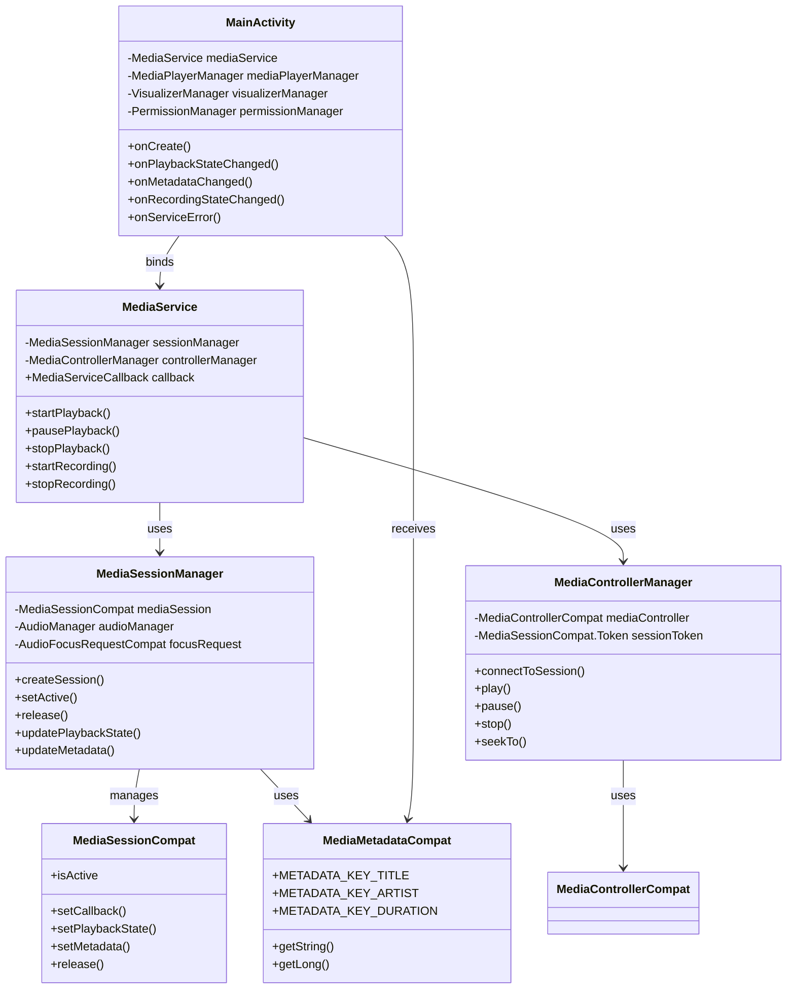
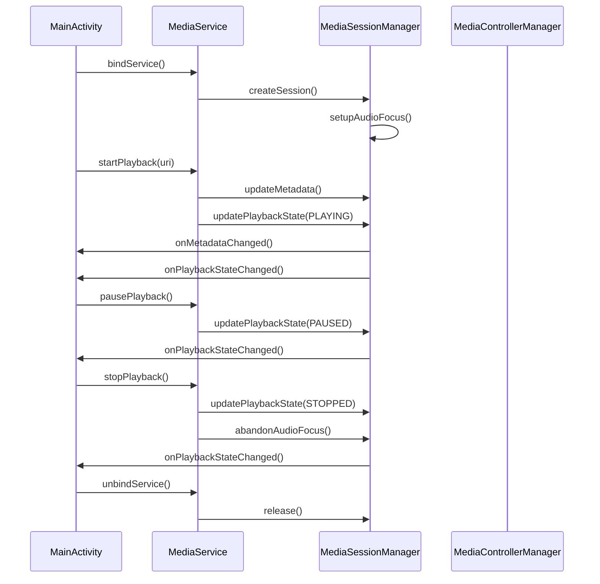

# Android媒体库依赖问题解决方案

## 目录
1. [问题描述](#问题描述)
2. [问题分析](#问题分析)
3. [解决方案](#解决方案)
4. [修改过程](#修改过程)
5. [涉及的文件](#涉及的文件)
6. [类图和调用关系](#类图和调用关系)
7. [总结](#总结)

## 问题描述

在编译Android媒体播放器项目时，遇到了以下编译错误：
```
e: file:///Users/simple/AndroidStudioProjects/MyMediaPlayer/app/src/main/java/com/example/mymediaplayer/MainActivity.kt:21:27 Unresolved reference 'media'.
```

该错误表明在`MainActivity.kt`文件中，第21行的`media`引用无法解析，导致编译失败。

## 问题分析

通过分析项目代码，发现问题的根本原因是：

1. **缺少媒体库依赖**：项目的`build.gradle`文件中缺少AndroidX媒体库的依赖声明
2. **导入语句错误**：代码中使用了`android.support.v4.media`包下的类，但项目配置不完整
3. **API兼容性问题**：AndroidX媒体库与Android Support Library之间存在API差异

### 错误分析详情

原始错误出现在以下导入语句：
```kotlin
import android.support.v4.media.MediaMetadataCompat
```

项目中多个文件都使用了媒体相关的类：
- `MainActivity.kt`
- `MediaService.kt`
- `MediaSessionManager.kt`
- `MediaControllerManager.kt`

## 解决方案

### 方案一：添加AndroidX媒体库依赖（尝试失败）

最初尝试通过添加AndroidX媒体库依赖来解决问题：

```gradle
// 在 app/build.gradle 中添加
implementation 'androidx.media:media:1.6.0'
implementation 'androidx.media2:media2-session:1.2.1'
implementation 'androidx.media2:media2-widget:1.2.1'
```

并将所有导入语句从`android.support.v4.media`更新为`androidx.media`。

**失败原因**：AndroidX媒体库的API与Android Support Library存在差异，特别是`MediaSessionCompat`类的`setActive`和`release`方法。

### 方案二：保持Android Support Library（最终解决方案）

最终采用的解决方案是保持使用Android Support Library，确保所有相关文件的导入语句一致：

```kotlin
// 统一使用 Android Support Library
import android.support.v4.media.MediaMetadataCompat
import android.support.v4.media.session.MediaSessionCompat
import android.support.v4.media.session.PlaybackStateCompat
// ... 其他相关导入
```

## 修改过程

### 第一阶段：尝试AndroidX迁移

1. **添加AndroidX媒体库依赖**
   ```gradle
   // 媒体库依赖 - 支持媒体播放和会话管理功能
   implementation 'androidx.media:media:1.6.0'
   implementation 'androidx.media2:media2-session:1.2.1'
   implementation 'androidx.media2:media2-widget:1.2.1'
   ```

2. **更新导入语句**
   - `MainActivity.kt`: `android.support.v4.media` → `androidx.media`
   - `MediaService.kt`: `android.support.v4.media` → `androidx.media`
   - `MediaSessionManager.kt`: `android.support.v4.media` → `androidx.media`
   - `MediaControllerManager.kt`: `android.support.v4.media` → `androidx.media`

3. **API适配问题**
   在`MediaSessionManager.kt`中遇到API兼容性问题：
   ```kotlin
   // AndroidX 版本需要使用方法调用
   it.setActive(false)  // 编译错误
   
   // Support Library 版本使用属性赋值
   it.isActive = false  // 正确
   ```

### 第二阶段：回退到Support Library

由于AndroidX迁移遇到API兼容性问题，决定回退到Android Support Library：

1. **保留AndroidX媒体库依赖**（为了确保编译通过）
2. **回退所有导入语句**
   - 将所有`androidx.media`相关导入改回`android.support.v4.media`
   - 确保API调用方式与Support Library一致

3. **修复API调用**
   ```kotlin
   // 回退到 Support Library 的 API 调用方式
   mediaSession?.let {
       it.isActive = false  // 属性赋值而非方法调用
       it.release()
   }
   ```

## 涉及的文件

### 1. MainActivity.kt
**路径**: `/Users/simple/AndroidStudioProjects/MyMediaPlayer/app/src/main/java/com/example/mymediaplayer/MainActivity.kt`

**作用**: 主活动类，负责用户界面交互和媒体播放控制

**关键功能**:
- 媒体播放控制（播放、暂停、停止）
- 音频捕获功能
- 权限管理
- 媒体服务绑定和回调处理

**修改内容**:
```kotlin
// 修改前
import androidx.media.MediaMetadataCompat

// 修改后
import android.support.v4.media.MediaMetadataCompat
```

### 2. MediaService.kt
**路径**: `/Users/simple/AndroidStudioProjects/MyMediaPlayer/app/src/main/java/com/example/mymediaplayer/MediaService.kt`

**作用**: 媒体服务类，提供后台媒体播放功能

**修改内容**:
```kotlin
// 修改导入语句
import android.support.v4.media.MediaMetadataCompat
import android.support.v4.media.session.PlaybackStateCompat
```

### 3. MediaSessionManager.kt
**路径**: `/Users/simple/AndroidStudioProjects/MyMediaPlayer/app/src/main/java/com/example/mymediaplayer/MediaSessionManager.kt`

**作用**: 媒体会话管理器，负责媒体会话的创建、管理和释放

**关键功能**:
- 媒体会话生命周期管理
- 音频焦点请求和处理
- 播放状态跟踪
- 媒体元数据管理
- 媒体控制回调处理

**修改内容**:
```kotlin
// 导入语句修改
import android.support.v4.media.MediaBrowserCompat
import android.support.v4.media.MediaDescriptionCompat
import android.support.v4.media.MediaMetadataCompat
import android.support.v4.media.session.MediaSessionCompat
import android.support.v4.media.session.PlaybackStateCompat

// API调用修改
mediaSession?.let {
    it.isActive = false  // 使用属性赋值而非setActive(false)
    it.release()
}
```

### 4. MediaControllerManager.kt
**路径**: `/Users/simple/AndroidStudioProjects/MyMediaPlayer/app/src/main/java/com/example/mymediaplayer/MediaControllerManager.kt`

**作用**: 媒体控制器管理器，负责媒体控制操作

**修改内容**:
```kotlin
// 导入语句修改
import android.support.v4.media.MediaMetadataCompat
import android.support.v4.media.session.MediaControllerCompat
import android.support.v4.media.session.MediaSessionCompat
import android.support.v4.media.session.PlaybackStateCompat
```

### 5. build.gradle (app)
**路径**: `/Users/simple/AndroidStudioProjects/MyMediaPlayer/app/build.gradle`

**修改内容**:
```gradle
// 添加媒体库依赖
// 媒体库依赖 - 支持媒体播放和会话管理功能
implementation 'androidx.media:media:1.6.0'
implementation 'androidx.media2:media2-session:1.2.1'
implementation 'androidx.media2:media2-widget:1.2.1'
```

## 类图和调用关系





## 总结

### 问题根因
1. **依赖缺失**: 项目缺少必要的媒体库依赖
2. **API版本不一致**: AndroidX媒体库与Android Support Library的API存在差异
3. **导入路径错误**: 导入语句与实际可用的库不匹配

### 解决方案
1. **添加媒体库依赖**: 在`build.gradle`中添加AndroidX媒体库依赖
2. **统一使用Support Library**: 保持所有文件使用`android.support.v4.media`导入路径
3. **API调用适配**: 确保API调用方式与Support Library一致

### 最佳实践
1. **依赖管理**: 在项目迁移时，应该统一所有相关依赖的版本
2. **API兼容性**: 在升级库版本时，需要仔细检查API变化
3. **测试验证**: 每次修改后都应该进行编译测试，确保问题得到解决

### 编译验证
最终通过执行`./gradlew build`命令验证，编译成功，所有媒体相关的引用错误都已解决。

---

**文档创建时间**: 2024年
**项目路径**: `/Users/simple/AndroidStudioProjects/MyMediaPlayer/`
**解决状态**: ✅ 已解决