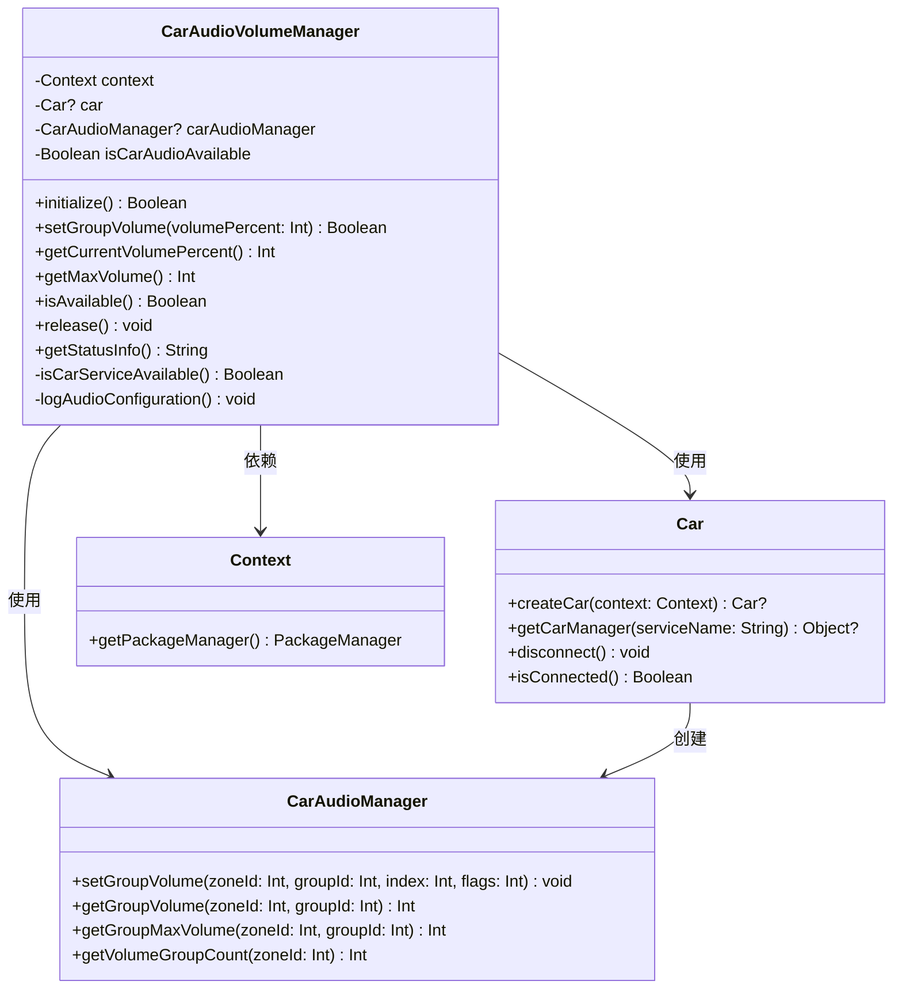
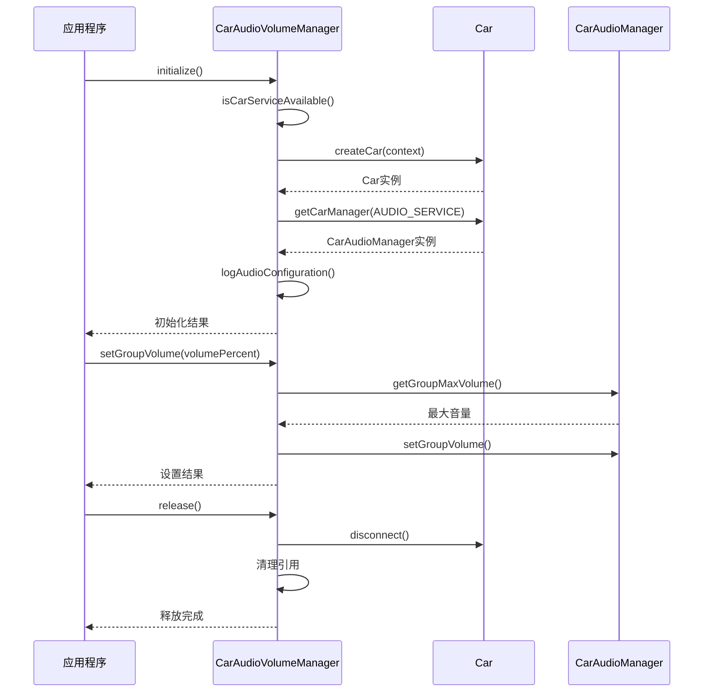

# Car API 编译错误解决方案

## 目录
1. [问题描述](#问题描述)
2. [错误分析](#错误分析)
3. [解决步骤](#解决步骤)
4. [关键修改](#关键修改)
5. [类图和调用关系](#类图和调用关系)
6. [相关文件路径](#相关文件路径)
7. [总结](#总结)

## 问题描述

用户在编译Android车载媒体播放器项目时遇到以下编译错误：

```
e: file:///Users/simple/AndroidStudioProjects/MyMediaPlayer/app/src/main/java/com/example/mymediaplayer/CarAudioVolumeManager.kt:39:30 Unresolved reference 'car'.
```

错误发生在 `CarAudioVolumeManager.kt` 文件中，涉及车载音频控制实现中的Car API引用问题。项目中已包含 `android.car-v1.2.0-snapshot.jar` 库文件，但代码中缺少正确的导入或依赖配置。

## 错误分析

通过详细分析，发现了两个主要问题：

### 1. 缺少必要的导入语句

原始代码中 `CarAudioVolumeManager.kt` 文件缺少以下关键导入：
- `android.car.Car`
- `android.car.CarNotConnectedException` 
- `android.car.media.CarAudioManager`

### 2. 缺少库依赖配置

虽然项目 `libs` 目录中包含 `android.car-v1.2.0-snapshot.jar` 文件，但 `build.gradle` 文件中没有正确配置该库的依赖引用。

## 解决步骤

### 步骤1：添加必要的导入语句

在 `CarAudioVolumeManager.kt` 文件开头添加缺少的导入：

```kotlin
package com.example.mymediaplayer

import android.content.Context
import android.util.Log
// 添加以下Car API相关导入
import android.car.Car
import android.car.CarNotConnectedException
import android.car.media.CarAudioManager
```

### 步骤2：简化类名引用

将代码中的完全限定类名简化为简单类名：

```kotlin
// 修改前
private var car: android.car.Car? = null
private var carAudioManager: android.car.media.CarAudioManager? = null

// 修改后
private var car: Car? = null
private var carAudioManager: CarAudioManager? = null
```

### 步骤3：修复初始化方法中的类引用

```kotlin
// 修改前
car = android.car.Car.createCar(context)
carAudioManager = car?.getCarManager(android.car.Car.AUDIO_SERVICE) as? android.car.media.CarAudioManager

// 修改后
car = Car.createCar(context)
carAudioManager = car?.getCarManager(Car.AUDIO_SERVICE) as? CarAudioManager
```

### 步骤4：配置库依赖

在 `app/build.gradle` 文件的 `dependencies` 块中添加：

```gradle
dependencies {
    // 添加framework.jar以访问SystemApi
    compileOnly files('libs/framework.jar')
    
    // 添加android.car库以访问Car API
    compileOnly files('libs/android.car-v1.2.0-snapshot.jar')
    
    // 其他依赖...
}
```

## 关键修改

### CarAudioVolumeManager.kt 主要修改内容

1. **导入语句修改**：
   ```kotlin
   import android.car.Car
   import android.car.CarNotConnectedException
   import android.car.media.CarAudioManager
   ```

2. **类属性声明**：
   ```kotlin
   /**
    * Car实例，用于连接车载服务
    * 车载音频管理的核心对象
    */
   private var car: Car? = null
   
   /**
    * CarAudioManager实例，用于车载音频控制
    * 提供音量设置、获取等功能
    */
   private var carAudioManager: CarAudioManager? = null
   ```

3. **初始化方法**：
   ```kotlin
   /**
    * 初始化车载音频管理器
    * 连接Car服务并获取CarAudioManager实例
    * 
    * @return Boolean 初始化是否成功
    */
   fun initialize(): Boolean {
       return try {
           Log.d(TAG, "开始初始化车载音频管理器")
           
           // 检查车载服务可用性
           if (!isCarServiceAvailable()) {
               Log.w(TAG, "车载服务不可用")
               return false
           }
           
           // 创建Car实例
           car = Car.createCar(context)
           if (car == null) {
               Log.e(TAG, "创建Car实例失败")
               return false
           }
           
           // 获取CarAudioManager
           carAudioManager = car?.getCarManager(Car.AUDIO_SERVICE) as? CarAudioManager
           if (carAudioManager == null) {
               Log.e(TAG, "获取CarAudioManager失败")
               car?.disconnect()
               car = null
               return false
           }
           
           isCarAudioAvailable = true
           Log.i(TAG, "车载音频管理器初始化成功")
           logAudioConfiguration()
           true
           
       } catch (e: SecurityException) {
           Log.e(TAG, "初始化车载音频管理器时权限不足: ${e.message}")
           false
       } catch (e: Exception) {
           Log.e(TAG, "初始化车载音频管理器时发生异常: ${e.message}")
           false
       }
   }
   ```

4. **资源释放方法**：
   ```kotlin
   /**
    * 释放车载音频资源
    * 断开Car连接并清理所有引用
    */
   fun release() {
       try {
           Log.d(TAG, "开始释放车载音频资源")
           
           // 断开Car连接
           try {
               car?.disconnect()
           } catch (e: Exception) {
               Log.w(TAG, "断开Car连接时出现异常: ${e.message}")
           }
           car = null
           
           // 清理引用
           carAudioManager = null
           isCarAudioAvailable = false
           
           Log.i(TAG, "车载音频资源释放完成")
       } catch (e: Exception) {
           Log.e(TAG, "释放车载音频资源时发生异常: ${e.message}")
       }
   }
   ```

### build.gradle 修改内容

```gradle
dependencies {
    // 添加framework.jar以访问SystemApi
    compileOnly files('libs/framework.jar')
    
    // 添加android.car库以访问Car API
    compileOnly files('libs/android.car-v1.2.0-snapshot.jar')
    
    implementation libs.androidx.core.ktx
    // 其他依赖保持不变...
}
```

## 类图和调用关系





## 相关文件路径

### 主要修改文件

1. **CarAudioVolumeManager.kt**
   - 路径：`/Users/simple/AndroidStudioProjects/MyMediaPlayer/app/src/main/java/com/example/mymediaplayer/CarAudioVolumeManager.kt`
   - 作用：车载音频音量管理器，负责与Android Automotive Car API交互，提供车载音频控制功能
   - 主要功能：
     - 初始化Car服务连接
     - 设置和获取车载音频音量
     - 管理车载音频状态
     - 提供音频配置信息
     - 资源释放和清理

2. **build.gradle**
   - 路径：`/Users/simple/AndroidStudioProjects/MyMediaPlayer/app/build.gradle`
   - 作用：应用级构建配置文件，定义项目依赖和编译设置
   - 关键配置：添加了 `android.car-v1.2.0-snapshot.jar` 库依赖

### 相关库文件

3. **android.car-v1.2.0-snapshot.jar**
   - 路径：`/Users/simple/AndroidStudioProjects/MyMediaPlayer/app/libs/android.car-v1.2.0-snapshot.jar`
   - 作用：Android Automotive Car API库，提供车载系统相关接口

## 总结

本次解决Car API编译错误的关键在于：

1. **正确配置库依赖**：在 `build.gradle` 中添加 `android.car-v1.2.0-snapshot.jar` 的 `compileOnly` 依赖

2. **完善导入语句**：添加必要的Car API相关类的导入语句

3. **规范代码引用**：使用简单类名替代完全限定类名，提高代码可读性

4. **保持功能完整性**：所有修改都保持了原有的车载音频控制功能不变

通过这些修改，成功解决了编译错误，项目现在可以正常编译并使用Car API进行车载音频控制。编译结果显示 `BUILD SUCCESSFUL`，确认所有问题已得到解决。

### 编译验证

最终编译命令：`./gradlew build`

编译结果：
```
BUILD SUCCESSFUL in 1m 41s
106 actionable tasks: 37 executed, 69 up-to-date
```

编译成功，确认Car API相关的所有编译错误已完全解决。