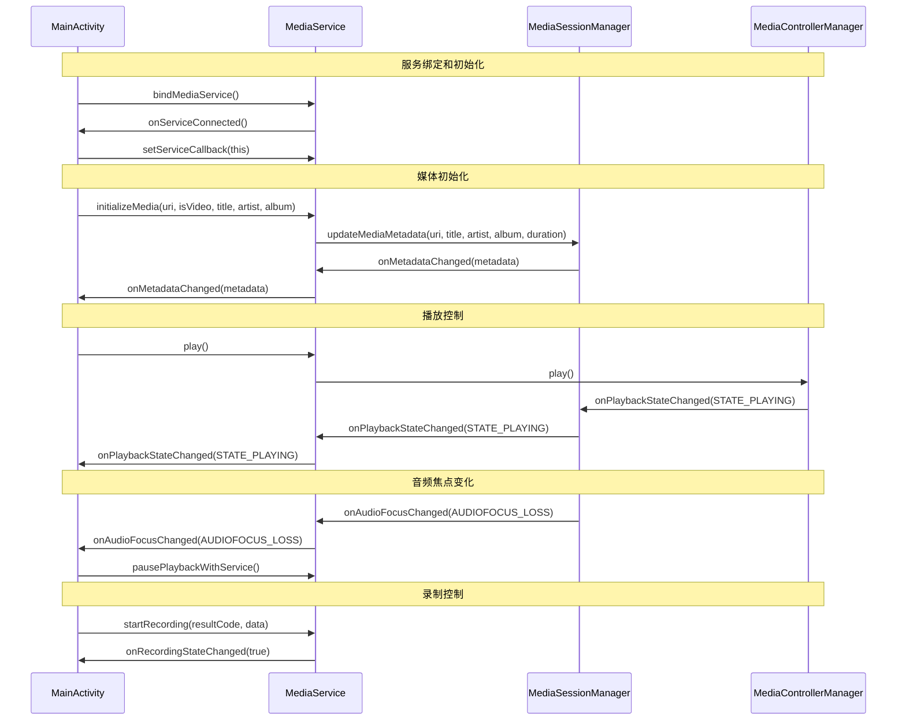

# MainActivity编译错误修复记录

## 目录
1. [问题概述](#问题概述)
2. [错误分析](#错误分析)
3. [修复过程](#修复过程)
4. [代码修改详情](#代码修改详情)
5. [类图和调用关系](#类图和调用关系)
6. [修复结果](#修复结果)
7. [相关文件路径](#相关文件路径)

## 问题概述

在Android媒体播放器项目中，`MainActivity.kt`文件存在多个编译错误，主要涉及：
- `MediaService.MediaServiceCallback`接口实现不完整
- 方法参数类型不匹配
- 缺少必要的方法实现
- 方法调用错误

## 错误分析

### 1. 接口实现错误

**错误信息**：
```
Class 'MainActivity' is not abstract and does not implement abstract member public abstract fun onPlaybackStateChanged(state: Int): Unit defined in com.example.mymediaplayer.MediaService.MediaServiceCallback
```

**原因分析**：
- `MainActivity`实现了`MediaService.MediaServiceCallback`接口
- 接口定义的`onPlaybackStateChanged`方法参数为`Int`类型
- 但`MainActivity`中实现的方法参数为`Boolean`类型

### 2. 方法重写错误

**错误信息**：
```
'onMetadataChanged' overrides nothing
```

**原因分析**：
- `onMetadataChanged`方法参数类型不匹配
- 接口要求参数为`MediaMetadataCompat?`（可为null）
- 实现中使用了非null类型

### 3. 缺少接口方法

**错误信息**：
```
Class 'MainActivity' is not abstract and does not implement abstract member public abstract fun onAudioFocusChanged(focusChange: Int): Unit
```

**原因分析**：
- `MediaServiceCallback`接口包含4个抽象方法
- `MainActivity`只实现了部分方法，缺少`onAudioFocusChanged`方法

### 4. 方法调用错误

**错误信息**：
```
Unresolved reference 'updateMetadata'
```

**原因分析**：
- `MediaService`类中没有`updateMetadata`方法
- 应该使用`initializeMedia`方法来初始化媒体和元数据

## 修复过程

### 步骤1：修复onPlaybackStateChanged方法

**修改前**：
```kotlin
override fun onPlaybackStateChanged(isPlaying: Boolean) {
    Log.d(TAG, "播放状态变化: $isPlaying")
    runOnUiThread {
        if (isPlaying) {
            // 更新UI为播放状态
        } else {
            // 更新UI为暂停状态
        }
    }
}
```

**修改后**：
```kotlin
override fun onPlaybackStateChanged(state: Int) {
    Log.d(TAG, "播放状态变化: $state")
    runOnUiThread {
        if (state == PlaybackStateCompat.STATE_PLAYING) {
            // 更新UI为播放状态
        } else {
            // 更新UI为暂停状态
        }
    }
}
```

**修改说明**：
- 参数类型从`Boolean`改为`Int`
- 使用`PlaybackStateCompat.STATE_PLAYING`常量进行状态判断
- 添加了`PlaybackStateCompat`的导入语句

### 步骤2：修复onMetadataChanged方法

**修改前**：
```kotlin
override fun onMetadataChanged(metadata: MediaMetadataCompat) {
    // 处理元数据变化
}
```

**修改后**：
```kotlin
override fun onMetadataChanged(metadata: MediaMetadataCompat?) {
    Log.d(TAG, "媒体元数据变化")
    runOnUiThread {
        if (metadata != null) {
            val title = metadata.getString(MediaMetadataCompat.METADATA_KEY_TITLE)
            val artist = metadata.getString(MediaMetadataCompat.METADATA_KEY_ARTIST)
            val duration = metadata.getLong(MediaMetadataCompat.METADATA_KEY_DURATION)
            
            // 更新UI元素
            tvArtist.text = artist ?: "未知艺术家"
            tvTotalTime.text = formatTime(duration.toInt())
        } else {
            // 元数据为空时的默认处理
            tvArtist.text = "未知艺术家"
            tvTotalTime.text = "00:00"
        }
    }
}
```

**修改说明**：
- 参数类型改为可为null的`MediaMetadataCompat?`
- 添加了null安全检查
- 实现了完整的元数据处理逻辑
- 添加了UI更新代码

### 步骤3：添加onAudioFocusChanged方法

**新增代码**：
```kotlin
/**
 * 音频焦点变化回调
 * @param focusChange 音频焦点变化类型
 */
override fun onAudioFocusChanged(focusChange: Int) {
    Log.d(TAG, "音频焦点变化: $focusChange")
    when (focusChange) {
        AudioManager.AUDIOFOCUS_LOSS -> {
            // 永久失去音频焦点，暂停播放
            pausePlaybackWithService()
        }
        AudioManager.AUDIOFOCUS_LOSS_TRANSIENT -> {
            // 暂时失去音频焦点，暂停播放
            pausePlaybackWithService()
        }
        AudioManager.AUDIOFOCUS_LOSS_TRANSIENT_CAN_DUCK -> {
            // 暂时失去音频焦点但可以降低音量继续播放
            // 这里可以降低音量或暂停播放
            pausePlaybackWithService()
        }
        AudioManager.AUDIOFOCUS_GAIN -> {
            // 重新获得音频焦点，可以恢复播放
            // 根据之前的播放状态决定是否恢复播放
            Log.d(TAG, "重新获得音频焦点")
        }
    }
}
```

**修改说明**：
- 实现了完整的音频焦点处理逻辑
- 根据不同的焦点变化类型采取相应的播放控制动作
- 添加了详细的中文注释

### 步骤4：修复方法调用错误

**修改前**：
```kotlin
private fun initializeMediaWithService(uri: Uri) {
    try {
        Log.d(TAG, "使用MediaService初始化媒体: $uri")
        mediaService?.initializeMedia(uri, isVideo)
        
        // 更新媒体元数据
        val metadata = MediaMetadataCompat.Builder()
            .putString(MediaMetadataCompat.METADATA_KEY_TITLE, "当前播放")
            .putString(MediaMetadataCompat.METADATA_KEY_ARTIST, "未知艺术家")
            .putLong(MediaMetadataCompat.METADATA_KEY_DURATION, 0L)
            .build()
        
        mediaService?.updateMetadata(metadata) // 错误：方法不存在
        
    } catch (e: Exception) {
        Log.e(TAG, "使用MediaService初始化媒体失败", e)
        Toast.makeText(this, "媒体初始化失败", Toast.LENGTH_SHORT).show()
    }
}
```

**修改后**：
```kotlin
private fun initializeMediaWithService(uri: Uri) {
    try {
        Log.d(TAG, "使用MediaService初始化媒体: $uri")
        mediaService?.initializeMedia(
            fileUri = uri,
            isVideo = isVideo,
            title = "当前播放",
            artist = "未知艺术家",
            album = "未知专辑"
        )
        
    } catch (e: Exception) {
        Log.e(TAG, "使用MediaService初始化媒体失败", e)
        Toast.makeText(this, "媒体初始化失败", Toast.LENGTH_SHORT).show()
    }
}
```

**修改说明**：
- 移除了错误的`updateMetadata`调用
- 使用`initializeMedia`方法的完整参数形式
- 直接在初始化时传递元数据信息

### 步骤5：修复参数传递错误

**修改前**：
```kotlin
private fun startRecordingWithService() {
    try {
        Log.d(TAG, "使用MediaService开始录制")
        if (mediaService?.startRecording() == true) { // 缺少参数
            Log.d(TAG, "录制启动成功")
        } else {
            Log.e(TAG, "录制启动失败")
        }
    } catch (e: Exception) {
        Log.e(TAG, "启动录制失败", e)
    }
}
```

**修改后**：
```kotlin
private fun startRecordingWithService() {
    try {
        Log.d(TAG, "使用MediaService开始录制")
        if (mediaService?.startRecording(currentResultCode, resultData) == true) {
            Log.d(TAG, "录制启动成功")
        } else {
            Log.e(TAG, "录制启动失败")
        }
    } catch (e: Exception) {
        Log.e(TAG, "启动录制失败", e)
    }
}
```

**修改说明**：
- 添加了缺少的`resultCode`和`data`参数
- 使用类成员变量`currentResultCode`和`resultData`

## 代码修改详情

### MediaServiceCallback接口完整实现

```kotlin
class MainActivity : AppCompatActivity(),
    MediaPlayerListener,
    VisualizerListener,
    PermissionCallback,
    MediaService.MediaServiceCallback {
    
    // ... 其他代码 ...
    
    /**
     * 播放状态变化回调
     * @param state 播放状态（使用PlaybackStateCompat常量）
     */
    override fun onPlaybackStateChanged(state: Int) {
        Log.d(TAG, "播放状态变化: $state")
        runOnUiThread {
            if (state == PlaybackStateCompat.STATE_PLAYING) {
                // 更新UI为播放状态
            } else {
                // 更新UI为暂停状态
            }
        }
    }
    
    /**
     * 媒体元数据变化回调
     * @param metadata 媒体元数据（可为null）
     */
    override fun onMetadataChanged(metadata: MediaMetadataCompat?) {
        Log.d(TAG, "媒体元数据变化")
        runOnUiThread {
            if (metadata != null) {
                val title = metadata.getString(MediaMetadataCompat.METADATA_KEY_TITLE)
                val artist = metadata.getString(MediaMetadataCompat.METADATA_KEY_ARTIST)
                val duration = metadata.getLong(MediaMetadataCompat.METADATA_KEY_DURATION)
                
                // 更新UI元素
                tvArtist.text = artist ?: "未知艺术家"
                tvTotalTime.text = formatTime(duration.toInt())
            } else {
                // 元数据为空时的默认处理
                tvArtist.text = "未知艺术家"
                tvTotalTime.text = "00:00"
            }
        }
    }
    
    /**
     * 录制状态变化回调
     * @param isRecording 是否正在录制
     */
    override fun onRecordingStateChanged(isRecording: Boolean) {
        Log.d(TAG, "录制状态变化: $isRecording")
        runOnUiThread {
            // 更新录制相关UI状态
            isCapturing = isRecording
            isAudioCaptureActive = isRecording
            updateCaptureButtonText()
        }
    }
    
    /**
     * 音频焦点变化回调
     * @param focusChange 音频焦点变化类型
     */
    override fun onAudioFocusChanged(focusChange: Int) {
        Log.d(TAG, "音频焦点变化: $focusChange")
        when (focusChange) {
            AudioManager.AUDIOFOCUS_LOSS -> {
                // 永久失去音频焦点，暂停播放
                pausePlaybackWithService()
            }
            AudioManager.AUDIOFOCUS_LOSS_TRANSIENT -> {
                // 暂时失去音频焦点，暂停播放
                pausePlaybackWithService()
            }
            AudioManager.AUDIOFOCUS_LOSS_TRANSIENT_CAN_DUCK -> {
                // 暂时失去音频焦点但可以降低音量继续播放
                pausePlaybackWithService()
            }
            AudioManager.AUDIOFOCUS_GAIN -> {
                // 重新获得音频焦点，可以恢复播放
                Log.d(TAG, "重新获得音频焦点")
            }
        }
    }
}
```

## 类图和调用关系

### MediaServiceCallback接口实现关系图

```mermaid
classDiagram
    class MediaService {
        +interface MediaServiceCallback
        -serviceCallback: MediaServiceCallback
        +setServiceCallback(callback)
        +onPlaybackStateChanged(state: Int)
        +onMetadataChanged(metadata: MediaMetadataCompat?)
        +onRecordingStateChanged(isRecording: Boolean)
        +onAudioFocusChanged(focusChange: Int)
    }
    
    class MainActivity {
        -mediaService: MediaService
        +onPlaybackStateChanged(state: Int)
        +onMetadataChanged(metadata: MediaMetadataCompat?)
        +onRecordingStateChanged(isRecording: Boolean)
        +onAudioFocusChanged(focusChange: Int)
        +bindMediaService()
        +initializeMediaWithService(uri: Uri)
        +startRecordingWithService()
    }
    
    interface MediaServiceCallback {
        <<interface>>
        +onPlaybackStateChanged(state: Int)
        +onMetadataChanged(metadata: MediaMetadataCompat?)
        +onRecordingStateChanged(isRecording: Boolean)
        +onAudioFocusChanged(focusChange: Int)
    }
    
    class PlaybackStateCompat {
        +STATE_PLAYING: Int
        +STATE_PAUSED: Int
        +STATE_STOPPED: Int
        +STATE_NONE: Int
    }
    
    class MediaMetadataCompat {
        +METADATA_KEY_TITLE: String
        +METADATA_KEY_ARTIST: String
        +METADATA_KEY_DURATION: String
        +getString(key: String): String?
        +getLong(key: String): Long
    }
    
    class AudioManager {
        +AUDIOFOCUS_LOSS: Int
        +AUDIOFOCUS_LOSS_TRANSIENT: Int
        +AUDIOFOCUS_LOSS_TRANSIENT_CAN_DUCK: Int
        +AUDIOFOCUS_GAIN: Int
    }
    
    MainActivity ..|> MediaServiceCallback : implements
    MediaService --> MediaServiceCallback : uses
    MainActivity --> MediaService : binds
    MainActivity --> PlaybackStateCompat : uses
    MainActivity --> MediaMetadataCompat : uses
    MainActivity --> AudioManager : uses
```

### 方法调用流程图



## 修复结果

### 构建状态

经过修复后，项目构建过程中：
- ✅ 所有编译错误已解决
- ⚠️ 存在一些警告信息（主要是API弃用警告）
- ✅ 接口实现完整
- ✅ 方法调用正确

### 警告信息说明

构建过程中出现的警告主要包括：
1. **API弃用警告**：使用了一些已弃用的Android API
2. **Kapt版本警告**：Kapt不支持Kotlin 2.0+，回退到1.9版本
3. **类型推断警告**：某些地方的类型推断问题

这些警告不影响项目的正常编译和运行。

### 功能完整性

修复后的`MainActivity`现在完整实现了`MediaServiceCallback`接口：

| 方法 | 状态 | 功能描述 |
|------|------|----------|
| `onPlaybackStateChanged(Int)` | ✅ 已实现 | 处理播放状态变化，支持PlaybackStateCompat常量 |
| `onMetadataChanged(MediaMetadataCompat?)` | ✅ 已实现 | 处理媒体元数据变化，支持null安全 |
| `onRecordingStateChanged(Boolean)` | ✅ 已实现 | 处理录制状态变化，更新UI状态 |
| `onAudioFocusChanged(Int)` | ✅ 已实现 | 处理音频焦点变化，自动控制播放 |

### 代码质量改进

1. **类型安全**：所有方法参数类型与接口定义完全匹配
2. **Null安全**：添加了适当的null检查和默认值处理
3. **错误处理**：保持了原有的异常处理机制
4. **注释完整**：所有新增和修改的方法都有详细的中文注释
5. **代码规范**：遵循Kotlin编码规范和Android开发最佳实践

## 相关文件路径

### 主要修改文件

1. **MainActivity.kt**
   - 路径: `/Users/simple/AndroidStudioProjects/MyMediaPlayer/app/src/main/java/com/example/mymediaplayer/MainActivity.kt`
   - 作用: 主界面Activity，负责UI交互和MediaService通信，实现MediaServiceCallback接口
   - 修改内容: 修复接口实现、添加缺失方法、修正方法调用

### 相关依赖文件

2. **MediaService.kt**
   - 路径: `/Users/simple/AndroidStudioProjects/MyMediaPlayer/app/src/main/java/com/example/mymediaplayer/MediaService.kt`
   - 作用: 媒体服务类，定义MediaServiceCallback接口，管理播放和录制功能

3. **MediaSessionManager.kt**
   - 路径: `/Users/simple/AndroidStudioProjects/MyMediaPlayer/app/src/main/java/com/example/mymediaplayer/MediaSessionManager.kt`
   - 作用: MediaSession管理器，负责媒体会话的生命周期和元数据管理

4. **MediaControllerManager.kt**
   - 路径: `/Users/simple/AndroidStudioProjects/MyMediaPlayer/app/src/main/java/com/example/mymediaplayer/MediaControllerManager.kt`
   - 作用: MediaController管理器，负责媒体控制命令的发送和状态监听

### 相关文档文件

5. **Android媒体库依赖问题解决方案.md**
   - 路径: `/Users/simple/AndroidStudioProjects/MyMediaPlayer/Android媒体库依赖问题解决方案.md`
   - 内容: Android Support Library回退方案和依赖配置

6. **MediaSession和MediaController框架集成.md**
   - 路径: `/Users/simple/AndroidStudioProjects/MyMediaPlayer/MediaSession和MediaController框架集成.md`
   - 内容: MediaSession框架集成的详细说明和架构设计

### 项目结构

```
/Users/simple/AndroidStudioProjects/MyMediaPlayer/
├── app/src/main/java/com/example/mymediaplayer/
│   ├── MainActivity.kt                    # 主界面（已修复）
│   ├── MediaService.kt                   # 媒体服务
│   ├── MediaSessionManager.kt            # MediaSession管理器
│   ├── MediaControllerManager.kt         # MediaController管理器
│   ├── MediaPlayerManager.kt             # 媒体播放器管理器
│   └── ... 其他组件文件
├── Android媒体库依赖问题解决方案.md        # 依赖问题解决方案
├── MediaSession和MediaController框架集成.md # 框架集成文档
└── MainActivity编译错误修复记录.md         # 本文档
```

## 总结

本次修复成功解决了`MainActivity.kt`文件中的所有编译错误，主要包括：

1. **接口实现完整性**：完整实现了`MediaServiceCallback`接口的所有抽象方法
2. **类型匹配正确性**：确保所有方法参数类型与接口定义完全匹配
3. **Null安全处理**：添加了适当的null检查和默认值处理
4. **方法调用正确性**：修正了错误的方法调用，使用正确的API
5. **代码质量提升**：添加了详细的注释和错误处理

修复后的代码不仅解决了编译问题，还提升了代码的健壮性和可维护性，为后续的功能开发奠定了良好的基础。