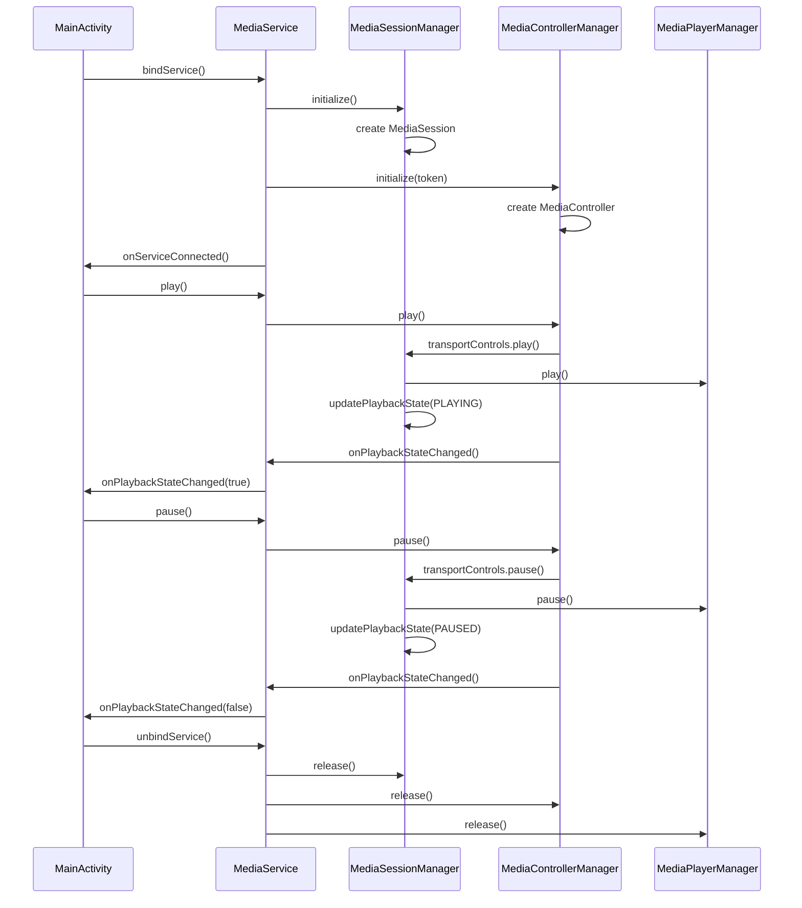

# MediaSession和MediaController框架集成

## 概述

本文档记录了将Android媒体播放器项目中的播放和录制功能接入MediaSession和MediaController框架的完整过程。MediaSession和MediaController是Android系统提供的标准媒体控制框架，能够实现系统级的媒体控制，包括通知栏控制、蓝牙设备控制、车载系统集成等功能。

## 目录

1. [项目结构分析](#项目结构分析)
2. [核心组件实现](#核心组件实现)
3. [集成步骤](#集成步骤)
4. [类图和调用关系](#类图和调用关系)
5. [文件路径说明](#文件路径说明)

## 项目结构分析

### 现有组件

项目原有的核心组件包括：

- **MainActivity**: 主界面Activity，包含播放控制UI和录制功能
- **MediaPlayerManager**: 媒体播放管理器，负责MediaPlayer的生命周期管理
- **AudioCaptureService**: 音频捕获服务，负责系统音频录制
- **VisualizerManager**: 音频可视化管理器
- **PermissionManager**: 权限管理器

### 新增组件

为了集成MediaSession和MediaController框架，新增了以下组件：

- **MediaSessionManager**: MediaSession管理器
- **MediaControllerManager**: MediaController管理器  
- **MediaService**: 媒体服务，统一管理播放和录制功能

## 核心组件实现

### 1. MediaSessionManager类

**文件路径**: `/Users/simple/AndroidStudioProjects/MyMediaPlayer/app/src/main/java/com/example/mymediaplayer/MediaSessionManager.kt`

**类作用**: 负责管理MediaSession的生命周期、播放状态和媒体元数据，集成Android系统媒体控制框架，支持音频焦点管理。

**核心功能**:
- MediaSession生命周期管理
- 播放状态更新和同步
- 媒体元数据管理
- 音频焦点请求和释放
- 系统媒体控制命令处理

**关键方法**:
- `initialize()`: 初始化MediaSession
- `updatePlaybackState()`: 更新播放状态
- `updateMetadata()`: 更新媒体元数据
- `getSessionToken()`: 获取MediaSession令牌
- `release()`: 释放资源

### 2. MediaControllerManager类

**文件路径**: `/Users/simple/AndroidStudioProjects/MyMediaPlayer/app/src/main/java/com/example/mymediaplayer/MediaControllerManager.kt`

**类作用**: 负责管理MediaController的生命周期、发送控制命令和接收状态更新，提供与MediaSession的双向通信能力。

**核心功能**:
- MediaController生命周期管理
- 媒体控制命令发送
- 状态变化监听和回调
- 自定义动作支持

**关键方法**:
- `initialize()`: 初始化MediaController
- `play()`, `pause()`, `stop()`: 基本播放控制
- `seekTo()`: 跳转控制
- `setPlaybackSpeed()`: 播放速度控制
- `sendCustomAction()`: 自定义动作

### 3. MediaService类

**文件路径**: `/Users/simple/AndroidStudioProjects/MyMediaPlayer/app/src/main/java/com/example/mymediaplayer/MediaService.kt`

**类作用**: 作为后台服务集成MediaSession和MediaController框架，负责管理播放和录制功能的MediaSession集成。

**核心功能**:
- 统一的媒体服务管理
- MediaSession和MediaController协调
- 播放和录制功能集成
- 服务生命周期管理
- 错误处理和回调通知

**关键方法**:
- `initializeMedia()`: 初始化媒体文件
- `play()`, `pause()`, `stop()`: 播放控制
- `startRecording()`, `stopRecording()`: 录制控制
- `setCallback()`: 设置回调接口

## 集成步骤

### 1. MainActivity集成

#### 1.1 添加必要的导入

```kotlin
import android.content.ComponentName
import android.content.ServiceConnection
import android.os.IBinder
import android.support.v4.media.MediaMetadataCompat
```

#### 1.2 实现MediaServiceCallback接口

```kotlin
class MainActivity : AppCompatActivity(),
    MediaPlayerListener,
    VisualizerListener,
    PermissionCallback,
    MediaService.MediaServiceCallback {
```

#### 1.3 添加服务绑定相关变量

```kotlin
// MediaService相关
private var mediaService: MediaService? = null
private var isServiceBound = false
```

#### 1.4 实现ServiceConnection

服务连接管理器负责管理与MediaService的绑定和解绑，包括服务连接成功时的初始化和连接断开时的清理。

#### 1.5 修改播放控制按钮事件

将原有的直接调用MediaPlayerManager的方式改为通过MediaService进行控制，实现了统一的媒体控制入口。

#### 1.6 添加MediaService集成方法

包括绑定/解绑服务、媒体初始化、播放控制、录制控制等方法，并实现了完整的回调机制。

### 2. AndroidManifest.xml配置

在AndroidManifest.xml中添加了MediaService的声明：

```xml
<service
    android:name=".MediaService"
    android:exported="false" />
```

## 类图和调用关系

### 类图

```mermaid
classDiagram
    class MainActivity {
        -mediaService: MediaService
        -isServiceBound: boolean
        -serviceConnection: ServiceConnection
        +bindMediaService()
        +unbindMediaService()
        +playOrResumeWithService()
        +pausePlaybackWithService()
        +stopPlaybackWithService()
        +onPlaybackStateChanged(boolean)
        +onMetadataChanged(MediaMetadataCompat)
        +onRecordingStateChanged(boolean)
        +onServiceError(String)
    }
    
    class MediaService {
        -mediaPlayerManager: MediaPlayerManager
        -mediaSessionManager: MediaSessionManager
        -mediaControllerManager: MediaControllerManager
        -serviceCallback: MediaServiceCallback
        +initializeMedia(Uri)
        +play()
        +pause()
        +stop()
        +startRecording(int, Intent)
        +stopRecording()
        +setCallback(MediaServiceCallback)
    }
    
    class MediaSessionManager {
        -mediaSession: MediaSessionCompat
        -audioManager: AudioManager
        -mediaPlayerManager: MediaPlayerManager
        +initialize()
        +updatePlaybackState(int, long, float)
        +updateMetadata(String, String, String, long)
        +getSessionToken(): Token
        +release()
    }
    
    class MediaControllerManager {
        -mediaController: MediaControllerCompat
        -stateCallback: StateCallback
        +initialize(Token, StateCallback)
        +play()
        +pause()
        +stop()
        +seekTo(long)
        +setPlaybackSpeed(float)
        +release()
    }
    
    class MediaPlayerManager {
        -mediaPlayer: MediaPlayer
        +initializePlayer(Uri)
        +play()
        +pause()
        +stop()
        +seekTo(int)
        +setPlaybackSpeed(float)
        +release()
    }
    
    interface MediaServiceCallback {
        +onPlaybackStateChanged(boolean)
        +onMetadataChanged(MediaMetadataCompat)
        +onRecordingStateChanged(boolean)
        +onServiceError(String)
    }
    
    interface StateCallback {
        +onPlaybackStateChanged(PlaybackStateCompat)
        +onMetadataChanged(MediaMetadataCompat)
    }
    
    MainActivity ..|> MediaServiceCallback
    MainActivity --> MediaService : binds
    MediaService --> MediaSessionManager : uses
    MediaService --> MediaControllerManager : uses
    MediaService --> MediaPlayerManager : uses
    MediaSessionManager --> MediaPlayerManager : controls
    MediaControllerManager ..|> StateCallback
    MediaService ..|> MediaServiceCallback : notifies
```

### 函数调用关系图



## 文件路径说明

### 新增文件

1. **MediaSessionManager.kt**
   - 路径: `/Users/simple/AndroidStudioProjects/MyMediaPlayer/app/src/main/java/com/example/mymediaplayer/MediaSessionManager.kt`
   - 作用: 管理MediaSession的生命周期，处理系统媒体控制命令，管理音频焦点

2. **MediaControllerManager.kt**
   - 路径: `/Users/simple/AndroidStudioProjects/MyMediaPlayer/app/src/main/java/com/example/mymediaplayer/MediaControllerManager.kt`
   - 作用: 管理MediaController，发送控制命令，接收状态更新

3. **MediaService.kt**
   - 路径: `/Users/simple/AndroidStudioProjects/MyMediaPlayer/app/src/main/java/com/example/mymediaplayer/MediaService.kt`
   - 作用: 后台服务，统一管理播放和录制功能的MediaSession集成

### 修改文件

1. **MainActivity.kt**
   - 路径: `/Users/simple/AndroidStudioProjects/MyMediaPlayer/app/src/main/java/com/example/mymediaplayer/MainActivity.kt`
   - 修改内容: 添加MediaService绑定、集成MediaSession控制、实现回调接口
   - 作用: 主界面Activity，负责UI交互和MediaService通信

2. **AndroidManifest.xml**
   - 路径: `/Users/simple/AndroidStudioProjects/MyMediaPlayer/app/src/main/AndroidManifest.xml`
   - 修改内容: 添加MediaService声明
   - 作用: 应用清单文件，声明应用组件和权限

## 实现特点

### 1. 架构设计

- **分层架构**: 通过MediaService作为中间层，实现UI层和媒体控制层的解耦
- **标准化接口**: 采用Android标准的MediaSession/MediaController框架
- **服务化设计**: 通过后台服务确保媒体控制的持续性

### 2. 兼容性处理

- **回退机制**: 当MediaService不可用时，自动回退到原有的控制方式
- **错误处理**: 完善的异常处理和错误回调机制
- **状态同步**: 确保UI状态与服务状态的实时同步

### 3. 扩展性

- **模块化设计**: 各组件职责明确，便于独立维护和扩展
- **接口抽象**: 通过接口实现组件间的松耦合
- **配置灵活**: 支持自定义动作和扩展功能

## 总结

通过本次集成，项目成功接入了Android的MediaSession和MediaController框架，实现了以下功能：

1. **系统级媒体控制**: 支持通知栏、锁屏界面、蓝牙设备等系统级媒体控制
2. **音频焦点管理**: 自动处理音频焦点的获取和释放
3. **标准化接口**: 提供标准的媒体控制接口，便于扩展和维护
4. **服务化架构**: 通过MediaService实现后台媒体管理
5. **回调机制**: 完善的状态回调机制，确保UI和服务状态同步

这个集成方案保持了原有功能的完整性，同时添加了现代Android应用所需的媒体控制能力，为后续的车载系统集成和功能扩展奠定了良好的基础。

## 车载系统适配说明

### MTK车载平台特性

在MTK车载系统中，MediaSession框架具有以下特殊优势：

1. **车载UI集成**: 自动适配车载系统的媒体控制界面
2. **方向盘控制**: 支持方向盘上的媒体控制按键
3. **语音控制**: 与车载语音助手的无缝集成
4. **多媒体切换**: 支持与其他车载应用的媒体焦点协调

### 后续优化方向

1. **通知栏优化**: 添加自定义通知栏控制界面
2. **车载UI适配**: 针对车载大屏进行UI优化
3. **多用户支持**: 支持车载系统的多用户场景
4. **性能优化**: 针对车载硬件进行性能调优