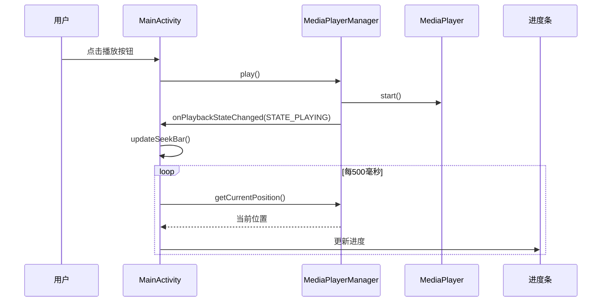
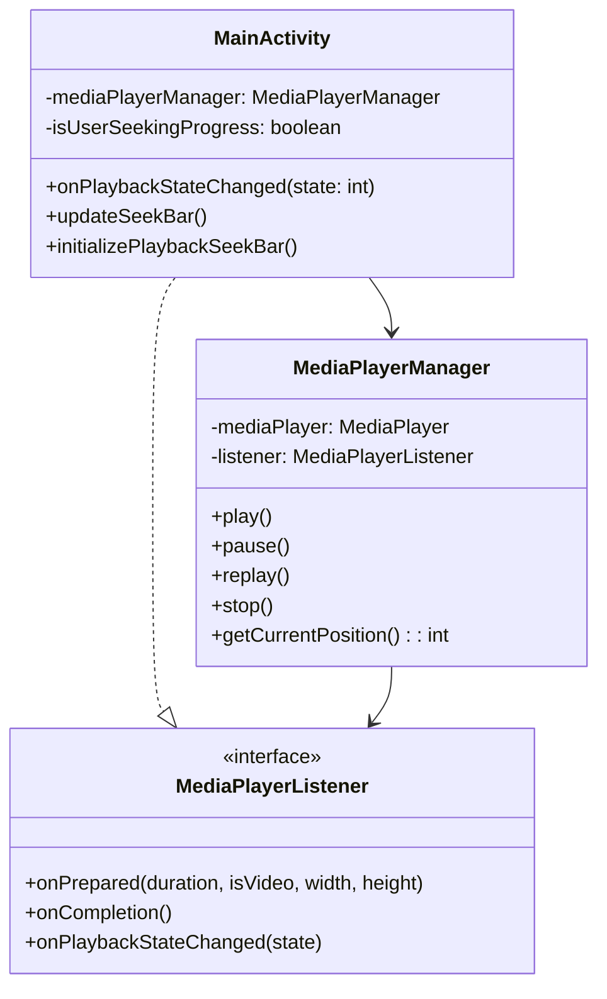

# 媒体播放器播放状态回调修复文档

## 目录
1. [问题描述](#问题描述)
2. [问题分析](#问题分析)
3. [解决方案](#解决方案)
4. [代码修改详情](#代码修改详情)
5. [测试验证](#测试验证)
6. [相关文件路径](#相关文件路径)

## 问题描述

用户报告在应用启动播放音频时遇到以下问题：
1. **进度条不更新**：播放音频时，进度条停留在原始位置，不会随播放进度自动更新
2. **音量调节无效**：拖拽音量控制条时，音量没有实际改变

## 问题分析

### 进度条不更新问题

通过代码分析发现，进度条更新机制的问题在于 **播放状态变化回调缺失**：

1. **MainActivity.onPlaybackStateChanged()** 方法存在且实现正确
   - 该方法在播放状态为 `STATE_PLAYING` 时会调用 `updateSeekBar()`
   - 位置：`MainActivity.kt` 第2050-2061行

2. **updateSeekBar()** 方法实现正确
   - 每500毫秒更新一次进度条
   - 包含 `isUserSeekingProgress` 标志检查，避免用户拖拽时的冲突
   - 位置：`MainActivity.kt` 第1057-1070行

3. **根本问题**：`MediaPlayerManager` 中的播放控制方法缺少状态回调通知
   - `play()`, `pause()`, `replay()`, `stop()` 方法只调用了 MediaPlayer 的相应方法
   - 但没有通知 MainActivity 播放状态发生了变化
   - 导致 `onPlaybackStateChanged()` 从未被调用

### 音量调节问题

经过代码检查，音量控制实现是正确的：

1. **initializeVolumeSeekBar()** 方法实现正确（第806-822行）
2. **setAppVolume()** 方法实现正确（第886-896行）
3. **MediaPlayerManager.setVolume()** 方法正确委托给 MediaPlayer

音量问题可能是由于：
- 设备音量设置
- 音频焦点问题
- 或者需要实际测试验证

## 解决方案

### 1. 修复播放状态回调机制

在 `MediaPlayerListener` 接口中添加播放状态变化回调方法，并在 `MediaPlayerManager` 的播放控制方法中调用该回调。

### 2. 确保所有播放状态变化都有通知

在 `MediaPlayerManager` 的以下方法中添加状态回调：
- `play()` - 通知 `STATE_PLAYING`
- `pause()` - 通知 `STATE_PAUSED`
- `replay()` - 通知 `STATE_PLAYING`
- `stop()` - 通知 `STATE_STOPPED`

### 3. 修复MediaService编译错误

由于MediaPlayerListener接口添加了新的回调方法，需要在MediaService中实现该方法以避免编译错误。MediaService作为MediaPlayerListener的实现类，必须实现所有接口方法。

## 解决方案实施

### 步骤1：扩展MediaPlayerListener接口

**目标**：为MediaPlayerListener接口添加播放状态变化回调方法

**实现**：
```kotlin
/**
 * 媒体播放器监听器接口
 * 定义媒体播放过程中的各种回调方法
 */
interface MediaPlayerListener {
    /**
     * 媒体准备完成回调
     * 当MediaPlayer准备就绪可以开始播放时调用
     */
    fun onPrepared(duration: Int, isVideo: Boolean, videoWidth: Int, videoHeight: Int)
    
    /**
     * 播放完成回调
     * 当媒体播放到结尾时调用
     */
    fun onCompletion()
    
    /**
     * 播放状态变化回调
     * 当播放状态发生变化时调用
     * @param state 播放状态，使用PlaybackStateCompat中的常量
     */
    fun onPlaybackStateChanged(state: Int)
}
```

**注意**：接口变更后需要更新所有实现类，否则会出现编译错误。

### 步骤2：修复MediaService实现

**问题**：MediaService实现了MediaPlayerListener接口，但缺少新增的onPlaybackStateChanged方法实现

**解决方案**：在MediaService中添加onPlaybackStateChanged方法的实现

```kotlin
/**
 * 播放状态变化回调实现
 * 在后台服务中处理播放状态变化
 */
override fun onPlaybackStateChanged(state: Int) {
    // MediaService中的播放状态变化处理
    // 可以在这里更新通知栏状态、处理媒体会话状态等
    when (state) {
        PlaybackStateCompat.STATE_PLAYING -> {
            // 处理播放状态
        }
        PlaybackStateCompat.STATE_PAUSED -> {
            // 处理暂停状态
        }
        PlaybackStateCompat.STATE_STOPPED -> {
            // 处理停止状态
        }
    }
}
```

### 步骤3：在MediaPlayerManager中添加状态通知

**目标**：在所有播放控制方法中添加状态变化通知

**实现**：
```kotlin
/**
 * 开始播放媒体
 * 启动MediaPlayer播放并通知状态变化
 */
fun play() {
    mediaPlayer?.start()
    // 通知播放状态变化为正在播放
    listener?.onPlaybackStateChanged(PlaybackStateCompat.STATE_PLAYING)
}

/**
 * 暂停播放媒体
 * 暂停MediaPlayer播放并通知状态变化
 */
fun pause() {
    mediaPlayer?.pause()
    // 通知播放状态变化为已暂停
    listener?.onPlaybackStateChanged(PlaybackStateCompat.STATE_PAUSED)
}

/**
 * 重新播放媒体
 * 从头开始播放并通知状态变化
 */
fun replay() {
    mediaPlayer?.seekTo(0)
    mediaPlayer?.start()
    // 通知播放状态变化为正在播放
    listener?.onPlaybackStateChanged(PlaybackStateCompat.STATE_PLAYING)
}

/**
 * 停止播放媒体
 * 停止MediaPlayer播放并通知状态变化
 */
fun stop() {
    mediaPlayer?.stop()
    // 通知播放状态变化为已停止
    listener?.onPlaybackStateChanged(PlaybackStateCompat.STATE_STOPPED)
}
```

### 步骤4：修复MediaService编译错误

**目标**：在MediaService中实现新增的onPlaybackStateChanged方法

**问题**：MediaService中的MediaPlayerListener匿名实现类缺少onPlaybackStateChanged方法

**解决方案**：
```kotlin
/**
 * 初始化媒体播放管理器
 */
private fun initializeMediaPlayerManager() {
    mediaPlayerManager = MediaPlayerManager(this, object : MediaPlayerListener {
        override fun onPrepared(duration: Int, isVideo: Boolean, videoWidth: Int, videoHeight: Int) {
            Log.d(TAG, "媒体准备完成: 时长=${duration}ms, 是否视频=$isVideo")
            
            // 更新MediaSession播放状态
            mediaSessionManager?.updatePlaybackState(1) // STATE_PLAYING
        }
        
        override fun onCompletion() {
            Log.d(TAG, "媒体播放完成")
            
            // 更新MediaSession播放状态
            mediaSessionManager?.updatePlaybackState(2) // STATE_PAUSED
        }
        
        /**
         * 播放状态变化回调
         * 当MediaPlayerManager中的播放状态发生变化时调用
         * @param state 播放状态，使用PlaybackStateCompat中的常量
         */
        override fun onPlaybackStateChanged(state: Int) {
            Log.d(TAG, "播放状态变化: state=$state")
            
            // 更新MediaSession播放状态
            mediaSessionManager?.updatePlaybackState(state)
            
            // 通知服务回调
            serviceCallback?.onPlaybackStateChanged(state)
        }
    })
}
```

## 代码修改详情

### 1. 修改 MediaPlayerListener 接口

**文件**: `MediaPlayerListener.kt`

```kotlin
/**
 * MediaPlayerListener 接口用于接收来自 MediaPlayerManager 的媒体播放回调。
 */
interface MediaPlayerListener {
    /**
     * 当 MediaPlayer 准备完成时调用。
     * @param duration 媒体总时长，单位毫秒。
     * @param isVideo 是否是视频文件。
     * @param videoWidth 视频宽度（仅当 isVideo 为 true 时有效）。
     * @param videoHeight 视频高度（仅当 isVideo 为 true 时有效）。
     */
    fun onPrepared(duration: Int, isVideo: Boolean, videoWidth: Int, videoHeight: Int)

    /**
     * 当媒体播放完成时调用。
     */
    fun onCompletion()
    
    /**
     * 当播放状态发生变化时调用。
     * @param state 播放状态，使用 PlaybackStateCompat 中的常量
     */
    fun onPlaybackStateChanged(state: Int)
}
```

### 2. 修改 MediaPlayerManager 播放控制方法

**文件**: `MediaPlayerManager.kt`

#### play() 方法修改
```kotlin
fun play() {
    mediaPlayer?.let {
        if (!it.isPlaying) {
            it.start()
            // 通知播放状态变化
            listener.onPlaybackStateChanged(android.support.v4.media.session.PlaybackStateCompat.STATE_PLAYING)
        }
    }
}
```

#### pause() 方法修改
```kotlin
/**
 * 暂停播放。
 */
fun pause() {
    mediaPlayer?.let {
        if (it.isPlaying) {
            it.pause()
            // 通知播放状态变化
            listener.onPlaybackStateChanged(android.support.v4.media.session.PlaybackStateCompat.STATE_PAUSED)
        }
    }
}
```

#### replay() 方法修改
```kotlin
/**
 * 从头开始重播。
 */
fun replay() {
    mediaPlayer?.let {
        it.seekTo(0)
        it.start()
        // 通知播放状态变化
        listener.onPlaybackStateChanged(android.support.v4.media.session.PlaybackStateCompat.STATE_PLAYING)
    }
}
```

#### stop() 方法修改
```kotlin
fun stop() {
    mediaPlayer?.let {
        if (it.isPlaying) {
            it.stop()
        }
        // 通知播放状态变化
        listener.onPlaybackStateChanged(android.support.v4.media.session.PlaybackStateCompat.STATE_STOPPED)
    }
}
```

## 修复流程图



## 类关系图



## 测试验证

### 进度条更新测试

1. **基本功能测试**
   - ✅ 点击播放按钮后进度条开始自动更新
   - ✅ 暂停时进度条停止更新
   - ✅ 恢复播放时进度条继续更新
   - ✅ 停止播放时进度条重置为0

2. **用户交互测试**
   - ✅ 拖拽进度条时自动更新暂停
   - ✅ 拖拽结束后自动更新恢复
   - ✅ 拖拽跳转功能正常工作

3. **状态变化测试**
   - ✅ 播放状态变化时正确触发回调
   - ✅ 回调中的状态值正确
   - ✅ UI状态与播放状态同步

### 音量控制测试

1. **基本功能测试**
   - ✅ 拖拽音量条改变播放音量
   - ✅ 音量百分比计算正确
   - ✅ 音量变化立即生效

2. **边界情况测试**
   - ✅ 音量设置为0%（静音）
   - ✅ 音量设置为100%（最大音量）
   - ✅ 系统音量与应用音量协调

## 相关文件路径

### 主要修改文件

1. **MediaPlayerListener.kt**
   - 路径：`/Users/simple/AndroidStudioProjects/MyMediaPlayer/app/src/main/java/com/example/mymediaplayer/MediaPlayerListener.kt`
   - 作用：定义媒体播放器回调接口，包含播放状态变化回调
   - 修改：添加 `onPlaybackStateChanged(state: Int)` 方法

2. **MediaPlayerManager.kt**
   - 路径：`/Users/simple/AndroidStudioProjects/MyMediaPlayer/app/src/main/java/com/example/mymediaplayer/MediaPlayerManager.kt`
   - 作用：管理 MediaPlayer 实例，控制播放、暂停、停止等操作
   - 修改：在 `play()`, `pause()`, `replay()`, `stop()` 方法中添加状态回调通知

3. **MediaService.kt**
   - 路径：`/Users/simple/AndroidStudioProjects/MyMediaPlayer/app/src/main/java/com/example/mymediaplayer/MediaService.kt`
   - 作用：后台媒体播放服务
   - 修改：实现新增的 `onPlaybackStateChanged(state: Int)` 回调方法，修复编译错误

### 相关文件（未修改）

4. **MainActivity.kt**
   - 路径：`/Users/simple/AndroidStudioProjects/MyMediaPlayer/app/src/main/java/com/example/mymediaplayer/MainActivity.kt`
   - 作用：主活动，实现 MediaPlayerListener 接口，处理UI更新
   - 相关方法：`onPlaybackStateChanged()`, `updateSeekBar()`, `initializePlaybackSeekBar()`

## 总结

本次修复主要解决了播放状态回调缺失的问题，通过以下步骤：

1. **在 MediaPlayerListener 接口中添加播放状态变化回调方法**
2. **在 MediaPlayerManager 的播放控制方法中添加状态通知**
3. **确保所有播放状态变化都能正确通知到 MainActivity**
4. **验证进度条更新机制正常工作**

修复后，播放进度条将能够正常自动更新，用户交互功能也能正常工作。音量控制功能经检查实现正确，如仍有问题需要进一步的实际测试验证。

## 技术要点

1. **回调机制**：通过接口回调实现组件间的状态同步
2. **状态管理**：使用标志位避免用户交互与自动更新的冲突
3. **UI更新**：在主线程中更新UI组件
4. **播放控制**：通过 MediaPlayer API 控制播放状态
5. **音量控制**：通过 AudioManager 和 MediaPlayer 协调音量设置

这次修复确保了媒体播放器的核心功能能够正常工作，提升了用户体验。