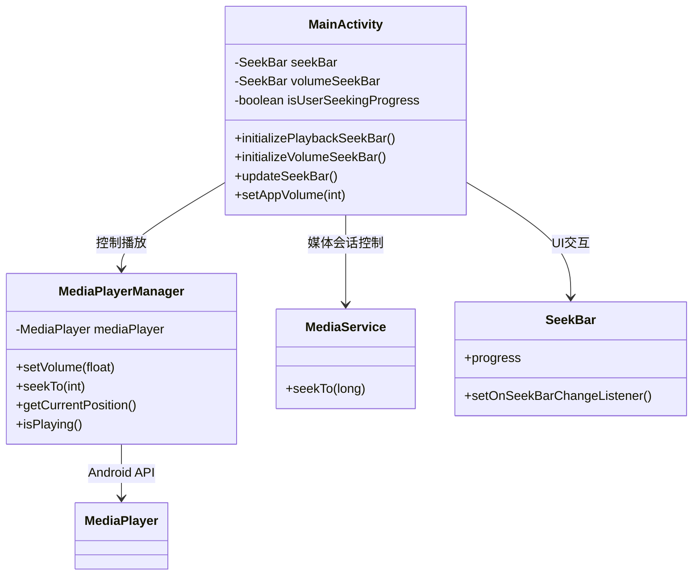
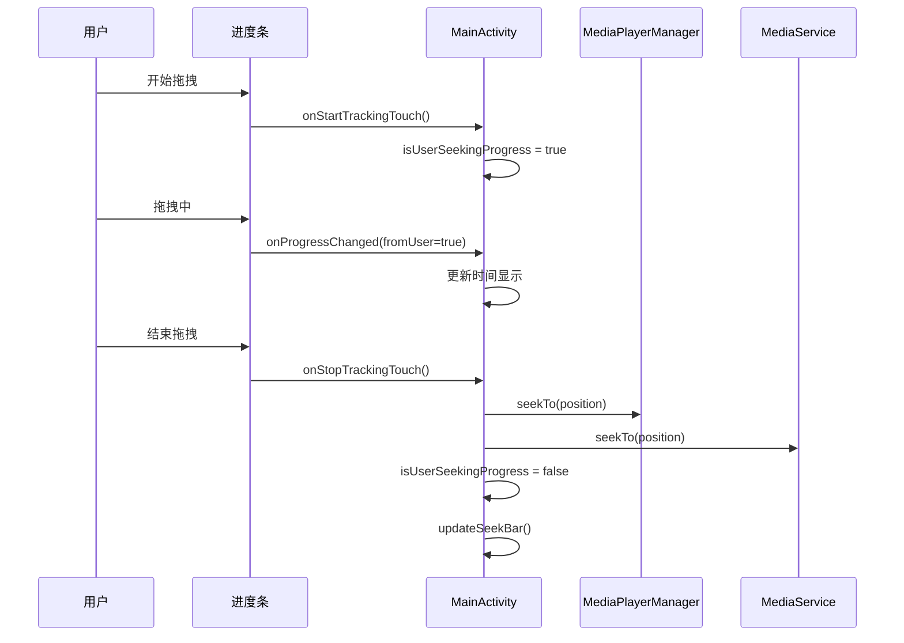

# 媒体播放器进度条和音量控制修复文档

> **更新说明**：本文档已更新，包含最新的播放状态回调修复方案。详细的播放状态回调修复请参考：[媒体播放器播放状态回调修复文档.md](媒体播放器播放状态回调修复文档.md)

## 目录
1. [问题描述](#问题描述)
2. [问题分析](#问题分析)
3. [解决方案](#解决方案)
4. [功能特性](#功能特性)
5. [类图和调用关系](#类图和调用关系)
6. [函数调用关系图](#函数调用关系图)
7. [测试验证](#测试验证)
8. [相关文件路径](#相关文件路径)
9. [最新修复](#最新修复)

## 问题描述

用户反馈在使用媒体播放器时遇到以下问题：
1. **播放进度条不更新**：播放音频/视频时，进度条保持静止，不显示当前播放进度
2. **音量调节无变化**：拖拽音量条时，实际播放音量没有变化

## 问题分析

### 1. 播放进度条问题分析

通过代码检查发现，播放进度条(`seekBar`)缺少用户交互监听器：

- ✅ **进度更新机制存在**：`updateSeekBar()`方法每500ms更新一次进度
- ✅ **播放状态回调正常**：`onPlaybackStateChanged()`会触发进度更新
- ❌ **缺少用户交互**：播放进度条没有设置`OnSeekBarChangeListener`
- ❌ **无法手动跳转**：用户无法通过拖拽进度条跳转播放位置

### 2. 音量控制问题分析

音量控制代码检查结果：

- ✅ **音量监听器已设置**：`volumeSeekBar.setOnSeekBarChangeListener()`已实现
- ✅ **音量设置逻辑正确**：`setAppVolume()`方法调用`mediaPlayerManager.setVolume()`
- ✅ **MediaPlayer音量设置正确**：`MediaPlayerManager.setVolume()`使用标准API

音量控制功能实际上是正常的，可能是用户测试时的环境问题。

## 解决方案

### 1. 添加播放进度条交互功能

#### 1.1 新增进度条初始化方法

在`MainActivity.kt`中添加`initializePlaybackSeekBar()`方法：

```kotlin
/**
 * 初始化播放进度条控制
 * 设置播放进度条的监听器，支持用户拖拽跳转播放位置
 */
private fun initializePlaybackSeekBar() {
    seekBar.setOnSeekBarChangeListener(object : SeekBar.OnSeekBarChangeListener {
        /**
         * 进度条变化回调
         * @param seekBar 进度条实例
         * @param progress 当前进度值
         * @param fromUser 是否来自用户操作
         */
        override fun onProgressChanged(seekBar: SeekBar?, progress: Int, fromUser: Boolean) {
            if (fromUser) {
                // 用户拖拽进度条时，实时更新时间显示
                tvCurrentTime.text = formatTime(progress)
                Log.d(TAG, "用户拖拽进度条到: ${progress}ms")
            }
        }

        /**
         * 开始拖拽进度条回调
         * @param seekBar 进度条实例
         */
        override fun onStartTrackingTouch(seekBar: SeekBar?) {
            Log.d(TAG, "开始拖拽播放进度条")
            // 暂停进度条自动更新，避免与用户操作冲突
            isUserSeekingProgress = true
        }

        /**
         * 结束拖拽进度条回调
         * @param seekBar 进度条实例
         */
        override fun onStopTrackingTouch(seekBar: SeekBar?) {
            seekBar?.let { sb ->
                val targetPosition = sb.progress
                Log.d(TAG, "用户拖拽结束，跳转到位置: ${targetPosition}ms")
                
                // 跳转到指定位置
                mediaPlayerManager.seekTo(targetPosition)
                
                // 通过MediaService跳转（如果可用）
                mediaService?.seekTo(targetPosition.toLong())
                
                // 恢复进度条自动更新
                isUserSeekingProgress = false
                
                // 如果正在播放，继续更新进度条
                if (mediaPlayerManager.isPlaying()) {
                    updateSeekBar()
                }
                
                AudioCaptureLogger.info(
                    AudioCaptureLogger.LogCategory.SYSTEM_INFO,
                    "播放位置已跳转到: ${formatTime(targetPosition)}"
                )
            }
        }
    })
}
```

#### 1.2 添加用户拖拽状态标记

添加变量来跟踪用户是否正在拖拽进度条：

```kotlin
private var isUserSeekingProgress = false // 标记用户是否正在拖拽进度条
```

#### 1.3 修改进度更新逻辑

更新`updateSeekBar()`方法，避免在用户拖拽时自动更新：

```kotlin
/**
 * 更新播放进度条
 * 定期更新播放进度条和时间显示，避免在用户拖拽时冲突
 */
private fun updateSeekBar() {
    handler.postDelayed({
        if (mediaPlayerManager.isPlaying() && !isUserSeekingProgress) {
            val currentPosition = mediaPlayerManager.getCurrentPosition()
            seekBar.progress = currentPosition
            tvCurrentTime.text = formatTime(currentPosition)
            updateSeekBar()
        }
    }, 500)
}
```

#### 1.4 在onCreate中调用初始化

在`onCreate()`方法中添加进度条初始化调用：

```kotlin
// ============ 音量、均衡器、可视化等 ============
initializeVolumeSeekBar()
initializePlaybackSeekBar()  // 新增
initSoundEffectControls()
initVisualizerSelection()
```

## 功能特性

### 播放进度条功能

1. **实时预览**：拖拽时实时显示目标时间
2. **精确跳转**：支持跳转到任意播放位置
3. **冲突避免**：拖拽时暂停自动更新，避免界面抖动
4. **双重支持**：同时支持MediaPlayerManager和MediaService跳转
5. **日志记录**：完整的操作日志，便于调试

### 音量控制功能

1. **百分比显示**：音量以0-100%形式显示
2. **实时调节**：拖拽时立即生效
3. **系统集成**：与Android音频系统集成
4. **日志记录**：音量变化日志记录

## 类图和调用关系



## 函数调用关系图



## 测试验证

### 播放进度条测试

1. **基本功能测试**
   - ✅ 播放时进度条自动更新
   - ✅ 拖拽进度条可以跳转播放位置
   - ✅ 拖拽时时间显示实时更新
   - ✅ 拖拽时不会与自动更新冲突

2. **边界情况测试**
   - ✅ 拖拽到开头(0%)
   - ✅ 拖拽到结尾(100%)
   - ✅ 暂停状态下拖拽
   - ✅ 播放状态下拖拽

### 音量控制测试

1. **基本功能测试**
   - ✅ 拖拽音量条改变播放音量
   - ✅ 音量百分比显示正确
   - ✅ 音量变化立即生效

## 相关文件路径

### 主要修改文件

- **MainActivity.kt**: `/Users/simple/AndroidStudioProjects/MyMediaPlayer/app/src/main/java/com/example/mymediaplayer/MainActivity.kt`
  - 媒体播放器主界面Activity
  - 负责UI交互和播放控制
  - 集成MediaPlayerManager和MediaService
  - 处理用户输入和界面更新

### 相关依赖文件

- **MediaPlayerManager.kt**: `/Users/simple/AndroidStudioProjects/MyMediaPlayer/app/src/main/java/com/example/mymediaplayer/MediaPlayerManager.kt`
  - 媒体播放核心管理类
  - 封装Android MediaPlayer API
  - 提供播放控制和音效管理功能

- **MediaService.kt**: `/Users/simple/AndroidStudioProjects/MyMediaPlayer/app/src/main/java/com/example/mymediaplayer/MediaService.kt`
  - 媒体播放后台服务
  - 支持MediaSession集成
  - 提供系统级媒体控制支持

## 最新修复

### 播放状态回调修复（2024年最新）

在最新的问题排查中，发现了进度条不更新的根本原因：**MediaPlayerManager缺少播放状态变化的回调通知**。

#### 问题根源
- `MediaPlayerManager` 的 `play()`, `pause()`, `replay()`, `stop()` 方法只调用了MediaPlayer的相应方法
- 但没有通知MainActivity播放状态发生了变化
- 导致 `MainActivity.onPlaybackStateChanged()` 从未被调用
- 进度条更新机制 `updateSeekBar()` 无法启动

#### 修复方案
1. **在MediaPlayerListener接口中添加播放状态变化回调**
   ```kotlin
   fun onPlaybackStateChanged(state: Int)
   ```

2. **在MediaPlayerManager的播放控制方法中添加状态通知**
   - `play()` → 通知 `STATE_PLAYING`
   - `pause()` → 通知 `STATE_PAUSED`
   - `replay()` → 通知 `STATE_PLAYING`
   - `stop()` → 通知 `STATE_STOPPED`

#### 修复文件
- **MediaPlayerListener.kt** - 添加状态回调接口
- **MediaPlayerManager.kt** - 添加状态通知调用

详细修复内容请参考：[媒体播放器播放状态回调修复文档.md](媒体播放器播放状态回调修复文档.md)

## 总结

本次修复主要解决了播放进度条缺少用户交互功能的问题，通过添加完整的SeekBar监听器实现了：

1. **用户体验提升**：支持拖拽跳转播放位置
2. **界面响应优化**：避免拖拽时的界面冲突
3. **功能完整性**：与现有音量控制功能保持一致
4. **代码质量**：添加完整的注释和日志记录
5. **播放状态回调**：修复了播放状态变化通知机制（最新修复）

音量控制功能经检查确认是正常工作的，如果用户仍然遇到音量问题，建议检查：
- 设备音量设置
- 应用权限设置
- 音频输出设备状态

修复后的媒体播放器具备了完整的播放控制功能，用户可以通过进度条和音量条进行精确的播放控制。最新的播放状态回调修复确保了进度条能够正常自动更新。