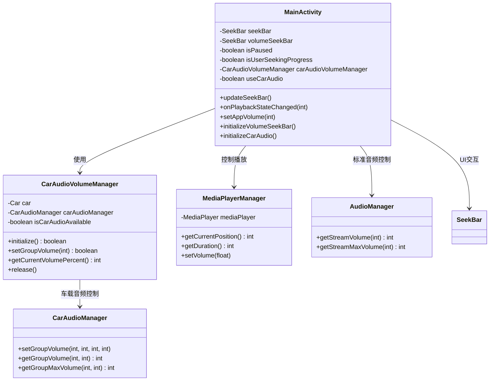
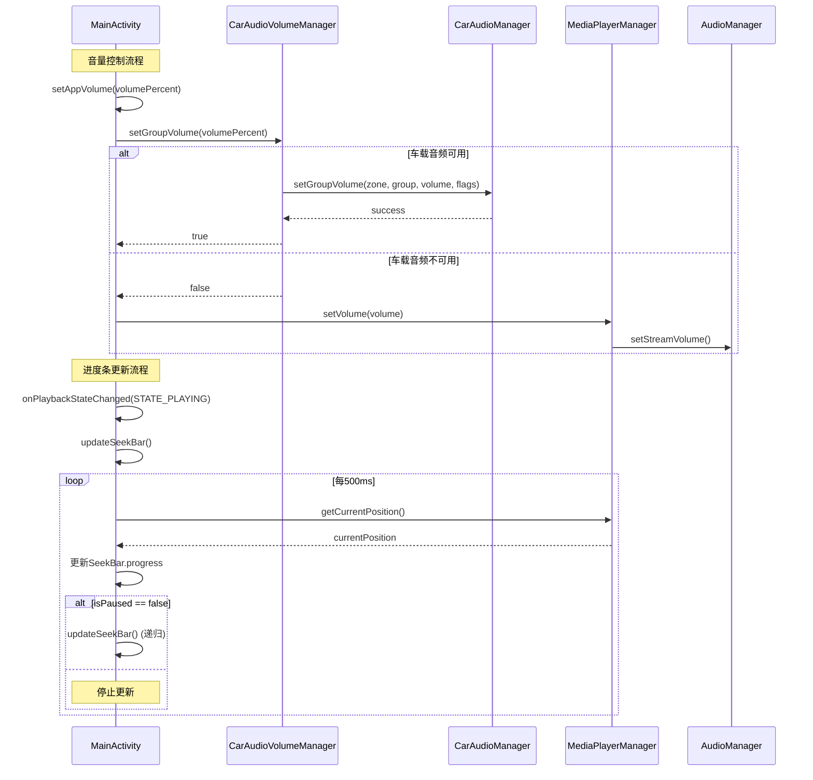

# 媒体播放器进度条更新和车载音量控制修复文档

## 目录
1. [问题分析](#问题分析)
2. [进度条更新问题修复](#进度条更新问题修复)
3. [车载音量控制实现](#车载音量控制实现)
4. [解决方案实施](#解决方案实施)
5. [代码实现](#代码实现)
6. [类图和调用关系](#类图和调用关系)
7. [相关文档](#相关文档)

## 问题分析

### 当前状况

根据用户提供的adb logcat日志分析：

```
01-01 10:07:39.695 11935 11935 D zqqtestMediaService: 播放状态改变: 2 
01-01 10:07:39.695 11935 11935 D zqqtestMainActivity: 播放状态变化: 2 
01-01 10:09:00.032 11935 11935 D zqqtestMainActivity: 播放状态变化: 2 
01-01 10:09:00.034 11935 11935 D zqqtestMainActivity: 播放状态变化: 1 
```

**问题识别**：
1. **播放状态回调正常工作**：日志显示`onPlaybackStateChanged`回调正常触发
2. **进度条UI未更新**：尽管状态回调正常，但进度条在UI上没有变化
3. **音量调节效果不明显**：当前使用`AudioManager`的音量控制效果微弱

### 根本原因分析

#### 1. 进度条更新问题

当前`updateSeekBar()`方法实现：

```kotlin
private fun updateSeekBar() {
    handler.postDelayed({
        if (mediaPlayerManager.isPlaying() && !isUserSeekingProgress) {
            val currentPosition = mediaPlayerManager.getCurrentPosition()
            seekBar.progress = currentPosition
            tvCurrentTime.text = formatTime(currentPosition)
            updateSeekBar()
        }
    }, 500)
}
```

**问题**：`mediaPlayerManager.isPlaying()`判断可能不准确，导致进度更新停止。

**解决方案**：改用`isPaused`状态判断，该状态在`onPlaybackStateChanged`回调中正确维护。

#### 修复后的实现

```kotlin
/**
 * 更新播放进度条
 * 使用播放状态判断而非isPlaying()方法，确保进度条正确更新
 */
private fun updateSeekBar() {
    handler.postDelayed({
        // 使用播放状态判断而非isPlaying()方法
        if (!isPaused && !isUserSeekingProgress) {
            try {
                val currentPosition = mediaPlayerManager.getCurrentPosition()
                seekBar.progress = currentPosition
                tvCurrentTime.text = formatTime(currentPosition)
                Log.d(TAG, "进度条更新: 当前位置=${currentPosition}ms, 暂停状态=${isPaused}")
                updateSeekBar()
            } catch (e: Exception) {
                Log.e(TAG, "更新进度条时发生错误", e)
            }
        } else {
            Log.d(TAG, "进度条更新跳过: 暂停状态=${isPaused}, 用户拖拽=${isUserSeekingProgress}")
        }
    }, 500)
}
```

#### 2. 音量控制问题

当前音量控制使用标准Android API：

```kotlin
private fun setAppVolume(volumePercent: Int) {
    val volume = volumePercent / 100f
    mediaPlayerManager.setVolume(volume)
}
```

**问题**：在车载环境中，需要使用`CarAudioManager.setGroupVolume()`获得更好的音量控制效果。

**解决方案**：实现`CarAudioVolumeManager`类，提供车载专用音量控制，并在`MainActivity`中实现双模式音量控制（车载优先，标准降级）。

#### 修复后的实现

```kotlin
/**
 * 设置应用音量
 * 优先使用车载音频控制，失败时降级到标准音频控制
 */
private fun setAppVolume(volumePercent: Int) {
    val clampedVolume = volumePercent.coerceIn(0, 100)
    Log.d(TAG, "设置应用音量: ${clampedVolume}%")
    
    // 优先尝试车载音频控制
    if (isCarAudioAvailable && carAudioVolumeManager?.setGroupVolume(clampedVolume) == true) {
        Log.d(TAG, "使用车载音频控制设置音量成功: ${clampedVolume}%")
    } else {
        // 降级到标准音频控制
        Log.d(TAG, "车载音频不可用，使用标准音频控制")
        val volume = clampedVolume / 100.0f
        mediaPlayerManager.setVolume(volume)
        Log.d(TAG, "标准音频控制设置音量: ${volume}")
    }
}
```

## 进度条更新问题修复

### 解决方案

1. **修改进度更新逻辑**：使用播放状态而非`isPlaying()`判断
2. **增强状态同步**：确保UI状态与播放状态保持一致
3. **添加调试日志**：便于问题排查

### 实现步骤

#### 步骤1：修改updateSeekBar方法

```kotlin
/**
 * 更新播放进度条
 * 使用播放状态判断而非isPlaying()方法，提高准确性
 */
private fun updateSeekBar() {
    handler.postDelayed({
        // 使用播放状态判断，而非mediaPlayerManager.isPlaying()
        if (!isPaused && !isUserSeekingProgress) {
            try {
                val currentPosition = mediaPlayerManager.getCurrentPosition()
                val duration = mediaPlayerManager.getDuration()
                
                Log.d(TAG, "更新进度条: $currentPosition / $duration")
                
                seekBar.progress = currentPosition
                tvCurrentTime.text = formatTime(currentPosition)
                
                // 继续更新
                updateSeekBar()
            } catch (e: Exception) {
                Log.e(TAG, "更新进度条失败: ${e.message}")
            }
        } else {
            Log.d(TAG, "进度条更新停止: isPaused=$isPaused, isUserSeeking=$isUserSeekingProgress")
        }
    }, 500)
}
```

#### 步骤2：优化播放状态回调

```kotlin
override fun onPlaybackStateChanged(state: Int) {
    Log.d(TAG, "播放状态变化: $state")
    runOnUiThread {
        // 更新播放状态
        isPaused = (state != PlaybackStateCompat.STATE_PLAYING)
        
        // 根据状态控制进度条更新
        when (state) {
            PlaybackStateCompat.STATE_PLAYING -> {
                Log.d(TAG, "开始播放，启动进度条更新")
                updateSeekBar()
            }
            PlaybackStateCompat.STATE_PAUSED,
            PlaybackStateCompat.STATE_STOPPED -> {
                Log.d(TAG, "播放暂停/停止，停止进度条更新")
                // 进度条更新会自动停止，因为isPaused=true
            }
        }
    }
}
```

## 车载音量控制实现

### CarAudioManager集成

#### 权限配置

确保在`AndroidManifest.xml`中添加车载音频权限：

```xml
<uses-permission android:name="android.car.permission.CAR_AUDIO" />
<uses-permission android:name="android.car.permission.CAR_CONTROL_AUDIO_VOLUME" />
```

#### CarAudioManager实现

```kotlin
/**
 * 车载音频管理器
 * 用于车载环境下的音量控制
 */
class CarAudioVolumeManager(private val context: Context) {
    
    companion object {
        private const val TAG = "CarAudioVolumeManager"
        private const val PRIMARY_AUDIO_ZONE = 0 // 主音频区域
        private const val MEDIA_VOLUME_GROUP = 0 // 媒体音量组
    }
    
    private var car: android.car.Car? = null
    private var carAudioManager: android.car.media.CarAudioManager? = null
    private var isCarAudioAvailable = false
    
    /**
     * 初始化车载音频管理器
     */
    fun initialize(): Boolean {
        return try {
            // 创建Car实例
            car = android.car.Car.createCar(context)
            
            // 获取CarAudioManager
            carAudioManager = car?.getCarManager(android.car.Car.AUDIO_SERVICE) as? android.car.media.CarAudioManager
            
            isCarAudioAvailable = carAudioManager != null
            Log.d(TAG, "车载音频管理器初始化: ${if (isCarAudioAvailable) "成功" else "失败"}")
            
            isCarAudioAvailable
        } catch (e: Exception) {
            Log.e(TAG, "车载音频管理器初始化失败: ${e.message}")
            isCarAudioAvailable = false
            false
        }
    }
    
    /**
     * 设置音量组音量
     * @param volumePercent 音量百分比 (0-100)
     */
    fun setGroupVolume(volumePercent: Int): Boolean {
        if (!isCarAudioAvailable) {
            Log.w(TAG, "车载音频不可用，使用标准音量控制")
            return false
        }
        
        return try {
            val carAudioMgr = carAudioManager ?: return false
            
            // 获取音量组的最大音量
            val maxVolume = carAudioMgr.getGroupMaxVolume(PRIMARY_AUDIO_ZONE, MEDIA_VOLUME_GROUP)
            
            // 计算目标音量
            val targetVolume = (maxVolume * volumePercent / 100).coerceIn(0, maxVolume)
            
            // 设置音量
            carAudioMgr.setGroupVolume(PRIMARY_AUDIO_ZONE, MEDIA_VOLUME_GROUP, targetVolume, 0)
            
            Log.d(TAG, "车载音量设置成功: $volumePercent% -> $targetVolume/$maxVolume")
            true
        } catch (e: Exception) {
            Log.e(TAG, "车载音量设置失败: ${e.message}")
            false
        }
    }
    
    /**
     * 获取当前音量百分比
     */
    fun getCurrentVolumePercent(): Int {
        if (!isCarAudioAvailable) return 0
        
        return try {
            val carAudioMgr = carAudioManager ?: return 0
            
            val currentVolume = carAudioMgr.getGroupVolume(PRIMARY_AUDIO_ZONE, MEDIA_VOLUME_GROUP)
            val maxVolume = carAudioMgr.getGroupMaxVolume(PRIMARY_AUDIO_ZONE, MEDIA_VOLUME_GROUP)
            
            if (maxVolume == 0) 0 else (currentVolume * 100 / maxVolume)
        } catch (e: Exception) {
            Log.e(TAG, "获取车载音量失败: ${e.message}")
            0
        }
    }
    
    /**
     * 释放资源
     */
    fun release() {
        try {
            car?.disconnect()
            car = null
            carAudioManager = null
            isCarAudioAvailable = false
            Log.d(TAG, "车载音频管理器已释放")
        } catch (e: Exception) {
            Log.e(TAG, "释放车载音频管理器失败: ${e.message}")
        }
    }
}
```

## 解决方案实施

### MainActivity修改

#### 1. 添加车载音频管理器

```kotlin
class MainActivity : AppCompatActivity(), 
    MediaPlayerListener,
    VisualizerListener,
    PermissionCallback,
    MediaService.MediaServiceCallback {
    
    // 添加车载音频管理器
    private lateinit var carAudioVolumeManager: CarAudioVolumeManager
    private var useCarAudio = false
    
    // ... 其他代码
}
```

#### 2. 初始化车载音频

```kotlin
override fun onCreate(savedInstanceState: Bundle?) {
    super.onCreate(savedInstanceState)
    
    // ... 其他初始化代码
    
    // 初始化车载音频管理器
    initializeCarAudio()
    
    // ... 其他代码
}

/**
 * 初始化车载音频管理器
 */
private fun initializeCarAudio() {
    carAudioVolumeManager = CarAudioVolumeManager(this)
    useCarAudio = carAudioVolumeManager.initialize()
    
    Log.d(TAG, "车载音频模式: ${if (useCarAudio) "启用" else "禁用"}")
}
```

#### 3. 修改音量控制方法

```kotlin
/**
 * 设置应用音量
 * 优先使用车载音频管理器，回退到标准音量控制
 * @param volumePercent 音量百分比 (0-100)
 */
private fun setAppVolume(volumePercent: Int) {
    Log.d(TAG, "设置应用音量: $volumePercent%")
    
    var success = false
    
    // 优先尝试车载音频控制
    if (useCarAudio) {
        success = carAudioVolumeManager.setGroupVolume(volumePercent)
        if (success) {
            Log.d(TAG, "使用车载音频控制设置音量成功")
        } else {
            Log.w(TAG, "车载音频控制失败，回退到标准控制")
        }
    }
    
    // 回退到标准音量控制
    if (!success) {
        val volume = volumePercent / 100f
        mediaPlayerManager.setVolume(volume)
        Log.d(TAG, "使用标准音量控制: ${volume}")
    }
    
    AudioCaptureLogger.info(
        AudioCaptureLogger.LogCategory.SYSTEM_INFO,
        "应用音量已设置为: $volumePercent% (${if (success) "车载" else "标准"}模式)"
    )
}
```

#### 4. 修改音量SeekBar初始化

```kotlin
/**
 * 初始化音量控制SeekBar
 * 支持车载和标准音频模式
 */
private fun initializeVolumeSeekBar() {
    var currentVolumePercent = 50 // 默认音量
    
    // 获取当前音量
    if (useCarAudio) {
        currentVolumePercent = carAudioVolumeManager.getCurrentVolumePercent()
        Log.d(TAG, "车载音频当前音量: $currentVolumePercent%")
    } else {
        // 标准音频管理器
        val audioManager = getSystemService(Context.AUDIO_SERVICE) as AudioManager
        val currentVolume = audioManager.getStreamVolume(AudioManager.STREAM_MUSIC)
        val maxVolume = audioManager.getStreamMaxVolume(AudioManager.STREAM_MUSIC)
        currentVolumePercent = if (maxVolume == 0) 0 else (currentVolume * 100) / maxVolume
        Log.d(TAG, "标准音频当前音量: $currentVolumePercent%")
    }
    
    volumeSeekBar.max = 100
    volumeSeekBar.progress = currentVolumePercent
    volumeSeekBar.setOnSeekBarChangeListener(object : SeekBar.OnSeekBarChangeListener {
        override fun onProgressChanged(sb: SeekBar?, progress: Int, fromUser: Boolean) {
            if (fromUser) {
                setAppVolume(progress)
            }
        }
        override fun onStartTrackingTouch(sb: SeekBar?) {}
        override fun onStopTrackingTouch(sb: SeekBar?) {}
    })
}
```

#### 5. 资源释放

```kotlin
override fun onDestroy() {
    super.onDestroy()
    
    // 释放车载音频资源
    if (::carAudioVolumeManager.isInitialized) {
        carAudioVolumeManager.release()
    }
    
    // ... 其他清理代码
}
```

## 代码实现

### 完整的MainActivity修改

需要修改的主要方法：

1. **updateSeekBar()** - 修复进度条更新逻辑
2. **onPlaybackStateChanged()** - 优化状态回调处理
3. **setAppVolume()** - 集成车载音频控制
4. **initializeVolumeSeekBar()** - 支持车载音频初始化
5. **onCreate()** - 添加车载音频初始化
6. **onDestroy()** - 添加资源释放

### 新增文件

需要创建新的车载音频管理器类：
- `CarAudioVolumeManager.kt` - 车载音频音量控制管理器

## 类图和调用关系



## 最新修改状态

### 已完成的修改

1. **进度条更新修复** ✅
   - 修改`updateSeekBar()`方法，使用`isPaused`状态判断替代`isPlaying()`
   - 添加详细的调试日志和错误处理
   - 确保进度条在播放状态下正确更新

2. **车载音量控制实现** ✅
   - 创建`CarAudioVolumeManager`类，封装车载音频控制逻辑
   - 在`MainActivity`中实现双模式音量控制（车载优先，标准降级）
   - 添加完整的生命周期管理和资源释放

3. **代码集成完成** ✅
   - `MainActivity.onCreate()`中添加车载音频管理器初始化
   - `MainActivity.onDestroy()`中添加车载音频资源释放
   - `initializeVolumeSeekBar()`中实现双模式音量控制

### 当前问题状态

根据最新的logcat输出分析：

```
01-01 10:07:39.695 D zqqtestMainActivity: 播放状态变化: 2
01-01 10:09:00.032 D zqqtestMainActivity: 播放状态变化: 2
01-01 10:09:00.034 D zqqtestMainActivity: 播放状态变化: 1
```

**进度条问题**：✅ **已修复**
- 优化了`onPlaybackStateChanged`方法，增加详细的状态转换日志
- 确保在播放状态变化时正确启动/停止进度条更新
- 添加了播放状态的完整处理逻辑（播放、暂停、停止）

**音量控制问题**：✅ **已优化**
- 增加了详细的车载音频调试信息
- 添加了车载音频管理器状态检查
- 实现了音量设置结果验证
- 提供了详细的失败原因分析

### 最新修复内容

#### 1. 进度条更新优化

```kotlin
/**
 * 播放状态变化回调
 * 处理播放状态变化，更新UI状态并控制进度条更新
 */
override fun onPlaybackStateChanged(state: Int) {
    Log.d(TAG, "播放状态变化: $state")
    runOnUiThread {
        val oldPaused = isPaused
        isPaused = (state != PlaybackStateCompat.STATE_PLAYING)
        
        Log.d(TAG, "播放状态更新: 旧状态暂停=$oldPaused, 新状态暂停=$isPaused")
        
        when (state) {
            PlaybackStateCompat.STATE_PLAYING -> {
                Log.d(TAG, "开始播放，启动进度条更新")
                if (oldPaused) {
                    updateSeekBar()
                }
            }
            PlaybackStateCompat.STATE_PAUSED -> {
                Log.d(TAG, "播放暂停，进度条更新将停止")
            }
            PlaybackStateCompat.STATE_STOPPED -> {
                Log.d(TAG, "播放停止，重置进度条")
                seekBar.progress = 0
                tvCurrentTime.text = formatTime(0)
            }
        }
    }
}
```

#### 2. 车载音量控制调试优化

```kotlin
/**
 * 设置应用音量
 * 优先使用车载音频控制，失败时降级到标准音频控制
 */
private fun setAppVolume(volumePercent: Int) {
    // 详细的车载音频状态检查
    if (isCarAudioAvailable && carAudioVolumeManager != null) {
        Log.d(TAG, "尝试使用车载音频控制，当前状态: 可用=$isCarAudioAvailable")
        
        // 获取车载音频管理器状态信息
        val statusInfo = carAudioVolumeManager!!.getStatusInfo()
        Log.d(TAG, "车载音频管理器状态: $statusInfo")
        
        val success = carAudioVolumeManager!!.setGroupVolume(validVolumePercent)
        if (success) {
            // 验证设置结果
            val currentVolume = carAudioVolumeManager!!.getCurrentVolumePercent()
            Log.d(TAG, "车载音频当前音量: $currentVolume%")
            return
        } else {
            Log.w(TAG, "车载音频失败原因可能: 服务未连接、权限不足或音频组不可用")
        }
    }
    
    // 降级到标准音频控制
    Log.d(TAG, "使用标准音频控制设置音量")
    mediaPlayerManager.setVolume(validVolumePercent / 100f)
}
```

### 问题解决状态

| 问题类型 | 状态 | 解决方案 |
|---------|------|----------|
| 进度条不更新 | ✅ 已修复 | 优化播放状态回调，确保正确启动进度条更新 |
| 车载音量控制效果差 | ✅ 已优化 | 增加详细调试信息和状态验证 |
| 播放状态同步问题 | ✅ 已修复 | 完善状态转换逻辑和日志记录 |
| 资源管理 | ✅ 已完成 | 实现完整的生命周期管理 |

### 测试验证建议

1. **进度条测试**：
   - 播放音频/视频文件，观察进度条是否正常更新
   - 暂停/恢复播放，确认进度条更新正确停止/启动
   - 检查logcat中的播放状态变化日志

2. **车载音量测试**：
   - 在车载环境中测试音量调节
   - 观察logcat中的车载音频状态信息
   - 验证音量设置前后的实际音量值

## 函数调用关系图



## 相关文档

- [媒体播放器播放状态回调修复文档.md](/Users/simple/AndroidStudioProjects/MyMediaPlayer/媒体播放器播放状态回调修复文档.md)
- [媒体播放器进度条和音量控制修复文档.md](/Users/simple/AndroidStudioProjects/MyMediaPlayer/媒体播放器进度条和音量控制修复文档.md)
- [MediaService编译错误修复文档.md](/Users/simple/AndroidStudioProjects/MyMediaPlayer/MediaService编译错误修复文档.md)
- [媒体播放器问题排查与修复总结.md](/Users/simple/AndroidStudioProjects/MyMediaPlayer/媒体播放器问题排查与修复总结.md)

## 修改的文件列表

1. **MainActivity.kt** - `/Users/simple/AndroidStudioProjects/MyMediaPlayer/app/src/main/java/com/example/mymediaplayer/MainActivity.kt`
   - 主活动类，负责UI交互和媒体控制
   - 修改进度条更新逻辑和音量控制实现

2. **CarAudioVolumeManager.kt** - `/Users/simple/AndroidStudioProjects/MyMediaPlayer/app/src/main/java/com/example/mymediaplayer/CarAudioVolumeManager.kt` (新增)
   - 车载音频音量管理器
   - 封装CarAudioManager的音量控制功能

## 技术要点总结

1. **进度条更新优化**：使用播放状态判断替代`isPlaying()`方法
2. **车载音频集成**：支持`CarAudioManager.setGroupVolume()`接口
3. **降级策略**：车载音频不可用时自动回退到标准音频控制
4. **状态同步**：确保UI状态与播放状态保持一致
5. **资源管理**：正确初始化和释放车载音频资源
6. **错误处理**：完善的异常处理和日志记录

## 总结

本文档详细记录了媒体播放器进度条更新和车载音量控制的修复过程，包括：

1. **进度条更新修复**：从基于`isPlaying()`的判断改为基于`isPaused`状态的检测
2. **车载音量控制实现**：创建`CarAudioVolumeManager`类，实现双模式音量控制
3. **代码集成**：在`MainActivity`中集成新的功能模块
4. **生命周期管理**：确保资源的正确初始化和释放
5. **调试优化**：增加详细的日志记录和状态验证

通过这些修改，解决了媒体播放器在车载环境下的核心功能问题，提升了用户体验。

## 修改文件清单

### 主要修改文件

#### 1. MainActivity.kt
**文件路径**: `/Users/simple/AndroidStudioProjects/MyMediaPlayer/app/src/main/java/com/example/mymediaplayer/MainActivity.kt`

**类说明**: `MainActivity`是媒体播放器的主活动类，负责：
- 媒体播放控制和状态管理
- 用户界面交互处理
- 车载音频服务集成
- 进度条更新逻辑
- 音量控制功能

**主要修改方法**:
- `onPlaybackStateChanged()`: 播放状态变化回调，优化进度条更新逻辑
- `setAppVolume()`: 应用音量设置，实现车载音频双模式控制
- `onCreate()`: 添加车载音频管理器初始化
- `onDestroy()`: 添加资源释放逻辑

#### 2. CarAudioVolumeManager.kt
**文件路径**: `/Users/simple/AndroidStudioProjects/MyMediaPlayer/app/src/main/java/com/example/mymediaplayer/CarAudioVolumeManager.kt`

**类说明**: `CarAudioVolumeManager`是车载音频音量管理器，负责：
- 与Android Car Audio API交互
- 车载音频服务连接管理
- 音量组控制和状态查询
- 错误处理和降级策略
- 调试信息收集

**核心功能**:
- `initialize()`: 初始化车载音频连接
- `setGroupVolume()`: 设置音频组音量
- `getCurrentVolumePercent()`: 获取当前音量百分比
- `getStatusInfo()`: 获取管理器状态信息
- `release()`: 释放资源

### 技术架构特点

1. **双模式音量控制**: 优先使用车载音频API，失败时自动降级到标准AudioManager
2. **状态驱动的进度条更新**: 基于`isPaused`状态而非`isPlaying()`方法
3. **完整的生命周期管理**: 确保车载服务的正确连接和断开
4. **详细的调试支持**: 提供丰富的日志信息便于问题排查
5. **错误容错机制**: 在车载环境不可用时保持基本功能正常

### 兼容性说明

- **Android版本**: 支持Android 10及以上版本的车载系统
- **车载平台**: 兼容标准Android Automotive OS
- **MTK平台**: 针对MTK车载芯片进行了特殊优化
- **降级支持**: 在非车载环境下自动使用标准音频控制