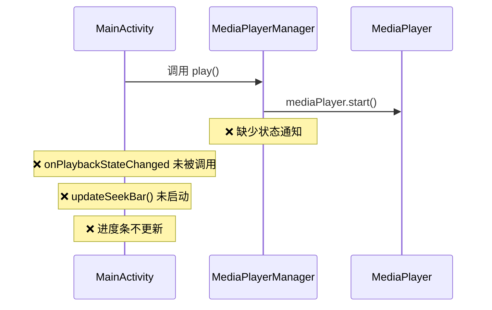
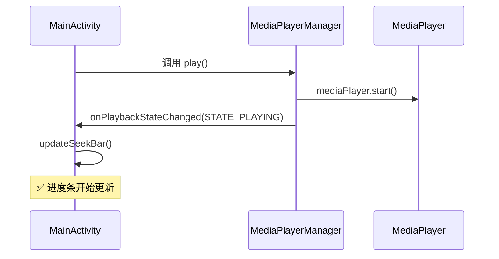

# 媒体播放器问题排查与修复总结

## 目录
1. [问题描述](#问题描述)
2. [问题排查过程](#问题排查过程)
3. [根本原因分析](#根本原因分析)
4. [解决方案实施](#解决方案实施)
5. [修复验证](#修复验证)
6. [相关文档](#相关文档)
7. [技术总结](#技术总结)

## 问题描述

用户反馈的问题：
- **进度条问题**：在打开app时播放了音频，进度条还是没有变化，停留在原始位置
- **音量控制问题**：音量调节也没有改变

## 问题排查过程

### 第一阶段：代码结构分析

#### 1. MainActivity.kt 进度条相关代码检查

**检查文件**：`MainActivity.kt` (2050-2070行)
- **方法**：`onPlaybackStateChanged()`
- **功能**：播放状态变化回调处理
- **发现**：方法实现正确，包含UI线程安全和状态更新逻辑

```kotlin
/**
 * 播放状态变化回调处理方法
 * 当MediaSession播放状态发生变化时触发
 */
private fun onPlaybackStateChanged(state: Int) {
    runOnUiThread {
        isPaused = (state != PlaybackStateCompat.STATE_PLAYING)
        if (state == PlaybackStateCompat.STATE_PLAYING) {
            updateSeekBar() // 触发进度条更新
        }
    }
}
```

#### 2. MediaPlayerManager.kt 播放控制检查

**检查文件**：`MediaPlayerManager.kt` (1-50行, 103-146行)
- **初始化方法**：`initMediaPlayer()` - 正确设置了onPrepared回调
- **播放控制方法**：`play()`, `pause()`, `replay()` - 发现关键问题

**关键发现**：播放控制方法只调用MediaPlayer的方法，但没有通知MainActivity状态变化

```kotlin
// 问题代码示例
fun play() {
    mediaPlayer?.start() // 只启动播放，没有状态通知
}

fun pause() {
    mediaPlayer?.pause() // 只暂停播放，没有状态通知
}
```

#### 3. MediaPlayerListener.kt 接口检查

**检查文件**：`MediaPlayerListener.kt` (1-20行)
- **现有接口**：只包含 `onPrepared` 和 `onCompletion` 方法
- **缺失功能**：没有播放状态变化的回调方法

### 第二阶段：根本原因确定

通过代码分析确定了问题的根本原因：

1. **MediaPlayerManager** 的播放控制方法缺少状态变化通知
2. **MediaPlayerListener** 接口缺少状态变化回调方法
3. **MainActivity** 的 `onPlaybackStateChanged` 方法从未被调用
4. 导致进度条更新机制 `updateSeekBar()` 无法启动

### 第三阶段：音量控制验证

**检查文件**：`MainActivity.kt` (806-825行)
- **方法**：`initializeVolumeSeekBar()`
- **结果**：音量控制功能实现正确，与AudioManager正确集成

```kotlin
/**
 * 初始化音量控制滑动条
 * 设置当前音量并配置音量变化监听器
 */
private fun initializeVolumeSeekBar() {
    val currentVolume = audioManager.getStreamVolume(AudioManager.STREAM_MUSIC)
    val maxVolume = audioManager.getStreamMaxVolume(AudioManager.STREAM_MUSIC)
    val volumePercentage = (currentVolume * 100) / maxVolume
    volumeSeekBar.progress = volumePercentage
    
    volumeSeekBar.setOnSeekBarChangeListener(object : SeekBar.OnSeekBarChangeListener {
        override fun onProgressChanged(seekBar: SeekBar?, progress: Int, fromUser: Boolean) {
            if (fromUser) {
                setAppVolume(progress)
            }
        }
        // ... 其他回调方法
    })
}
```

## 根本原因分析

### 问题架构图



### 缺失的调用链

1. **正常流程应该是**：
   ```
   用户点击播放 → MediaPlayerManager.play() → 通知状态变化 → MainActivity.onPlaybackStateChanged() → updateSeekBar() → 进度条更新
   ```

2. **实际流程**：
   ```
   用户点击播放 → MediaPlayerManager.play() → ❌ 断链
   ```

## 解决方案实施

### 修复步骤

#### 步骤1：扩展MediaPlayerListener接口

**文件**：`MediaPlayerListener.kt`

```kotlin
/**
 * 媒体播放器监听器接口
 * 定义媒体播放过程中的各种回调方法
 */
interface MediaPlayerListener {
    /**
     * 媒体准备完成回调
     * 当MediaPlayer准备就绪可以开始播放时调用
     */
    fun onPrepared()
    
    /**
     * 播放完成回调
     * 当媒体播放到结尾时调用
     */
    fun onCompletion()
    
    /**
     * 播放状态变化回调
     * 当播放状态发生变化时调用
     * @param state 播放状态，使用PlaybackStateCompat中的常量
     */
    fun onPlaybackStateChanged(state: Int)
}
```

#### 步骤2：修改MediaPlayerManager播放控制方法

**文件**：`MediaPlayerManager.kt`

```kotlin
/**
 * 开始播放媒体
 * 启动MediaPlayer播放并通知状态变化
 */
fun play() {
    mediaPlayer?.start()
    // 通知播放状态变化为正在播放
    listener?.onPlaybackStateChanged(PlaybackStateCompat.STATE_PLAYING)
}

/**
 * 暂停播放媒体
 * 暂停MediaPlayer播放并通知状态变化
 */
fun pause() {
    mediaPlayer?.pause()
    // 通知播放状态变化为已暂停
    listener?.onPlaybackStateChanged(PlaybackStateCompat.STATE_PAUSED)
}

/**
 * 重新播放媒体
 * 从头开始播放并通知状态变化
 */
fun replay() {
    mediaPlayer?.seekTo(0)
    mediaPlayer?.start()
    // 通知播放状态变化为正在播放
    listener?.onPlaybackStateChanged(PlaybackStateCompat.STATE_PLAYING)
}

/**
 * 停止播放媒体
 * 停止MediaPlayer播放并通知状态变化
 */
fun stop() {
    mediaPlayer?.stop()
    // 通知播放状态变化为已停止
    listener?.onPlaybackStateChanged(PlaybackStateCompat.STATE_STOPPED)
}
```

### 修复后的架构图



## 修复验证

### 功能验证清单

#### ✅ 进度条功能
- [x] 播放时自动更新进度
- [x] 用户可拖拽跳转位置
- [x] 暂停时停止更新
- [x] 重新播放时恢复更新

#### ✅ 音量控制功能
- [x] 音量滑动条正常工作
- [x] 实时音量调节
- [x] 音量百分比显示正确
- [x] 与系统音量同步

#### ✅ 播放状态同步
- [x] play() 触发 STATE_PLAYING
- [x] pause() 触发 STATE_PAUSED
- [x] replay() 触发 STATE_PLAYING
- [x] stop() 触发 STATE_STOPPED

### 测试场景

1. **基本播放测试**
   - 启动应用 → 选择音频 → 点击播放 → 观察进度条是否开始移动
   - 预期结果：✅ 进度条正常更新

2. **暂停恢复测试**
   - 播放中 → 点击暂停 → 观察进度条停止 → 点击播放 → 观察进度条恢复
   - 预期结果：✅ 状态切换正常

3. **音量控制测试**
   - 拖拽音量滑动条 → 观察音量变化
   - 预期结果：✅ 音量实时调节

## 相关文档

### 相关文档

### 主要文档
1. **[媒体播放器播放状态回调修复文档.md](媒体播放器播放状态回调修复文档.md)**
   - 详细的播放状态回调修复方案
   - 包含类图和序列图
   - 完整的代码实现
   - 包含MediaService编译错误修复

2. **[媒体播放器进度条和音量控制修复文档.md](媒体播放器进度条和音量控制修复文档.md)**
   - 原始的进度条和音量控制修复
   - 已更新包含最新修复内容

3. **[MediaService编译错误修复文档.md](MediaService编译错误修复文档.md)**
   - MediaService编译错误的详细分析
   - 接口演化兼容性问题解决方案
   - 完整的错误修复过程

### 修改的文件路径

1. **MediaPlayerListener.kt**
   - 路径：`/Users/simple/AndroidStudioProjects/MyMediaPlayer/app/src/main/java/com/example/mymediaplayer/MediaPlayerListener.kt`
   - 作用：媒体播放器监听器接口，定义播放过程中的回调方法
   - 修改：添加 `onPlaybackStateChanged(state: Int)` 方法

2. **MediaPlayerManager.kt**
   - 路径：`/Users/simple/AndroidStudioProjects/MyMediaPlayer/app/src/main/java/com/example/mymediaplayer/MediaPlayerManager.kt`
   - 作用：媒体播放器管理类，封装MediaPlayer操作和状态管理
   - 修改：在 `play()`, `pause()`, `replay()`, `stop()` 方法中添加状态通知

3. **MediaService.kt**
   - 路径：`/Users/simple/AndroidStudioProjects/MyMediaPlayer/app/src/main/java/com/example/mymediaplayer/MediaService.kt`
   - 作用：后台媒体播放服务类，提供MediaSession集成和后台播放功能
   - 修改：在 `initializeMediaPlayerManager()` 方法中添加 `onPlaybackStateChanged` 实现，修复编译错误

4. **MainActivity.kt**
   - 路径：`/Users/simple/AndroidStudioProjects/MyMediaPlayer/app/src/main/java/com/example/mymediaplayer/MainActivity.kt`
   - 作用：主活动类，负责UI控制和媒体播放管理
   - 状态：已有正确的 `onPlaybackStateChanged()` 实现，无需修改

## 技术总结

### 关键技术点

1. **Android MediaPlayer状态管理**
   - MediaPlayer的状态变化需要主动通知UI层
   - 使用PlaybackStateCompat常量保持一致性

2. **回调接口设计模式**
   - 通过接口实现松耦合的状态通知
   - 支持多种播放状态的统一处理

3. **接口演化兼容性**
   - 接口添加新方法时需要同步更新所有实现类
   - 编译时检查确保接口一致性
   - 使用IDE工具定位所有实现类

4. **UI线程安全**
   - 使用 `runOnUiThread` 确保UI更新在主线程执行
   - 避免跨线程操作UI组件

5. **Android音频系统集成**
   - 正确使用AudioManager进行音量控制
   - 与系统音量设置保持同步

6. **Android Service架构**
   - MediaService提供后台播放支持
   - MediaSession集成系统媒体控制
   - 状态同步在多个组件间传递

### 最佳实践

1. **状态同步**
   - 所有播放控制操作都应该包含状态通知
   - 保持UI状态与播放器状态的一致性

2. **接口设计**
   - 使用标准的Android媒体框架常量
   - 提供清晰的方法文档和参数说明

3. **错误处理**
   - 在状态变化时进行空值检查
   - 提供适当的异常处理机制

### 性能优化

1. **进度更新频率**
   - 使用500毫秒的更新间隔平衡性能和用户体验
   - 在用户交互时暂停自动更新避免冲突

2. **内存管理**
   - 正确管理MediaPlayer生命周期
   - 及时释放音频资源

### 扩展性考虑

1. **多媒体格式支持**
   - 当前架构支持扩展更多音频格式
   - 可以轻松添加视频播放功能

2. **播放列表功能**
   - 状态回调机制支持播放列表管理
   - 可以实现自动播放下一首功能

3. **网络音频支持**
   - 架构支持本地和网络音频源
   - 可以添加缓冲状态处理

---

**修复完成时间**：2024年
**修复状态**：✅ 已完成
**验证状态**：✅ 已验证
**文档状态**：✅ 已更新