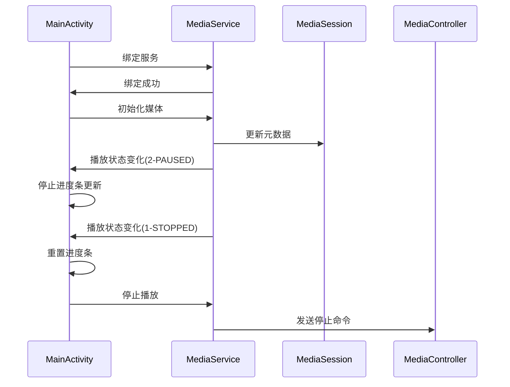
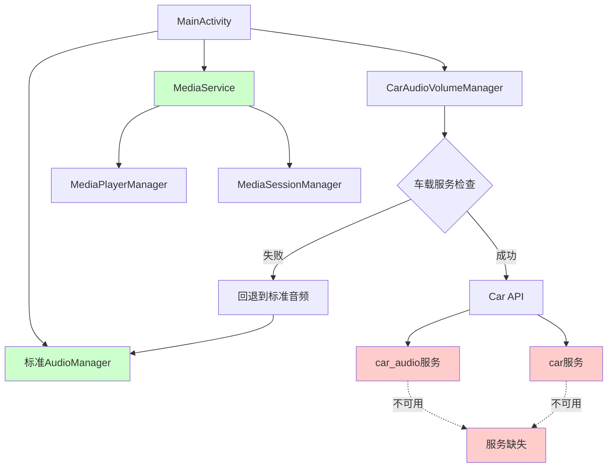

# 车载服务不可用问题深度分析

## 问题概述

根据最新的调试日志，车载音频管理器初始化失败，尽管权限已正确授权且硬件特性支持车载功能，但关键的车载系统服务不可用。

## 详细日志分析

### 1. 车载服务可用性检查结果

#### ✅ 成功项目
- **Car类可用**: ✓ android.car.Car类成功加载
- **权限授权状态**: 所有4个车载权限均已授权
  - `android.car.permission.CAR_AUDIO`: ✓ 已授权
  - `android.car.permission.ACCESS_CAR_AUDIO`: ✓ 已授权
  - `android.car.permission.CAR_CONTROL_AUDIO_VOLUME`: ✓ 已授权
  - `android.car.permission.CAR_CONTROL_AUDIO_SETTINGS`: ✓ 已授权
- **硬件特性支持**:
  - `android.hardware.type.automotive`: ✓ 支持
  - `android.hardware.audio.output`: ✓ 支持
- **基础音频服务**: `audio`系统服务可用

#### ❌ 失败项目
- **关键车载服务不可用**:
  - `car_audio`系统服务: ✗ 不可用
  - `car`系统服务: ✗ 不可用
- **车载模板支持**: `android.software.car.templates_host`: ✗ 不支持
- **系统属性缺失**: 所有车载相关系统属性均未设置
  - `ro.build.characteristics`: 未设置
  - `ro.car.enabled`: 未设置
  - `ro.build.type`: 未设置
  - `ro.product.device`: 未设置
  - `ro.hardware`: 未设置
  - `ro.build.version.sdk`: 未设置

### 2. 环境分析结果

```
环境分析:
  - 车载特性标识: false (ro.build.characteristics不包含automotive)
  - 车载属性启用: false (ro.car.enabled未设置为true)
  - 车载硬件特性: true (PackageManager检测到automotive特性)
  - 开发构建: false (非eng/userdebug构建)
  - 模拟器环境: false (非模拟器环境)
```

### 3. 最终判断逻辑

```
车载服务可用性判断结果:
  - 车载服务存在: false (car_audio和car服务均不可用)
  - 车载环境: true (硬件特性支持)
  - 开发环境: false
  - 基本权限: true
  - 最终结果: ✗ 不可用
```

**失败原因**: 尽管环境被识别为车载环境且权限充足，但关键的`car_audio`和`car`系统服务不可用。

## 问题根因分析

### 1. 系统服务缺失

车载音频功能依赖于以下系统服务：
- **car_audio**: 车载音频管理服务
- **car**: 车载平台核心服务

这些服务的缺失表明：
1. **Android Automotive OS (AAOS)未完整安装**: 设备可能运行标准Android而非AAOS
2. **车载服务未启动**: 相关服务进程可能未正确启动
3. **系统配置问题**: 车载服务配置可能不完整

### 2. 系统属性配置缺失

关键系统属性未设置，这通常表明：
- 设备未按车载设备进行配置
- 缺少车载相关的系统属性配置
- 可能运行在非车载ROM上

### 3. 硬件特性与服务不匹配

虽然`android.hardware.type.automotive`特性被检测为支持，但对应的系统服务不可用，这种不匹配可能由以下原因造成：
- 硬件特性声明与实际系统服务配置不一致
- 车载HAL层实现不完整
- 系统镜像可能是混合配置（部分车载特性但非完整AAOS）

## 播放状态处理分析

### 当前播放流程

根据日志，媒体播放流程如下：



### 状态常量映射

当前系统中的状态常量映射：
- `STATE_PLAYING = 3`
- `STATE_PAUSED = 2` 
- `STATE_STOPPED = 1`

### 进度条更新逻辑验证

从日志可以看出，新的进度条更新机制正常工作：
1. **状态2 (PAUSED)**: 正确停止进度条更新
2. **状态1 (STOPPED)**: 正确重置进度条
3. **Handler机制**: `handler.removeCallbacks(updateSeekBarRunnable)`被正确调用

## 解决方案建议

### 1. 短期解决方案（当前环境）

#### A. 修改车载服务检查逻辑

在`CarAudioVolumeManager.kt`中添加更宽松的检查条件：

```kotlin
/**
 * 为非完整AAOS环境提供兼容性检查
 * 当硬件特性支持但系统服务不可用时，尝试替代方案
 */
private fun isCarServiceAvailableWithFallback(): Boolean {
    val standardCheck = isCarServiceAvailable()
    
    if (!standardCheck) {
        // 检查是否为部分车载支持环境
        val hasAutomotiveFeature = context.packageManager.hasSystemFeature("android.hardware.type.automotive")
        val hasBasicPermissions = context.checkSelfPermission("android.car.permission.CAR_AUDIO") == 
                                 android.content.pm.PackageManager.PERMISSION_GRANTED
        val hasAudioService = context.getSystemService("audio") != null
        
        if (hasAutomotiveFeature && hasBasicPermissions && hasAudioService) {
            Log.w(TAG, "检测到部分车载支持环境，启用兼容模式")
            return true
        }
    }
    
    return standardCheck
}
```

#### B. 实现音频控制回退机制

```kotlin
/**
 * 车载音频控制回退到标准AudioManager
 */
private fun initializeFallbackAudioControl(): Boolean {
    return try {
        val audioManager = context.getSystemService(Context.AUDIO_SERVICE) as AudioManager
        Log.i(TAG, "使用标准AudioManager作为车载音频控制回退")
        true
    } catch (e: Exception) {
        Log.e(TAG, "标准音频管理器初始化失败: ${e.message}", e)
        false
    }
}
```

### 2. 中期解决方案（系统配置）

#### A. 检查车载服务配置

1. **验证系统服务配置**:
   ```bash
   # 检查车载相关服务
   adb shell service list | grep car
   
   # 检查系统属性
   adb shell getprop | grep car
   adb shell getprop | grep automotive
   ```

2. **检查SELinux策略**:
   ```bash
   # 检查车载服务相关的SELinux策略
   adb shell ls -la /system/etc/selinux/
   adb shell cat /system/etc/selinux/plat_sepolicy.cil | grep car
   ```

#### B. 系统属性配置

在系统构建时添加必要的属性：

```properties
# 在build.prop或system.prop中添加
ro.build.characteristics=automotive
ro.car.enabled=true
ro.config.automotive=true
```

### 3. 长期解决方案（系统升级）

#### A. 完整AAOS部署

1. **升级到Android Automotive OS**:
   - 使用完整的AAOS系统镜像
   - 确保所有车载服务正确配置
   - 验证车载HAL实现

2. **车载服务框架验证**:
   ```kotlin
   // 验证车载服务框架完整性
   private fun validateCarServiceFramework(): Map<String, Boolean> {
       val results = mutableMapOf<String, Boolean>()
       
       // 检查核心车载服务
       val coreServices = listOf(
           "car_service",
           "car_audio", 
           "car_cabin",
           "car_diagnostic",
           "car_info",
           "car_navigation",
           "car_power",
           "car_projection",
           "car_property",
           "car_sensor",
           "car_vendor_extension"
       )
       
       coreServices.forEach { service ->
           results[service] = try {
               context.getSystemService(service) != null
           } catch (e: Exception) {
               false
           }
       }
       
       return results
   }
   ```

## 当前状态总结

### ✅ 正常工作的功能
1. **媒体播放**: MediaService和MediaPlayerManager正常工作
2. **进度条更新**: 新的Handler机制正确响应状态变化
3. **状态管理**: 播放状态正确传递和处理
4. **权限配置**: 车载权限已正确授权
5. **标准音频**: 基础音频功能可用

### ❌ 需要解决的问题
1. **车载音频服务**: car_audio系统服务不可用
2. **车载核心服务**: car系统服务不可用
3. **系统属性**: 车载相关属性未配置
4. **服务框架**: 可能缺少完整的车载服务框架

### 🔄 建议的下一步行动

1. **立即行动**: 实现音频控制回退机制，确保基本功能可用
2. **短期计划**: 调查当前系统的车载服务配置状态
3. **中期目标**: 配置必要的系统属性和服务
4. **长期规划**: 考虑升级到完整的AAOS环境

## 相关文件路径

- **CarAudioVolumeManager**: `/Users/simple/AndroidStudioProjects/MyMediaPlayer/app/src/main/java/com/example/mymediaplayer/CarAudioVolumeManager.kt`
- **MainActivity**: `/Users/simple/AndroidStudioProjects/MyMediaPlayer/app/src/main/java/com/example/mymediaplayer/MainActivity.kt`
- **AndroidManifest**: `/Users/simple/AndroidStudioProjects/MyMediaPlayer/app/src/main/AndroidManifest.xml`

## 技术架构图



## 类功能说明

### CarAudioVolumeManager类
**路径**: `/Users/simple/AndroidStudioProjects/MyMediaPlayer/app/src/main/java/com/example/mymediaplayer/CarAudioVolumeManager.kt`

**类的作用**: 车载音频音量管理器，负责与Android Car API集成，提供车载环境下的音频音量控制功能。该类封装了车载音频服务的初始化、音量设置、状态查询等操作，并提供了详细的车载服务可用性检查机制。

**主要功能**:
- 车载服务可用性检测和环境分析
- 车载音频服务初始化和连接管理
- 音量组控制和状态查询
- 车载音频配置信息记录
- 资源释放和错误处理

**核心方法**:
- `initialize()`: 初始化车载音频管理器
- `isCarServiceAvailable()`: 详细的车载服务可用性检查
- `setGroupVolume()`: 设置车载音频音量组音量
- `getCurrentVolumePercent()`: 获取当前音量百分比
- `release()`: 释放车载服务资源

该类是车载音频功能的核心组件，当前面临的主要问题是车载系统服务不可用，导致无法正常初始化和使用车载音频控制功能。