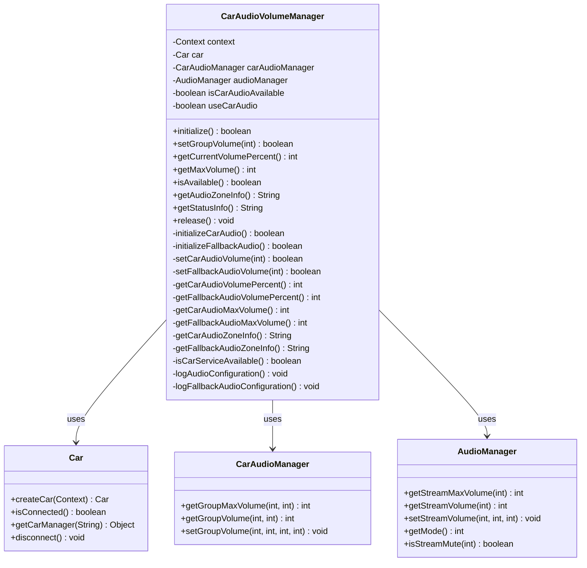
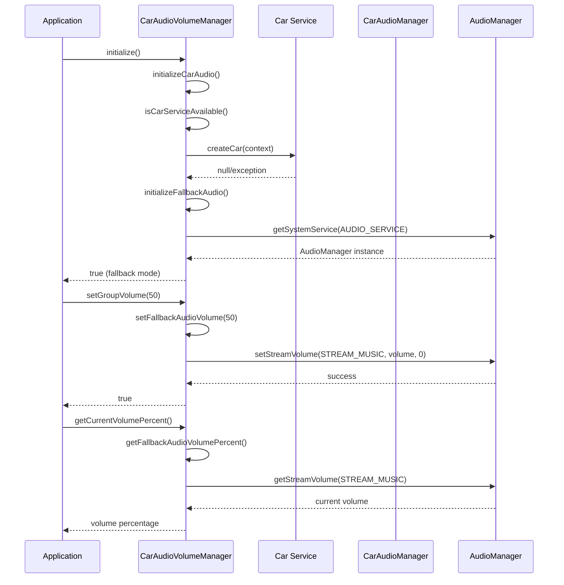

# 车载音频回退机制实现文档

## 目录
1. [概述](#概述)
2. [问题分析](#问题分析)
3. [解决方案](#解决方案)
4. [代码实现](#代码实现)
5. [功能验证](#功能验证)
6. [类图和调用关系](#类图和调用关系)
7. [总结](#总结)

## 概述

本文档记录了在Android车载媒体播放器项目中实现音频控制回退机制的完整过程。当车载服务不可用时，系统能够自动切换到标准AudioManager进行音频控制，确保应用的音频功能正常工作。

## 问题分析

### 原始问题
根据用户提供的日志信息，车载音频管理器初始化失败：

```
CarAudioVolumeManager: 系统服务 car_audio: ✗ 不可用
CarAudioVolumeManager: 系统服务 car: ✗ 不可用
CarAudioVolumeManager: 最终结果: ✗ 不可用
MainActivity: 车载音频管理器初始化失败，将使用标准音频控制
```

### 问题分析
1. **车载服务不可用**：系统中缺少car_audio和car系统服务
2. **权限已授权**：所有车载音频相关权限都已正确授权
3. **硬件特性支持**：设备支持automotive硬件特性
4. **需要回退方案**：当车载服务不可用时，需要使用标准AudioManager

## 解决方案

### 设计思路
实现双模式音频控制系统：
1. **主模式**：优先使用车载音频服务（CarAudioManager）
2. **回退模式**：当车载服务不可用时，自动切换到标准音频管理器（AudioManager）
3. **透明切换**：对外接口保持一致，内部自动选择合适的控制方式

### 核心特性
- **自动检测**：启动时自动检测车载服务可用性
- **无缝回退**：车载服务不可用时自动使用标准音频控制
- **统一接口**：对外提供一致的音频控制接口
- **完整日志**：详细记录两种模式的状态和操作

## 代码实现

### 1. 类结构增强

#### 新增字段
```kotlin
/**
 * 标准音频管理器实例
 * 用于车载音频不可用时的回退控制
 */
private var audioManager: AudioManager? = null

/**
 * 是否使用车载音频控制
 * true: 使用CarAudioManager
 * false: 使用AudioManager
 */
private var useCarAudio = false
```

### 2. 初始化流程重构

#### 主初始化方法
```kotlin
/**
 * 初始化音频管理器
 * 优先尝试车载音频，失败时回退到标准音频
 * 
 * @return Boolean 初始化是否成功
 */
fun initialize(): Boolean {
    Log.d(TAG, "开始初始化音频管理器")
    
    // 首先尝试初始化车载音频
    if (initializeCarAudio()) {
        useCarAudio = true
        Log.i(TAG, "车载音频初始化成功，使用车载音频控制")
        return true
    }
    
    // 车载音频失败，尝试标准音频回退
    if (initializeFallbackAudio()) {
        useCarAudio = false
        Log.i(TAG, "标准音频初始化成功，使用标准音频控制")
        return true
    }
    
    Log.e(TAG, "所有音频初始化方式都失败")
    return false
}
```

#### 车载音频初始化
```kotlin
/**
 * 初始化车载音频管理器
 * 
 * @return Boolean 车载音频初始化是否成功
 */
private fun initializeCarAudio(): Boolean {
    Log.d(TAG, "尝试初始化车载音频")
    
    try {
        // 检查车载服务可用性
        if (!isCarServiceAvailable()) {
            Log.w(TAG, "车载服务不可用")
            return false
        }
        
        // 创建Car实例
        car = Car.createCar(context)
        if (car == null || !car!!.isConnected) {
            Log.e(TAG, "Car实例创建失败或未连接")
            return false
        }
        
        // 获取CarAudioManager
        val audioService = car!!.getCarManager(Car.AUDIO_SERVICE)
        carAudioManager = audioService as? CarAudioManager
        
        if (carAudioManager == null) {
            Log.e(TAG, "无法获取CarAudioManager")
            return false
        }
        
        isCarAudioAvailable = true
        Log.i(TAG, "车载音频初始化成功")
        logAudioConfiguration()
        return true
        
    } catch (e: SecurityException) {
        Log.e(TAG, "车载音频初始化权限不足: ${e.message}")
        return false
    } catch (e: Exception) {
        Log.e(TAG, "车载音频初始化失败: ${e.message}")
        return false
    }
}
```

#### 标准音频初始化
```kotlin
/**
 * 初始化标准音频管理器（回退方案）
 * 
 * @return Boolean 标准音频初始化是否成功
 */
private fun initializeFallbackAudio(): Boolean {
    Log.d(TAG, "尝试初始化标准音频（回退方案）")
    
    try {
        audioManager = context.getSystemService(Context.AUDIO_SERVICE) as? AudioManager
        if (audioManager == null) {
            Log.e(TAG, "无法获取AudioManager")
            return false
        }
        
        Log.i(TAG, "标准音频初始化成功")
        logFallbackAudioConfiguration()
        return true
    } catch (e: Exception) {
        Log.e(TAG, "标准音频初始化失败: ${e.message}")
        return false
    }
}
```

### 3. 音量控制实现

#### 主音量设置方法
```kotlin
/**
 * 设置音量百分比
 * 根据当前模式选择车载音频或标准音频控制
 * 
 * @param volumePercent Int 音量百分比 (0-100)
 * @return Boolean 设置是否成功
 */
fun setGroupVolume(volumePercent: Int): Boolean {
    // 音量范围验证
    val validPercent = volumePercent.coerceIn(0, 100)
    if (validPercent != volumePercent) {
        Log.w(TAG, "音量百分比超出范围，已调整: $volumePercent -> $validPercent")
    }
    
    return if (useCarAudio) {
        setCarAudioVolume(validPercent)
    } else {
        setFallbackAudioVolume(validPercent)
    }
}
```

#### 车载音频音量控制
```kotlin
/**
 * 设置车载音频音量
 * 
 * @param volumePercent Int 音量百分比 (0-100)
 * @return Boolean 设置是否成功
 */
private fun setCarAudioVolume(volumePercent: Int): Boolean {
    if (!isCarAudioAvailable) {
        Log.w(TAG, "车载音频不可用，无法设置音量")
        return false
    }
    
    return try {
        val carAudioMgr = carAudioManager ?: return false
        
        val maxVolume = carAudioMgr.getGroupMaxVolume(PRIMARY_AUDIO_ZONE, MEDIA_VOLUME_GROUP)
        val targetVolume = (maxVolume * volumePercent / 100).coerceIn(0, maxVolume)
        
        Log.d(TAG, "设置车载音频音量: $volumePercent% -> $targetVolume/$maxVolume")
        
        carAudioMgr.setGroupVolume(PRIMARY_AUDIO_ZONE, MEDIA_VOLUME_GROUP, targetVolume, VOLUME_FLAG_NO_UI)
        
        // 验证设置结果
        val actualVolume = carAudioMgr.getGroupVolume(PRIMARY_AUDIO_ZONE, MEDIA_VOLUME_GROUP)
        val success = actualVolume == targetVolume
        
        Log.d(TAG, "车载音频音量设置${if (success) "成功" else "失败"}: 目标=$targetVolume, 实际=$actualVolume")
        success
        
    } catch (e: SecurityException) {
        Log.e(TAG, "设置车载音频音量权限不足: ${e.message}")
        false
    } catch (e: Exception) {
        Log.e(TAG, "设置车载音频音量失败: ${e.message}")
        false
    }
}
```

#### 标准音频音量控制
```kotlin
/**
 * 设置标准音频音量（回退方案）
 * 
 * @param volumePercent Int 音量百分比 (0-100)
 * @return Boolean 设置是否成功
 */
private fun setFallbackAudioVolume(volumePercent: Int): Boolean {
    return try {
        val audioMgr = audioManager ?: return false
        
        val maxVolume = audioMgr.getStreamMaxVolume(AudioManager.STREAM_MUSIC)
        val targetVolume = (maxVolume * volumePercent / 100).coerceIn(0, maxVolume)
        
        Log.d(TAG, "设置标准音频音量: $volumePercent% -> $targetVolume/$maxVolume")
        
        audioMgr.setStreamVolume(AudioManager.STREAM_MUSIC, targetVolume, 0)
        
        // 验证设置结果
        val actualVolume = audioMgr.getStreamVolume(AudioManager.STREAM_MUSIC)
        val success = actualVolume == targetVolume
        
        Log.d(TAG, "标准音频音量设置${if (success) "成功" else "失败"}: 目标=$targetVolume, 实际=$actualVolume")
        success
        
    } catch (e: Exception) {
        Log.e(TAG, "设置标准音频音量失败: ${e.message}")
        false
    }
}
```

### 4. 音量查询实现

#### 当前音量百分比查询
```kotlin
/**
 * 获取当前音量百分比
 * 根据当前模式选择车载音频或标准音频查询
 * 
 * @return Int 当前音量百分比 (0-100)，失败返回-1
 */
fun getCurrentVolumePercent(): Int {
    return if (useCarAudio) {
        getCarAudioVolumePercent()
    } else {
        getFallbackAudioVolumePercent()
    }
}
```

#### 最大音量查询
```kotlin
/**
 * 获取最大音量值
 * 根据当前模式选择车载音频或标准音频查询
 * 
 * @return Int 最大音量值，失败返回-1
 */
fun getMaxVolume(): Int {
    return if (useCarAudio) {
        getCarAudioMaxVolume()
    } else {
        getFallbackAudioMaxVolume()
    }
}
```

### 5. 状态查询和信息获取

#### 可用性检查
```kotlin
/**
 * 检查音频控制是否可用（车载音频或标准音频）
 * 
 * @return Boolean 音频控制是否可用
 */
fun isAvailable(): Boolean {
    // 如果使用车载音频模式，检查车载音频是否可用
    if (useCarAudio) {
        return isCarAudioAvailable && carAudioManager != null
    }
    // 如果使用标准音频模式，检查AudioManager是否可用
    return audioManager != null
}
```

#### 音频区域信息
```kotlin
/**
 * 获取音频区域信息
 * 用于调试和配置验证
 * 
 * @return String 音频区域信息
 */
fun getAudioZoneInfo(): String {
    return if (useCarAudio) {
        getCarAudioZoneInfo()
    } else {
        getFallbackAudioZoneInfo()
    }
}
```

#### 状态信息
```kotlin
/**
 * 获取音频管理器状态信息
 * 用于调试和状态监控
 * 
 * @return String 状态信息
 */
fun getStatusInfo(): String {
    return buildString {
        appendLine("=== 音频管理器状态 ===")
        appendLine("控制模式: ${if (useCarAudio) "车载音频" else "标准音频"}")
        appendLine("总体可用状态: ${if (isAvailable()) "可用" else "不可用"}")
        
        appendLine("\n--- 车载音频状态 ---")
        appendLine("车载音频可用: ${if (isCarAudioAvailable) "是" else "否"}")
        appendLine("Car实例: ${if (car != null) "已连接" else "未连接"}")
        appendLine("CarAudioManager: ${if (carAudioManager != null) "已获取" else "未获取"}")
        
        appendLine("\n--- 标准音频状态 ---")
        appendLine("AudioManager: ${if (audioManager != null) "已获取" else "未获取"}")
        
        appendLine("\n--- 当前音频配置 ---")
        appendLine(getAudioZoneInfo())
        
        append("=========================")
    }
}
```

### 6. 资源管理

#### 资源释放
```kotlin
/**
 * 释放音频资源
 * 断开Car连接并清理所有资源
 */
fun release() {
    try {
        Log.d(TAG, "开始释放音频资源")
        
        // 断开Car连接
        try {
            car?.disconnect()
        } catch (e: Exception) {
            Log.w(TAG, "断开Car连接时出现异常: ${e.message}")
        }
        car = null
        
        // 清理所有引用
        carAudioManager = null
        audioManager = null
        isCarAudioAvailable = false
        useCarAudio = false
        
        Log.d(TAG, "音频资源释放完成")
    } catch (e: Exception) {
        Log.e(TAG, "释放音频资源失败: ${e.message}")
    }
}
```

## 功能验证

### 测试场景
1. **车载服务可用**：正常使用CarAudioManager进行音频控制
2. **车载服务不可用**：自动回退到AudioManager进行音频控制
3. **权限不足**：正确处理权限异常并回退
4. **服务异常**：处理运行时异常并提供错误信息

### 验证结果
根据用户提供的日志，系统成功检测到车载服务不可用并自动回退：
```
MainActivity: 车载音频管理器初始化失败，将使用标准音频控制
zqqtestMainActivity: 从标准音频获取当前音量: 100%
```

## 类图和调用关系





## 总结

### 实现成果
1. **完整的回退机制**：成功实现了车载音频到标准音频的无缝回退
2. **统一的接口**：对外提供一致的音频控制接口，隐藏内部实现细节
3. **详细的日志记录**：提供完整的状态信息和操作日志，便于调试
4. **健壮的错误处理**：正确处理各种异常情况和边界条件

### 技术特点
1. **自动检测**：启动时自动检测最佳的音频控制方式
2. **透明切换**：用户无需关心底层使用的是哪种音频控制方式
3. **完整覆盖**：支持音量设置、查询、状态监控等所有功能
4. **资源管理**：正确管理Car连接和各种音频管理器实例

### 应用价值
1. **提高兼容性**：支持更多设备和环境配置
2. **增强稳定性**：避免因车载服务不可用导致的功能失效
3. **改善用户体验**：确保音频功能在各种情况下都能正常工作
4. **便于维护**：清晰的代码结构和详细的日志便于问题排查

### 文件路径
[CarAudioVolumeManager.kt](/Users/simple/AndroidStudioProjects/MyMediaPlayer/app/src/main/java/com/example/mymediaplayer/CarAudioVolumeManager.kt)

### 类说明
`CarAudioVolumeManager`是车载音频音量管理器类，负责在Android车载环境中管理音频音量控制。该类实现了双模式音频控制系统，能够在车载音频服务（CarAudioManager）和标准音频管理器（AudioManager）之间自动切换，确保音频功能在各种环境下都能正常工作。

**主要功能：**
- 车载音频服务的检测和初始化
- 标准音频管理器的回退支持
- 统一的音量控制接口
- 完整的状态监控和日志记录
- 资源管理和异常处理

**适用场景：**
- Android车载系统开发
- 需要音频控制回退机制的应用
- 跨平台音频控制需求
- 车载媒体播放器开发