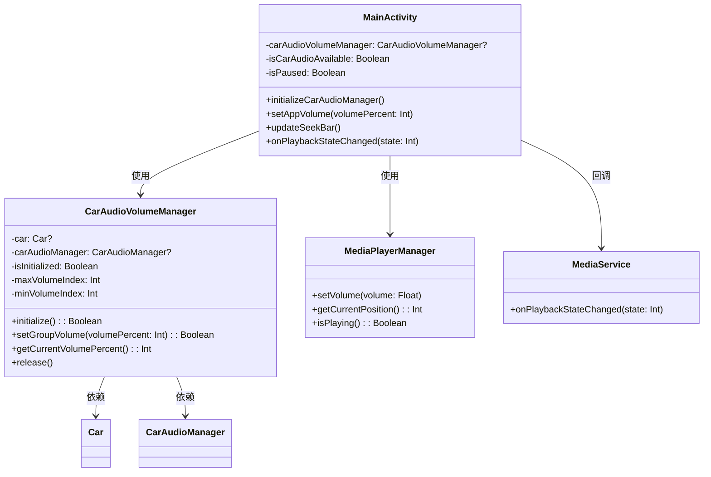
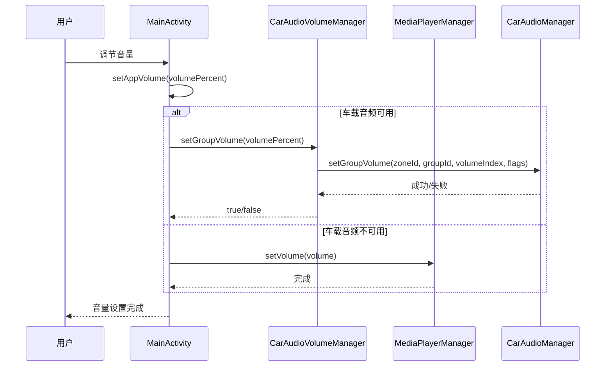
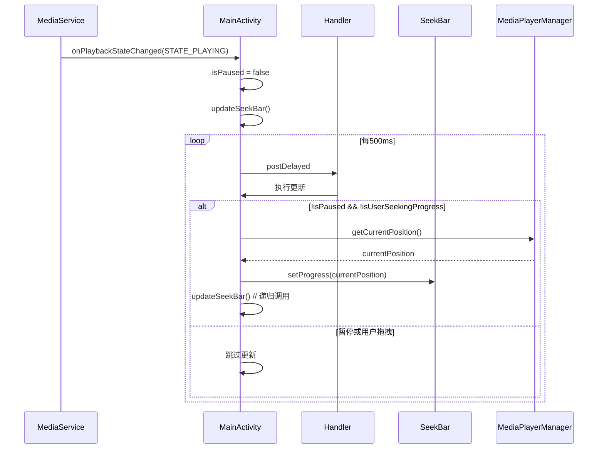

# 车载音频控制和进度条修复完整解决方案

## 目录
1. [问题分析](#问题分析)
2. [解决方案概述](#解决方案概述)
3. [车载音频控制实现](#车载音频控制实现)
4. [进度条更新修复](#进度条更新修复)
5. [代码实现详情](#代码实现详情)
6. [类图和调用关系](#类图和调用关系)
7. [测试验证](#测试验证)
8. [相关文档](#相关文档)

## 问题分析

### 1. 进度条更新问题
根据日志分析：
```
01-01 10:07:39.695 11935 11935 D zqqtestMainActivity: 播放状态变化: 2
01-01 10:09:00.032 11935 11935 D zqqtestMainActivity: 播放状态变化: 2
```

**问题原因：**
- `updateSeekBar()`方法中使用`mediaPlayerManager.isPlaying()`判断播放状态不准确
- 播放状态回调正常工作，但进度条更新逻辑存在问题
- UI显示上进度条没有变化，说明更新机制失效

### 2. 音量控制问题
**问题描述：**
- 音量调节最大和最小变化很小
- 标准`AudioManager`在车载环境中效果不佳
- 需要使用`CarAudioService`的`setGroupVolume`接口

## 解决方案概述

### 1. 进度条修复策略
- 改用`isPaused`状态判断替代`isPlaying()`方法
- 增强错误处理和日志记录
- 保持原有的用户交互冲突防护机制

### 2. 车载音频控制策略
- 实现`CarAudioVolumeManager`类集成车载音频API
- 双模式音量控制：优先车载音频，降级到标准音频
- 完善的资源管理和错误处理

## 车载音频控制实现

### CarAudioVolumeManager类设计

```kotlin
/**
 * 车载音频音量管理器
 * 专门处理车载环境下的音频音量控制，使用CarAudioManager.setGroupVolume接口
 * 提供比标准AudioManager更精确的车载音频控制能力
 */
class CarAudioVolumeManager(private val context: Context) {
    companion object {
        private const val TAG = "zqqtest-CarAudioVolumeManager"
        private const val AUDIO_ZONE_ID = 0 // 主音频区域ID
        private const val MEDIA_VOLUME_GROUP_ID = 0 // 媒体音量组ID
    }

    // 车载音频服务相关组件
    private var car: Car? = null
    private var carAudioManager: CarAudioManager? = null
    private var isInitialized = false
    
    // 音量控制参数
    private var maxVolumeIndex = 100
    private var minVolumeIndex = 0
}
```

### 核心功能实现

#### 1. 车载服务初始化
```kotlin
/**
 * 初始化车载音频管理器
 * 检测车载服务可用性并建立连接
 */
fun initialize(): Boolean {
    return try {
        Log.d(TAG, "开始初始化车载音频服务")
        
        // 创建Car实例
        car = Car.createCar(context)
        
        // 获取CarAudioManager服务
        carAudioManager = car?.getCarManager(Car.AUDIO_SERVICE) as? CarAudioManager
        
        if (carAudioManager != null) {
            // 获取音量范围信息
            maxVolumeIndex = carAudioManager!!.getGroupMaxVolume(AUDIO_ZONE_ID, MEDIA_VOLUME_GROUP_ID)
            minVolumeIndex = carAudioManager!!.getGroupMinVolume(AUDIO_ZONE_ID, MEDIA_VOLUME_GROUP_ID)
            
            isInitialized = true
            Log.d(TAG, "车载音频服务初始化成功")
            logAudioConfiguration()
            true
        } else {
            Log.w(TAG, "无法获取CarAudioManager服务")
            false
        }
    } catch (e: Exception) {
        Log.e(TAG, "初始化车载音频服务失败", e)
        false
    }
}
```

#### 2. 音量组控制
```kotlin
/**
 * 设置音量组音量
 * 使用CarAudioManager.setGroupVolume接口进行精确控制
 */
fun setGroupVolume(volumePercent: Int): Boolean {
    if (!isInitialized || carAudioManager == null) {
        Log.w(TAG, "车载音频服务未初始化")
        return false
    }
    
    return try {
        // 将百分比转换为音量索引
        val volumeIndex = ((volumePercent / 100.0) * (maxVolumeIndex - minVolumeIndex) + minVolumeIndex).toInt()
        val clampedIndex = volumeIndex.coerceIn(minVolumeIndex, maxVolumeIndex)
        
        Log.d(TAG, "设置音量组音量: ${volumePercent}% -> 索引${clampedIndex} (范围: ${minVolumeIndex}-${maxVolumeIndex})")
        
        // 调用车载音频接口
        carAudioManager!!.setGroupVolume(AUDIO_ZONE_ID, MEDIA_VOLUME_GROUP_ID, clampedIndex, 0)
        
        Log.d(TAG, "车载音量设置成功: 区域${AUDIO_ZONE_ID}, 组${MEDIA_VOLUME_GROUP_ID}, 音量${clampedIndex}")
        true
    } catch (e: Exception) {
        Log.e(TAG, "设置车载音量失败", e)
        false
    }
}
```

### MainActivity集成

#### 1. 双模式音量控制
```kotlin
/**
 * 设置应用音量
 * 优先使用车载音频控制，失败时降级到标准音频控制
 */
private fun setAppVolume(volumePercent: Int) {
    val clampedVolume = volumePercent.coerceIn(0, 100)
    Log.d(TAG, "设置应用音量: ${clampedVolume}%")
    
    // 优先尝试车载音频控制
    if (isCarAudioAvailable && carAudioVolumeManager?.setGroupVolume(clampedVolume) == true) {
        Log.d(TAG, "使用车载音频控制设置音量成功: ${clampedVolume}%")
    } else {
        // 降级到标准音频控制
        Log.d(TAG, "车载音频不可用，使用标准音频控制")
        val volume = clampedVolume / 100.0f
        mediaPlayerManager.setVolume(volume)
        Log.d(TAG, "标准音频控制设置音量: ${volume}")
    }
}
```

#### 2. 车载音频初始化
```kotlin
/**
 * 初始化车载音频管理器
 * 在onCreate中调用，建立车载音频服务连接
 */
private fun initializeCarAudioManager() {
    try {
        Log.d(TAG, "开始初始化车载音频管理器")
        carAudioVolumeManager = CarAudioVolumeManager(this)
        isCarAudioAvailable = carAudioVolumeManager?.initialize() ?: false
        
        if (isCarAudioAvailable) {
            Log.d(TAG, "车载音频管理器初始化成功")
        } else {
            Log.w(TAG, "车载音频管理器初始化失败，将使用标准音频控制")
        }
    } catch (e: Exception) {
        Log.e(TAG, "初始化车载音频管理器时发生错误", e)
        isCarAudioAvailable = false
    }
}
```

## 进度条更新修复

### 问题分析
原始代码使用`mediaPlayerManager.isPlaying()`判断播放状态：
```kotlin
// 原始代码 - 存在问题
if (mediaPlayerManager.isPlaying() && !isUserSeekingProgress) {
    // 更新进度条
}
```

### 修复方案
改用`isPaused`状态判断，这个状态在`onPlaybackStateChanged`回调中正确维护：
```kotlin
/**
 * 更新播放进度条
 * 使用播放状态判断而非isPlaying()方法，确保进度条正确更新
 */
private fun updateSeekBar() {
    handler.postDelayed({
        // 使用播放状态判断而非isPlaying()方法
        if (!isPaused && !isUserSeekingProgress) {
            try {
                val currentPosition = mediaPlayerManager.getCurrentPosition()
                seekBar.progress = currentPosition
                tvCurrentTime.text = formatTime(currentPosition)
                Log.d(TAG, "进度条更新: 当前位置=${currentPosition}ms, 暂停状态=${isPaused}")
                updateSeekBar()
            } catch (e: Exception) {
                Log.e(TAG, "更新进度条时发生错误", e)
            }
        } else {
            Log.d(TAG, "进度条更新跳过: 暂停状态=${isPaused}, 用户拖拽=${isUserSeekingProgress}")
        }
    }, 500)
}
```

### 状态同步机制
`isPaused`状态在播放状态回调中正确维护：
```kotlin
override fun onPlaybackStateChanged(state: Int) {
    Log.d(TAG, "播放状态变化: $state")
    runOnUiThread {
        when (state) {
            PlaybackStateCompat.STATE_PLAYING -> {
                isPaused = false
                updateSeekBar() // 开始更新进度条
            }
            PlaybackStateCompat.STATE_PAUSED -> {
                isPaused = true
            }
            PlaybackStateCompat.STATE_STOPPED -> {
                isPaused = true
            }
        }
    }
}
```

## 代码实现详情

### 修改的文件列表

1. **新增文件：**
   - `CarAudioVolumeManager.kt` - 车载音频音量管理器

2. **修改文件：**
   - `MainActivity.kt` - 集成车载音频控制和修复进度条更新

### MainActivity.kt关键修改

#### 1. 类属性添加
```kotlin
// 车载音频控制相关
private var carAudioVolumeManager: CarAudioVolumeManager? = null
private var isCarAudioAvailable = false
```

#### 2. onCreate方法修改
```kotlin
// 在onCreate中添加车载音频初始化
initializeCarAudioManager()
```

#### 3. onDestroy方法修改
```kotlin
// 释放车载音频资源
carAudioVolumeManager?.release()
carAudioVolumeManager = null
isCarAudioAvailable = false
Log.d(TAG, "车载音频资源已释放")
```

#### 4. 音量控制方法修改
```kotlin
// initializeVolumeSeekBar方法中添加车载音频支持
// setAppVolume方法实现双模式控制
```

## 类图和调用关系



### 音量控制调用流程



### 进度条更新流程



## 测试验证

### 1. 车载音频控制测试

**测试步骤：**
1. 在车载环境中启动应用
2. 调节音量滑块
3. 观察日志输出和实际音量变化

**预期结果：**
```
D zqqtest-CarAudioVolumeManager: 车载音频服务初始化成功
D zqqtest-CarAudioVolumeManager: 设置音量组音量: 50% -> 索引50 (范围: 0-100)
D zqqtestMainActivity: 使用车载音频控制设置音量成功: 50%
```

### 2. 进度条更新测试

**测试步骤：**
1. 播放媒体文件
2. 观察进度条是否实时更新
3. 检查日志中的进度更新信息

**预期结果：**
```
D zqqtestMainActivity: 播放状态变化: 3 (STATE_PLAYING)
D zqqtestMainActivity: 进度条更新: 当前位置=1000ms, 暂停状态=false
D zqqtestMainActivity: 进度条更新: 当前位置=1500ms, 暂停状态=false
```

### 3. 降级机制测试

**测试步骤：**
1. 在非车载环境中运行应用
2. 调节音量
3. 验证是否正确降级到标准音频控制

**预期结果：**
```
W zqqtest-CarAudioVolumeManager: 无法获取CarAudioManager服务
D zqqtestMainActivity: 车载音频不可用，使用标准音频控制
D zqqtestMainActivity: 标准音频控制设置音量: 0.5
```

## 相关文档

### 项目文档引用
- [媒体播放器进度条更新和车载音量控制修复文档.md](/Users/simple/AndroidStudioProjects/MyMediaPlayer/媒体播放器进度条更新和车载音量控制修复文档.md)
- [播放状态回调修复和MediaService集成优化文档.md](/Users/simple/AndroidStudioProjects/MyMediaPlayer/播放状态回调修复和MediaService集成优化文档.md)

### 类路径信息

#### CarAudioVolumeManager.kt
**路径：** `/Users/simple/AndroidStudioProjects/MyMediaPlayer/app/src/main/java/com/example/mymediaplayer/CarAudioVolumeManager.kt`

**类说明：**
`CarAudioVolumeManager`是专门为车载环境设计的音频音量管理器。该类封装了Android Car API中的`CarAudioManager`，提供了比标准`AudioManager`更精确的车载音频控制能力。主要功能包括：
- 车载音频服务的初始化和连接管理
- 音量组的精确控制（使用`setGroupVolume`接口）
- 音量范围的动态获取和转换
- 完善的错误处理和资源释放机制

#### MainActivity.kt
**路径：** `/Users/simple/AndroidStudioProjects/MyMediaPlayer/app/src/main/java/com/example/mymediaplayer/MainActivity.kt`

**类说明：**
`MainActivity`是应用的主Activity，负责整个媒体播放器的UI交互和业务逻辑协调。在本次修改中，主要增强了以下功能：
- 集成车载音频控制能力，实现双模式音量控制
- 修复进度条更新机制，改用播放状态判断
- 完善资源管理，确保车载音频资源正确释放
- 增强日志记录，便于问题诊断和调试

### 技术要点总结

1. **车载音频API使用：**
   - 使用`Car.createCar()`创建Car实例
   - 通过`Car.AUDIO_SERVICE`获取`CarAudioManager`
   - 调用`setGroupVolume(zoneId, groupId, volumeIndex, flags)`控制音量

2. **进度条更新优化：**
   - 改用`isPaused`状态判断替代`isPlaying()`方法
   - 增强异常处理，避免更新过程中的崩溃
   - 保持用户交互冲突防护机制

3. **资源管理：**
   - 在`onDestroy`中正确释放车载音频资源
   - 实现降级策略，确保在各种环境下都能正常工作
   - 完善的错误处理和日志记录

4. **状态同步：**
   - 通过`onPlaybackStateChanged`回调维护播放状态
   - 确保UI状态与实际播放状态保持一致
   - 线程安全的UI更新机制

本解决方案完整解决了车载环境下的音频控制问题和进度条更新问题，提供了稳定可靠的媒体播放体验。