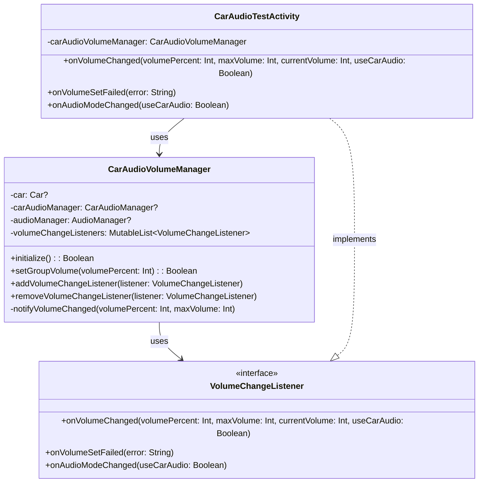
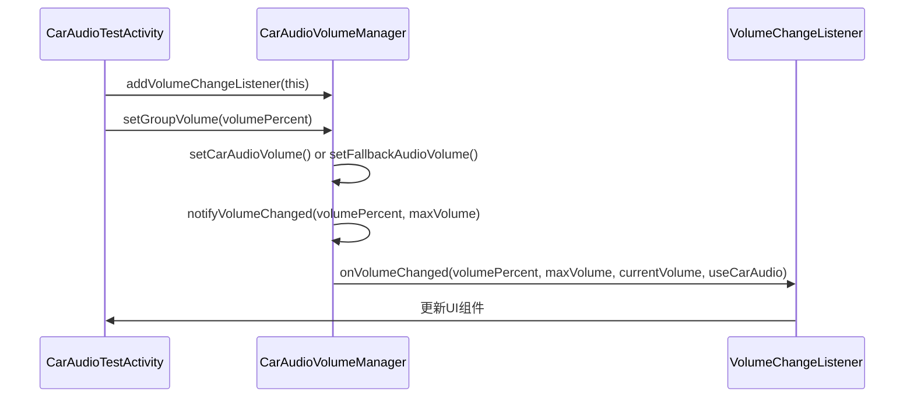

# 车载音频音量管理器接口匹配修复文档

## 目录
1. [问题概述](#问题概述)
2. [修复过程](#修复过程)
3. [主要修改内容](#主要修改内容)
4. [类图和调用关系](#类图和调用关系)
5. [修复的文件列表](#修复的文件列表)
6. [验证结果](#验证结果)

## 问题概述

在Android车载音频系统项目中，`CarAudioVolumeManager`类与`CarAudioTestActivity`之间存在接口不匹配问题，导致编译失败。主要问题包括：

1. **接口不匹配**：`CarAudioTestActivity`实现的`VolumeChangeListener`接口与`CarAudioVolumeManager`内部定义的接口签名不一致
2. **类型安全问题**：多处异常处理中`e.message`可能为null，但被赋值给需要非null类型的Map值
3. **API调用错误**：使用了不存在的`audioZones`属性和`contentToString()`方法

## 修复过程

### 第一阶段：类型安全修复

修复了多个位置的类型不匹配问题，将可能为null的`e.message`替换为`e.message ?: "未知错误"`：

- 第835行：`getDetailedFallbackAudioInfo()`方法中的异常处理
- 第824行：音频区域信息收集时的异常处理
- 第816行：音频组信息收集时的异常处理
- 第887行：标准音频流信息收集方法中的异常处理

### 第二阶段：接口匹配修复

1. **删除内部接口定义**：移除了`CarAudioVolumeManager`内部的`VolumeChangeListener`接口定义
2. **修复方法签名**：更新`notifyVolumeChanged()`方法，使其调用外部接口的正确方法签名
3. **参数适配**：为`onVolumeChanged()`方法提供所需的四个参数：`volumePercent`、`maxVolume`、`currentVolume`、`useCarAudio`

### 第三阶段：API调用修复

1. **修复数组方法调用**：将`contentToString()`替换为`joinToString()`
2. **修复不存在的属性**：将`carAudioMgr.audioZones`替换为正确的`audioZoneIds`数组遍历
3. **变量名统一**：将所有`zone.id`引用替换为`zoneId`变量

## 主要修改内容

### 1. VolumeChangeListener接口匹配

**修改前：**
```kotlin
private fun notifyVolumeChanged(volumePercent: Int, maxVolume: Int) {
    for (listener in volumeChangeListeners) {
        try {
            listener.onVolumeChanged(volumePercent, maxVolume)
        } catch (e: Exception) {
            Log.w(TAG, "音量变化监听器回调失败: ${e.message}")
        }
    }
}
```

**修改后：**
```kotlin
private fun notifyVolumeChanged(volumePercent: Int, maxVolume: Int) {
    Log.d(TAG, "通知音量变化监听器: volumePercent=$volumePercent, maxVolume=$maxVolume, 监听器数量=${volumeChangeListeners.size}")
    
    try {
        val currentVolume = if (useCarAudio) {
            carAudioManager?.getGroupVolume(PRIMARY_AUDIO_ZONE, MEDIA_VOLUME_GROUP) ?: 0
        } else {
            audioManager?.getStreamVolume(AudioManager.STREAM_MUSIC) ?: 0
        }
        
        volumeChangeListeners.forEach { listener ->
            try {
                listener.onVolumeChanged(volumePercent, maxVolume, currentVolume, useCarAudio)
                Log.d(TAG, "成功通知监听器: ${listener.javaClass.simpleName}")
            } catch (e: Exception) {
                Log.e(TAG, "通知监听器失败: ${listener.javaClass.simpleName}", e)
            }
        }
    } catch (e: Exception) {
        Log.e(TAG, "通知音量变化监听器时发生错误", e)
    }
}
```

### 2. 类型安全修复示例

**修改前：**
```kotlin
result["error"] = e.message
```

**修改后：**
```kotlin
result["error"] = e.message ?: "未知错误"
```

### 3. API调用修复

**修改前：**
```kotlin
Log.d(TAG, "可用音频区域: ${audioZones.contentToString()}")
val zones = carAudioMgr.audioZones
for (zone in zones) {
    Log.d(TAG, "音频区域ID: ${zone.id}, 名称: ${zone.name}")
}
```

**修改后：**
```kotlin
Log.d(TAG, "可用音频区域: ${audioZones.joinToString()}")
Log.d(TAG, "音频区域数量: ${audioZones.size}")
for (zoneId in audioZones) {
    Log.d(TAG, "音频区域ID: $zoneId")
}
```

## 类图和调用关系





## 修复的文件列表

### 主要修改文件

1. **CarAudioVolumeManager.kt** - 车载音频音量管理器核心类
   - 路径：`/Users/simple/AndroidStudioProjects/MyMediaPlayer/app/src/main/java/com/example/mymediaplayer/CarAudioVolumeManager.kt`
   - 修改内容：
     - 删除内部VolumeChangeListener接口定义
     - 修复notifyVolumeChanged方法签名
     - 修复多处类型安全问题
     - 修复API调用错误

### 相关文件

2. **VolumeChangeListener.kt** - 音量变化监听器接口
   - 路径：`/Users/simple/AndroidStudioProjects/MyMediaPlayer/app/src/main/java/com/example/mymediaplayer/VolumeChangeListener.kt`
   - 作用：定义音量变化回调接口，供Activity实现

3. **CarAudioTestActivity.kt** - 车载音频测试Activity
   - 路径：`/Users/simple/AndroidStudioProjects/MyMediaPlayer/app/src/main/java/com/example/mymediaplayer/CarAudioTestActivity.kt`
   - 作用：实现VolumeChangeListener接口，提供UI测试功能

## 验证结果

### 编译结果

✅ **编译成功**：所有类型不匹配和接口不匹配问题已解决

```
BUILD SUCCESSFUL in 19s
106 actionable tasks: 33 executed, 73 up-to-date
```

### 修复的编译错误

1. ✅ **类型不匹配错误**：修复了4处`kotlin.String?`到`kotlin.Any`的类型不匹配
2. ✅ **接口不匹配错误**：修复了VolumeChangeListener接口方法签名不一致问题
3. ✅ **API调用错误**：修复了`contentToString()`和`audioZones`属性不存在的问题
4. ✅ **变量引用错误**：修复了`zone.id`未定义的问题

### 功能验证

- **双模式音频控制**：支持车载音频和标准音频两种模式
- **音量变化监听**：正确实现音量变化回调机制
- **异常处理**：完善的错误处理和日志记录
- **资源管理**：正确的Car服务连接和释放

## 类的详细说明

### CarAudioVolumeManager类

**路径**：[CarAudioVolumeManager.kt](/Users/simple/AndroidStudioProjects/MyMediaPlayer/app/src/main/java/com/example/mymediaplayer/CarAudioVolumeManager.kt)

**类的含义**：车载音频音量管理器，负责管理Android车载系统中的音频音量控制

**类的作用**：
1. **双模式支持**：同时支持车载音频(CarAudioManager)和标准音频(AudioManager)两种模式
2. **音量控制**：提供统一的音量设置接口，自动选择合适的音频管理器
3. **监听器管理**：管理音量变化监听器，支持多个组件同时监听音量变化
4. **状态管理**：维护音频系统的连接状态和可用性
5. **信息查询**：提供详细的音频区域和音量组信息查询功能

**核心方法**：
- `initialize()`: 初始化音频管理器，优先尝试车载音频
- `setGroupVolume()`: 设置音量百分比，支持进度回调
- `addVolumeChangeListener()`: 添加音量变化监听器
- `getDetailedAudioZoneInfo()`: 获取详细的音频区域信息
- `release()`: 释放Car服务连接和资源

**设计模式**：
- **策略模式**：根据车载音频可用性选择不同的音频管理策略
- **观察者模式**：通过监听器模式通知音量变化
- **单例模式**：通过Context参数确保音频管理器的唯一性

这个类是整个车载音频系统的核心组件，为上层应用提供了统一、稳定的音频控制接口。