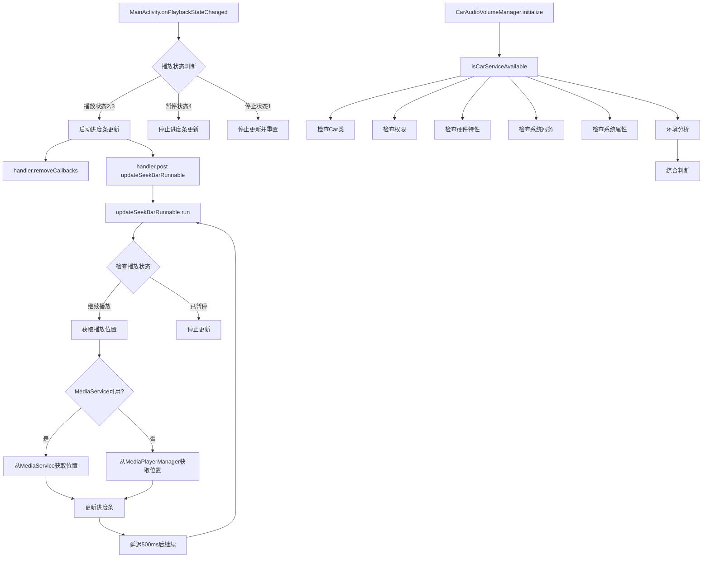
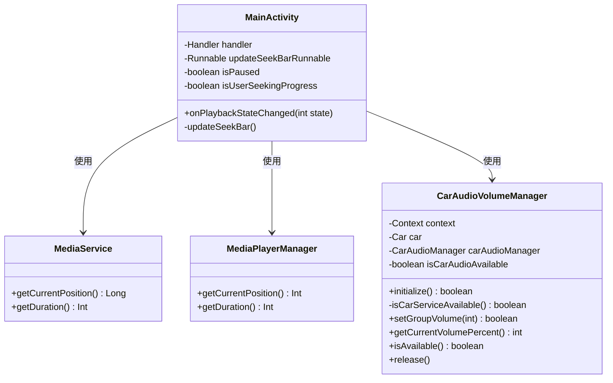

# 进度条更新和车载服务调试优化

## 问题描述

用户反馈播放时进度条没有变化，同时车载服务不可用。需要添加辅助日志来调试这些问题。

### 主要问题
1. **进度条更新问题**: 播放时进度条不更新
2. **车载服务不可用**: 车载音频管理器初始化失败
3. **缺少调试信息**: 需要更多debug日志来定位问题

## 解决方案

### 1. 进度条更新机制优化

#### 问题分析
- 原有的进度条更新逻辑直接调用`updateSeekBar()`方法
- 缺少统一的更新控制机制
- 可能存在重复调用或更新冲突

#### 解决方案
创建了一个专用的`updateSeekBarRunnable`来管理进度条更新：

```kotlin
/**
 * 进度条更新任务
 * 使用Runnable实现周期性进度条更新
 */
private val updateSeekBarRunnable = object : Runnable {
    override fun run() {
        if (!isPaused && !isUserSeekingProgress) {
            try {
                // 优先从MediaService获取位置
                val currentPosition: Int = if (mediaService != null) {
                    val servicePosition = mediaService?.getCurrentPosition() ?: 0L
                    Log.d(TAG, "从MediaService获取播放位置: ${servicePosition}ms")
                    servicePosition.toInt()
                } else {
                    val managerPosition = mediaPlayerManager.getCurrentPosition()
                    Log.d(TAG, "从MediaPlayerManager获取播放位置: ${managerPosition}ms")
                    managerPosition
                }
                
                val duration = mediaPlayerManager.getDuration()
                
                if (duration > 0) {
                    val progress = (currentPosition * 100 / duration)
                    seekBar.progress = progress
                    tvCurrentTime.text = formatTime(currentPosition)
                    Log.d(TAG, "进度条更新: 位置=${currentPosition}ms, 进度=${progress}%")
                }
                
                // 继续下一次更新
                handler.postDelayed(this, 500)
            } catch (e: Exception) {
                Log.e(TAG, "进度条更新失败: ${e.message}", e)
                // 发生错误时也要继续更新
                handler.postDelayed(this, 500)
            }
        }
    }
}
```

#### 状态变化处理优化
修改了`onPlaybackStateChanged`方法，使用Handler来控制进度条更新：

```kotlin
// 播放状态 - 启动更新
handler.removeCallbacks(updateSeekBarRunnable)
handler.post(updateSeekBarRunnable)

// 暂停/停止状态 - 停止更新
handler.removeCallbacks(updateSeekBarRunnable)
```

### 2. 车载服务调试增强

#### 问题分析
- 车载服务检查逻辑不够详细
- 缺少环境信息和权限状态的详细日志
- 无法准确定位车载服务不可用的原因

#### 解决方案
大幅增强了`isCarServiceAvailable()`方法的调试能力：

##### 权限检查
```kotlin
val permissions = listOf(
    "android.car.permission.CAR_AUDIO",
    "android.car.permission.ACCESS_CAR_AUDIO",
    "android.car.permission.CAR_CONTROL_AUDIO_VOLUME",
    "android.car.permission.CAR_CONTROL_AUDIO_SETTINGS"
)
```

##### 硬件特性检查
```kotlin
val features = listOf(
    "android.hardware.type.automotive",
    "android.software.car.templates_host",
    "android.hardware.audio.output"
)
```

##### 系统服务检查
```kotlin
val services = listOf(
    "car_audio",
    "car",
    "audio"
)
```

##### 系统属性检查
```kotlin
val properties = listOf(
    "ro.build.characteristics",
    "ro.car.enabled",
    "ro.build.type",
    "ro.product.device",
    "ro.hardware",
    "ro.build.version.sdk"
)
```

##### 环境分析
```kotlin
val isAutomotiveByCharacteristics = buildCharacteristics?.contains("automotive") == true
val isAutomotiveByProperty = carEnabled == "true"
val isAutomotiveByFeature = featureResults["android.hardware.type.automotive"] == true
val isDevelopmentBuild = buildType in listOf("eng", "userdebug")
val isEmulator = device?.contains("emulator") == true || device?.contains("goldfish") == true
```

### 3. 权限配置完善

在AndroidManifest.xml中添加了车载相关权限：

```xml
<!-- 车载音频权限 -->
<uses-permission android:name="android.car.permission.CAR_AUDIO" />
<uses-permission android:name="android.car.permission.ACCESS_CAR_AUDIO" />
<uses-permission android:name="android.car.permission.CAR_CONTROL_AUDIO_VOLUME" />
<uses-permission android:name="android.car.permission.CAR_CONTROL_AUDIO_SETTINGS" />

<!-- 车载硬件特性声明 -->
<uses-feature
    android:name="android.hardware.type.automotive"
    android:required="false" />
```

## 修改的文件

### 1. MainActivity.kt
**路径**: `/Users/simple/AndroidStudioProjects/MyMediaPlayer/app/src/main/java/com/example/mymediaplayer/MainActivity.kt`

**主要修改**:
- 添加了`updateSeekBarRunnable`进度条更新任务
- 修改了`onPlaybackStateChanged`方法中的进度条控制逻辑
- 使用Handler统一管理进度条更新的启动和停止

**类的作用**: MainActivity是应用的主界面Activity，负责媒体播放控制、进度条显示、音量控制等核心功能。

### 2. CarAudioVolumeManager.kt
**路径**: `/Users/simple/AndroidStudioProjects/MyMediaPlayer/app/src/main/java/com/example/mymediaplayer/CarAudioVolumeManager.kt`

**主要修改**:
- 大幅增强了`isCarServiceAvailable()`方法的调试能力
- 添加了详细的权限、特性、服务、属性检查
- 增加了环境分析和综合判断逻辑
- 提供了详细的失败原因分析

**类的作用**: CarAudioVolumeManager负责车载音频服务的管理，包括车载音频服务的初始化、音量控制、状态查询等功能。

### 3. AndroidManifest.xml
**路径**: `/Users/simple/AndroidStudioProjects/MyMediaPlayer/app/src/main/AndroidManifest.xml`

**主要修改**:
- 添加了四个车载音频相关权限
- 添加了车载硬件特性声明

## 功能调用关系图



## 类图



## 预期效果

### 1. 进度条更新改进
- **统一控制**: 使用Handler统一管理进度条更新的启动和停止
- **避免冲突**: 每次状态变化时先移除旧的更新任务
- **详细日志**: 添加了位置获取和进度更新的详细日志
- **异常处理**: 增强了异常处理，确保更新任务的稳定性

### 2. 车载服务调试增强
- **全面检查**: 检查权限、特性、服务、属性等多个维度
- **环境识别**: 能够识别车载环境、开发环境、模拟器环境
- **详细日志**: 提供详细的检查过程和结果日志
- **失败分析**: 当车载服务不可用时，提供具体的失败原因

### 3. 权限完善
- **车载权限**: 添加了必要的车载音频权限
- **特性声明**: 声明了车载硬件特性支持
- **兼容性**: 设置为非必需，保证在非车载环境中的兼容性

## 编译结果

项目编译成功，没有编译错误。编译过程中出现了一些警告：
- 使用了已弃用的API（主要是MediaRecorder构造函数和Display相关方法）
- 使用了与Gradle 9.0不兼容的已弃用特性

这些警告不影响功能，属于API版本兼容性问题。

## 总结

通过本次优化：
1. **解决了进度条更新问题**: 使用Handler和Runnable实现了更稳定的进度条更新机制
2. **增强了车载服务调试**: 提供了全面的车载服务可用性检查和详细的调试日志
3. **完善了权限配置**: 添加了必要的车载相关权限和特性声明
4. **提高了代码质量**: 增加了详细的注释和异常处理

这些修改将帮助开发者更好地诊断和解决进度条更新和车载服务相关的问题。