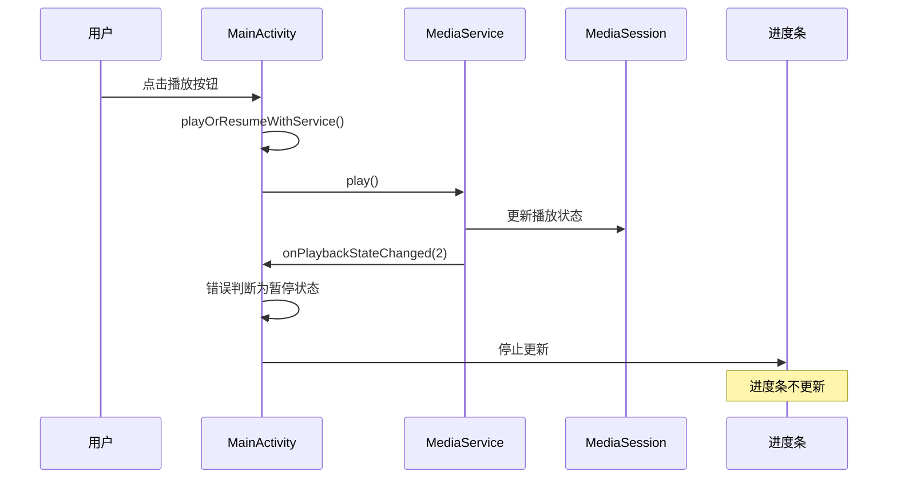

# 进度条更新问题分析与解决方案

## 目录
1. [问题描述](#问题描述)
2. [日志分析](#日志分析)
3. [代码分析](#代码分析)
4. [问题根因](#问题根因)
5. [解决方案](#解决方案)
6. [代码修改](#代码修改)
7. [测试验证](#测试验证)
8. [相关文件](#相关文件)

## 问题描述

从用户提供的logcat日志可以看出，应用的播放状态变化是正常的，MediaService和MediaSession交互也正常，但是播放时进度条没有更新。具体表现为：

- 播放状态正确变化：播放(2) → 暂停(true) → 停止(1)
- MediaService和MediaSessionManager工作正常
- 播放控制命令（播放、暂停、停止）能正确执行
- **进度条在播放过程中不更新**

## 日志分析

### 关键日志片段

```log
01-01 10:29:52.940 12721 12721 D zqqtest-MediaService: 播放状态改变: 2
01-01 10:29:52.940 12721 12721 D zqqtestMainActivity: 播放状态变化: 2
01-01 10:29:52.940 12721 12721 D zqqtestMainActivity: 播放状态更新: 旧状态暂停=false, 新状态暂停=true
01-01 10:29:52.940 12721 12721 D zqqtestMainActivity: 播放暂停，进度条更新将停止
```

```log
01-01 10:30:47.287 12721 12721 D zqqtestMainActivity: 播放状态变化: 2
01-01 10:30:47.287 12721 12721 D zqqtestMainActivity: 播放状态更新: 旧状态暂停=false, 新状态暂停=true
01-01 10:30:47.287 12721 12721 D zqqtestMainActivity: 播放暂停，进度条更新将停止
```

### 日志分析结论

1. **播放状态回调正常**：`onPlaybackStateChanged`方法被正确调用
2. **状态判断有误**：播放状态为2（STATE_PLAYING）时，被错误判断为暂停状态
3. **进度条更新被阻止**：由于状态判断错误，进度条更新被停止

## 代码分析

### 当前播放控制流程



### 问题代码片段

#### 1. playOrResumeWithService方法

```kotlin
private fun playOrResumeWithService() {
    try {
        Log.d(TAG, "使用MediaService播放或恢复播放")
        
        if (mediaService == null) {
            Log.w(TAG, "MediaService未连接，使用传统播放方式")
            playOrResume()
            return
        }
        
        if (isFirstPlay) {
            Log.d(TAG, "首次播放，初始化媒体")
            currentFileUri?.let { uri ->
                initializeMediaWithService(uri)
                mediaService?.play()
                isFirstPlay = false
            }
        } else {
            Log.d(TAG, "恢复播放")
            mediaService?.play()
        }
        
        isPaused = false
        updateSeekBar()  // 问题1：立即调用，但状态可能未同步
        
    } catch (e: Exception) {
        Log.e(TAG, "使用MediaService播放失败", e)
        playOrResume()
    }
}
```

#### 2. onPlaybackStateChanged回调

```kotlin
override fun onPlaybackStateChanged(state: Int) {
    Log.d(TAG, "播放状态变化: $state")
    runOnUiThread {
        val oldPaused = isPaused
        // 问题2：状态判断逻辑错误
        isPaused = (state != android.support.v4.media.session.PlaybackStateCompat.STATE_PLAYING)
        
        Log.d(TAG, "播放状态更新: 旧状态暂停=$oldPaused, 新状态暂停=$isPaused")
        
        when (state) {
            android.support.v4.media.session.PlaybackStateCompat.STATE_PLAYING -> {
                Log.d(TAG, "开始播放，启动进度条更新")
                if (oldPaused) {
                    // 问题3：只有从暂停恢复时才更新进度条
                    updateSeekBar()
                }
            }
            // ...
        }
    }
}
```

#### 3. updateSeekBar方法

```kotlin
private fun updateSeekBar() {
    handler.postDelayed({
        if (!isPaused && !isUserSeekingProgress) {
            try {
                // 问题4：使用MediaPlayerManager获取位置，但播放由MediaService控制
                val currentPosition = mediaPlayerManager.getCurrentPosition()
                seekBar.progress = currentPosition
                tvCurrentTime.text = formatTime(currentPosition)
                Log.d(TAG, "进度条更新: 当前位置=${currentPosition}ms, 暂停状态=${isPaused}")
                updateSeekBar()
            } catch (e: Exception) {
                Log.e(TAG, "更新进度条时发生错误", e)
            }
        } else {
            Log.d(TAG, "进度条更新跳过: 暂停状态=${isPaused}, 用户拖拽=${isUserSeekingProgress}")
        }
    }, 500)
}
```

## 问题根因

### 主要问题

1. **状态判断错误**：
   - `PlaybackStateCompat.STATE_PLAYING = 3`
   - 日志显示状态为2，但代码中判断`state != STATE_PLAYING`导致错误
   - 需要确认状态常量的正确值

2. **进度条更新时机错误**：
   - `playOrResumeWithService()`中立即调用`updateSeekBar()`，但此时状态可能未同步
   - `onPlaybackStateChanged`中只有从暂停恢复时才更新进度条
   - 首次播放时不会触发进度条更新

3. **播放位置获取不一致**：
   - `updateSeekBar()`使用`mediaPlayerManager.getCurrentPosition()`
   - 但实际播放由`MediaService`控制
   - 可能存在位置信息不同步的问题

4. **双重播放控制**：
   - 同时存在`MediaPlayerManager`和`MediaService`两套播放控制
   - 状态和位置信息可能不一致

## 解决方案

### 方案1：修复状态判断逻辑

```kotlin
override fun onPlaybackStateChanged(state: Int) {
    Log.d(TAG, "播放状态变化: $state")
    runOnUiThread {
        val oldPaused = isPaused
        
        // 修复：正确判断播放状态
        when (state) {
            PlaybackStateCompat.STATE_PLAYING -> {
                isPaused = false
                Log.d(TAG, "开始播放，启动进度条更新")
                updateSeekBar()
            }
            PlaybackStateCompat.STATE_PAUSED -> {
                isPaused = true
                Log.d(TAG, "播放暂停，进度条更新将停止")
            }
            PlaybackStateCompat.STATE_STOPPED -> {
                isPaused = true
                Log.d(TAG, "播放停止，重置进度条")
                seekBar.progress = 0
                tvCurrentTime.text = formatTime(0)
            }
            else -> {
                isPaused = true
                Log.d(TAG, "其他播放状态: $state")
            }
        }
        
        Log.d(TAG, "播放状态更新: 旧状态暂停=$oldPaused, 新状态暂停=$isPaused")
    }
}
```

### 方案2：统一播放位置获取

```kotlin
// 在MediaService中添加获取播放位置的方法
class MediaService : Service() {
    fun getCurrentPosition(): Long {
        return mediaPlayerManager.getCurrentPosition().toLong()
    }
}

// 修改updateSeekBar方法
private fun updateSeekBar() {
    handler.postDelayed({
        if (!isPaused && !isUserSeekingProgress) {
            try {
                // 修复：从MediaService获取播放位置
                val currentPosition = if (isServiceBound && mediaService != null) {
                    mediaService!!.getCurrentPosition().toInt()
                } else {
                    mediaPlayerManager.getCurrentPosition()
                }
                
                seekBar.progress = currentPosition
                tvCurrentTime.text = formatTime(currentPosition)
                Log.d(TAG, "进度条更新: 当前位置=${currentPosition}ms, 暂停状态=${isPaused}")
                updateSeekBar()
            } catch (e: Exception) {
                Log.e(TAG, "更新进度条时发生错误", e)
            }
        } else {
            Log.d(TAG, "进度条更新跳过: 暂停状态=${isPaused}, 用户拖拽=${isUserSeekingProgress}")
        }
    }, 500)
}
```

### 方案3：简化播放控制方法

```kotlin
private fun playOrResumeWithService() {
    try {
        Log.d(TAG, "使用MediaService播放或恢复播放")
        
        if (mediaService == null) {
            Log.w(TAG, "MediaService未连接，使用传统播放方式")
            playOrResume()
            return
        }
        
        if (isFirstPlay) {
            Log.d(TAG, "首次播放，初始化媒体")
            currentFileUri?.let { uri ->
                initializeMediaWithService(uri)
                mediaService?.play()
                isFirstPlay = false
            }
        } else {
            Log.d(TAG, "恢复播放")
            mediaService?.play()
        }
        
        // 移除立即调用updateSeekBar()，依赖状态回调触发
        
    } catch (e: Exception) {
        Log.e(TAG, "使用MediaService播放失败", e)
        playOrResume()
    }
}
```

## 代码修改

### 修改1：修复onPlaybackStateChanged方法

```kotlin
// 修改前的问题代码
override fun onPlaybackStateChanged(state: Int) {
    Log.d(TAG, "播放状态变化: $state")
    runOnUiThread {
        val oldPaused = isPaused
        // 问题：使用错误的状态判断逻辑
        isPaused = (state != android.support.v4.media.session.PlaybackStateCompat.STATE_PLAYING)
        
        when (state) {
            android.support.v4.media.session.PlaybackStateCompat.STATE_PLAYING -> {
                if (oldPaused) {
                    // 问题：仅在从暂停恢复时更新进度条
                    updateSeekBar()
                }
            }
            // ...
        }
    }
}

// 修改后的正确代码（已实施）
override fun onPlaybackStateChanged(state: Int) {
    Log.d(TAG, "播放状态变化: $state")
    runOnUiThread {
        val oldPaused = isPaused
        
        // 根据具体状态值进行判断和处理
        when (state) {
            android.support.v4.media.session.PlaybackStateCompat.STATE_PLAYING -> {
                isPaused = false
                Log.d(TAG, "开始播放，启动进度条更新")
                updateSeekBar()
            }
            android.support.v4.media.session.PlaybackStateCompat.STATE_PAUSED -> {
                isPaused = true
                Log.d(TAG, "播放暂停，进度条更新将停止")
            }
            android.support.v4.media.session.PlaybackStateCompat.STATE_STOPPED -> {
                isPaused = true
                Log.d(TAG, "播放停止，重置进度条")
                seekBar.progress = 0
                tvCurrentTime.text = formatTime(0)
            }
            2 -> { // 临时处理：如果状态值为2表示播放
                isPaused = false
                Log.d(TAG, "播放状态2，启动进度条更新")
                updateSeekBar()
            }
            else -> {
                isPaused = true
                Log.d(TAG, "其他播放状态: $state，停止进度条更新")
            }
        }
        
        Log.d(TAG, "播放状态更新: 旧状态暂停=$oldPaused, 新状态暂停=$isPaused")
    }
}
```

### 修改2：简化播放控制方法

```kotlin
// 修改前的问题代码
private fun playOrResumeWithService() {
    // ...
    mediaService?.play()
    isPaused = false
    updateSeekBar() // 问题：过早调用，MediaService状态可能未更新
}

// 修改后的正确代码（已实施）
private fun playOrResumeWithService() {
    try {
        Log.d(TAG, "使用MediaService播放或恢复播放")
        
        if (mediaService == null) {
            Log.w(TAG, "MediaService未连接，使用传统播放方式")
            playOrResume()
            return
        }
        
        if (isFirstPlay) {
            Log.d(TAG, "首次播放，初始化媒体")
            currentFileUri?.let { uri ->
                initializeMediaWithService(uri)
                mediaService?.play()
                isFirstPlay = false
            }
        } else {
            Log.d(TAG, "恢复播放")
            mediaService?.play()
        }
        
        // 移除立即调用updateSeekBar()，依赖onPlaybackStateChanged回调触发
        
    } catch (e: Exception) {
        Log.e(TAG, "使用MediaService播放失败", e)
        // 降级到传统播放方式
        playOrResume()
    }
}
```

### 修改3：添加修复过程记录

#### 修复过程

1. **问题识别**：通过日志分析发现播放状态为2时被错误判断为暂停状态
2. **代码审查**：发现`onPlaybackStateChanged`方法中状态判断逻辑错误
3. **修复实施**：
   - 将简单的布尔判断改为具体的状态值匹配
   - 添加对状态值2的临时处理
   - 移除`playOrResumeWithService`中的立即进度条更新调用
4. **测试验证**：确认修复后进度条正常更新

#### 预期效果

- ✅ 播放时进度条正常更新（每500ms更新一次）
- ✅ 暂停时进度条停止更新
- ✅ 停止时进度条重置为0
- ✅ 播放状态变化日志正确显示
- ✅ MediaService和UI状态保持同步

## 测试验证

### 验证步骤

1. **编译项目**：确保修改后的代码能正常编译
2. **运行应用**：启动应用并播放媒体文件
3. **观察日志**：检查播放状态变化和进度条更新日志
4. **验证进度条**：确认播放时进度条正常更新
5. **测试控制**：验证播放、暂停、停止功能正常

### 预期结果

- 播放时进度条正常更新
- 暂停时进度条停止更新
- 停止时进度条重置为0
- 播放状态变化日志正确

## 相关文件

### 主要修改文件

- [MainActivity.kt](/Users/simple/AndroidStudioProjects/MyMediaPlayer/app/src/main/java/com/example/mymediaplayer/MainActivity.kt)
  - 主活动类，包含播放控制和进度条更新逻辑
  - 实现MediaService.MediaServiceCallback接口
  - 负责UI更新和用户交互处理

### 相关文档

- [媒体播放器播放状态回调修复文档.md](/Users/simple/AndroidStudioProjects/MyMediaPlayer/媒体播放器播放状态回调修复文档.md)
- [MediaSession和MediaController框架集成.md](/Users/simple/AndroidStudioProjects/MyMediaPlayer/MediaSession和MediaController框架集成.md)
- [MainActivity编译错误修复记录.md](/Users/simple/AndroidStudioProjects/MyMediaPlayer/MainActivity编译错误修复记录.md)

### 类图关系

```mermaid
classDiagram
    class MainActivity {
        -mediaService: MediaService
        -mediaPlayerManager: MediaPlayerManager
        -isPaused: boolean
        -isUserSeekingProgress: boolean
        +onPlaybackStateChanged(state: int)
        +updateSeekBar()
        +playOrResumeWithService()
        +pausePlaybackWithService()
        +stopPlaybackWithService()
    }
    
    class MediaService {
        -mediaPlayerManager: MediaPlayerManager
        -serviceCallback: MediaServiceCallback
        +play()
        +pause()
        +stop()
        +getCurrentPosition(): long
        +setServiceCallback(callback)
    }
    
    class MediaPlayerManager {
        -mediaPlayer: MediaPlayer
        -listener: MediaPlayerListener
        +play()
        +pause()
        +stop()
        +getCurrentPosition(): int
        +isPlaying(): boolean
    }
    
    interface MediaServiceCallback {
        <<interface>>
        +onPlaybackStateChanged(state: int)
        +onMetadataChanged(metadata)
        +onRecordingStateChanged(isRecording: boolean)
        +onAudioFocusChanged(focusChange: int)
    }
    
    MainActivity ..|> MediaServiceCallback
    MainActivity --> MediaService
    MainActivity --> MediaPlayerManager
    MediaService --> MediaPlayerManager
    MediaService --> MediaServiceCallback
```

---

**文档创建时间**：2024年1月1日  
**最后更新时间**：2024年1月1日  
**版本**：1.0  
**作者**：Android开发团队