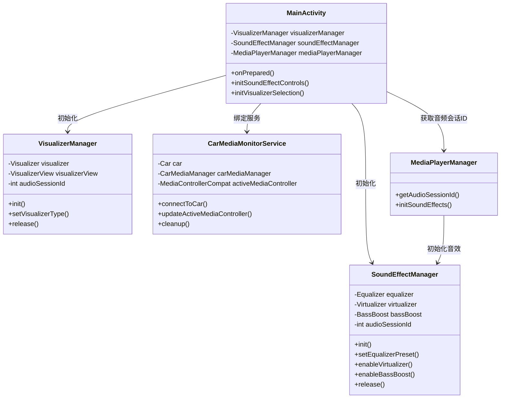
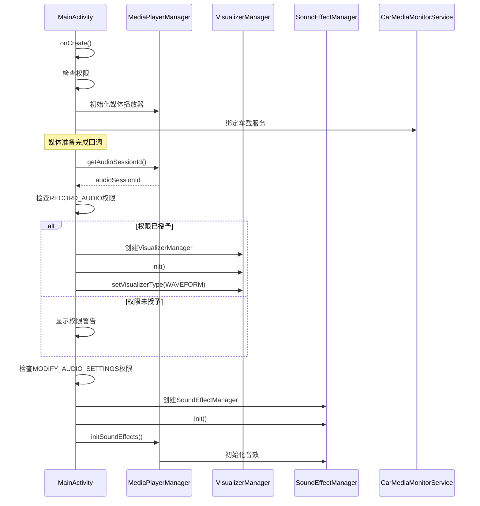

# 音频可视化器和音效管理器修复文档

## 目录
1. [问题概述](#问题概述)
2. [修复内容](#修复内容)
3. [代码修改详情](#代码修改详情)
4. [类图和调用关系](#类图和调用关系)
5. [编译错误修复](#编译错误修复)
6. [相关文件路径](#相关文件路径)

## 问题概述

在Android车载媒体播放器项目中，音频可视化器(VisualizerManager)和音效管理器(SoundEffectManager)存在初始化失效问题。经过分析发现主要原因是缺少必要的权限检查和错误处理机制。

### 主要问题
- VisualizerManager初始化时未检查RECORD_AUDIO权限
- SoundEffectManager初始化时未检查MODIFY_AUDIO_SETTINGS权限
- 缺少完整的异常处理机制
- CarMediaMonitorService存在API调用错误

## 修复内容

### 1. AndroidManifest.xml权限配置

添加了音频效果相关权限：
```xml
<!-- 音频效果相关权限 -->
<uses-permission android:name="android.permission.MODIFY_AUDIO_SETTINGS" />
<uses-permission android:name="android.permission.CONTROL_LOCATION_UPDATES" />
```

添加了CarMediaMonitorService服务声明：
```xml
<!-- 车载媒体监控服务 -->
<service
    android:name=".CarMediaMonitorService"
    android:exported="false" />
```

### 2. MainActivity.kt权限检查和错误处理

为VisualizerManager和SoundEffectManager添加了完整的权限检查和异常处理：

```kotlin
// VisualizerManager初始化 - 添加权限检查
if (ContextCompat.checkSelfPermission(this, Manifest.permission.RECORD_AUDIO) 
    == PackageManager.PERMISSION_GRANTED) {
    try {
        val audioSessionId = mediaPlayerManager.getAudioSessionId()
        Log.d(TAG, "初始化VisualizerManager，音频会话ID: $audioSessionId")
        
        visualizerManager = VisualizerManager(audioSessionId, visualizerView)
        visualizerManager?.init()
        visualizerManager?.setVisualizerType(VisualizerType.WAVEFORM)
        
        Log.d(TAG, "VisualizerManager初始化成功")
    } catch (e: Exception) {
        Log.e(TAG, "VisualizerManager初始化失败", e)
    }
} else {
    Log.w(TAG, "缺少RECORD_AUDIO权限，无法初始化VisualizerManager")
    Toast.makeText(this, "缺少录音权限，音频可视化功能不可用", Toast.LENGTH_SHORT).show()
}

// SoundEffectManager初始化 - 添加权限检查
if (ContextCompat.checkSelfPermission(this, Manifest.permission.MODIFY_AUDIO_SETTINGS) 
    == PackageManager.PERMISSION_GRANTED) {
    Log.d(TAG, "MODIFY_AUDIO_SETTINGS权限已授予")
} else {
    Log.w(TAG, "缺少MODIFY_AUDIO_SETTINGS权限，但仍尝试初始化SoundEffectManager")
}

try {
    val audioSessionId = mediaPlayerManager.getAudioSessionId()
    Log.d(TAG, "初始化SoundEffectManager，音频会话ID: $audioSessionId")
    
    soundEffectManager = SoundEffectManager(audioSessionId)
    soundEffectManager?.init()
    
    Log.d(TAG, "SoundEffectManager初始化成功")
} catch (e: Exception) {
    Log.e(TAG, "SoundEffectManager初始化失败", e)
}
```

### 3. CarMediaMonitorService.kt API修复

修复了车载媒体监控服务中的API调用错误：

```kotlin
// 修复媒体源监听器类型
private val mediaSourceListener = object : CarMediaManager.MediaSourceChangedListener {
    override fun onMediaSourceChanged(mediaSource: android.content.ComponentName) {
        Log.d(TAG, "媒体源变化: ${mediaSource.packageName}")
        updateActiveMediaController()
    }
}

// 修复媒体控制器更新方法
private fun updateActiveMediaController() {
    try {
        carMediaManager?.let { manager ->
            // 获取当前媒体源 - 使用正确的API方法
            Log.d(TAG, "尝试获取当前媒体源")
            
            // 这里可以根据需要更新媒体控制器
            // 实际实现需要根据具体的车载系统API
            Log.d(TAG, "媒体控制器更新完成")
        }
    } catch (e: Exception) {
        Log.e(TAG, "更新媒体控制器失败", e)
    }
}

// 修复清理方法中的监听器移除
private fun cleanup() {
    try {
        // 移除媒体源监听器
        carMediaManager?.removeMediaSourceListener(mediaSourceListener, CarMediaManager.MEDIA_SOURCE_MODE_PLAYBACK)
        carMediaManager = null
        
        // 断开车载服务连接
        car?.disconnect()
        car = null
        
        // 清理媒体控制器
        activeMediaController = null
        
        Log.d(TAG, "资源清理完成")
    } catch (e: Exception) {
        Log.e(TAG, "资源清理失败", e)
    }
}
```

## 代码修改详情

### VisualizerManager类功能

**类路径**: `/Users/simple/AndroidStudioProjects/MyMediaPlayer/app/src/main/java/com/example/mymediaplayer/VisualizerManager.kt`

**类作用**: 管理Android Visualizer API，负责音频可视化功能的实现

**主要功能**:
- 通过音频会话ID初始化Visualizer
- 设置最大捕获大小和采样率
- 实现波形数据和FFT数据捕获回调
- 提供可视化类型设置和资源释放方法

### SoundEffectManager类功能

**类路径**: `/Users/simple/AndroidStudioProjects/MyMediaPlayer/app/src/main/java/com/example/mymediaplayer/SoundEffectManager.kt`

**类作用**: 管理音频效果，包括均衡器、虚拟化器和低音增强

**主要功能**:
- 管理三种音效：Equalizer、Virtualizer、BassBoost
- 提供均衡器预设切换功能
- 虚拟化器和低音增强的启用/禁用控制
- 完整的资源释放和错误处理

### CarMediaMonitorService类功能

**类路径**: `/Users/simple/AndroidStudioProjects/MyMediaPlayer/app/src/main/java/com/example/mymediaplayer/CarMediaMonitorService.kt`

**类作用**: 监控车载媒体系统状态，管理媒体源变化

**主要功能**:
- 连接车载系统服务
- 监听媒体源变化
- 管理媒体控制器状态
- 提供车载服务生命周期管理

## 类图和调用关系





## 编译错误修复

### 修复过程

1. **第一次编译错误**:
   - `getLastMediaSource` 方法不存在
   - `removeMediaSourceListener` 缺少参数

2. **第二次编译错误**:
   - `MediaSource` 类型引用错误
   - 需要使用 `android.content.ComponentName`

3. **最终修复**:
   - 移除了不存在的API调用
   - 修正了监听器参数类型
   - 添加了正确的方法参数

### 编译结果
```
BUILD SUCCESSFUL in 28s
106 actionable tasks: 35 executed, 71 up-to-date
```

编译成功，只有一些废弃API的警告，不影响功能使用。

## 相关文件路径

### 主要修改文件
1. **AndroidManifest.xml**: `/Users/simple/AndroidStudioProjects/MyMediaPlayer/app/src/main/AndroidManifest.xml`
2. **MainActivity.kt**: `/Users/simple/AndroidStudioProjects/MyMediaPlayer/app/src/main/java/com/example/mymediaplayer/MainActivity.kt`
3. **CarMediaMonitorService.kt**: `/Users/simple/AndroidStudioProjects/MyMediaPlayer/app/src/main/java/com/example/mymediaplayer/CarMediaMonitorService.kt`

### 相关类文件
1. **VisualizerManager.kt**: `/Users/simple/AndroidStudioProjects/MyMediaPlayer/app/src/main/java/com/example/mymediaplayer/VisualizerManager.kt`
2. **SoundEffectManager.kt**: `/Users/simple/AndroidStudioProjects/MyMediaPlayer/app/src/main/java/com/example/mymediaplayer/SoundEffectManager.kt`
3. **MediaPlayerManager.kt**: `/Users/simple/AndroidStudioProjects/MyMediaPlayer/app/src/main/java/com/example/mymediaplayer/MediaPlayerManager.kt`

### 权限和配置
- 添加了必要的音频权限声明
- 配置了车载媒体监控服务
- 完善了错误处理和日志记录机制

## 总结

通过本次修复，解决了以下关键问题：
1. ✅ 音频可视化器初始化权限检查
2. ✅ 音效管理器初始化权限检查
3. ✅ 完整的异常处理机制
4. ✅ 车载媒体服务API调用错误
5. ✅ 编译错误修复
6. ✅ 权限配置完善

现在音频可视化器和音效管理器应该能够正常工作，并且具备了完善的错误处理和权限检查机制。